# Data Science with Apache Spark

## Development workstation setup

### Computer environment needed for this class:

[Setup Elipcse Scala IDE](https://app.gitbook.com/@george-jen/s/spark/~/drafts/-M18d7sI3yKXVibSPQQh/setup/untitled#setup-elipcse-scala-ide)

If you do not have 2nd computer for Linux machine, there is Ubuntu 16.04 Virtual box image available for you to download.

For my environment, there are 32GB RAM on my windows 10 laptop as a development Apache Spark workstation, and the Linux computer has Intel 8700 6 cores/12 thread CPU and 64GB RAM to run Apache Hadoop, Hive and Spark cluster that has 1 master and worker nodes running with docker, sufficient to simulate production Spark cluster environment whether on premise or in the cloud.

We will be writing the Spark Application in both Scala and Python

The codes that I developed for this class are in my github site and you will be writing the same level of codes at the end of the course:

[https://github.com/geyungjen/jentekllc/tree/master/Spark](https://github.com/geyungjen/jentekllc/tree/master/Spark)

### Spark Environment Setup

#### Development environment:

The dev environment we develop Spark applications in Python \(PySpark\) and Scala

Production environment: the Spark cluster environment that we will submit Spark jobs to be run with

The Dev environment setup,  tasks:

Install Java devilment toolkit 1.8 \(required, higher version Java may not work properly with Spark, we found out jdk1.8.0\_191 works best, therefore, recommend jdk1.8.0\_191. \(Do NOT install JDK 9 or above, Spark is not currently compatible with JDK 9 or above.\)

Download and install Anaconda Python and create virtual environment with Python 3.6 \(work best with most of the deep learning libraries\)

Download and install Spark

Download and install Scala \(optional, as Spark has scala\)

Setup Spylon-kernel on jupyter-notebook, we will be using jupyter-notebook for both Python and Scala

### Setup Elipcse Scala IDE

The Dev environment setup,  tasks:

Install Java devilment toolkit 1.8 \(required, higher version Java may not work properly with Spark, we found out jdk1.8.0\_191 works well, therefore, recommend jdk1.8.0\_191. \(Do NOT install JDK 9 or above, Spark is not currently compatible with JDK 9 or above.\)

[https://www.oracle.com/technetwork/java/javase/downloads/java-archive-javase8-2177648.html](https://www.oracle.com/technetwork/java/javase/downloads/java-archive-javase8-2177648.html)

#### JDK Windows \(10\) installation.

#### No space allowed in JDK folder name

Avoid install Java Development Kit into a folder which name contains space, such as c:\program files or c:\program files \(x86\).  Best should be no space in folder name.  If you installed JDK under c:\program files or c:\program files \(x86\),   you will need to later in your Scala code set environment variable JAVA\_HOME to

C:\Progra~1\Java\jdk1.8.0\_191 

If JDK is in C:\Program Files

C:\Progra~2\Java\jdk1.8.0\_191

If JDK is in C:\Program Files \(X86\)

Download and install Anaconda Python and create virtual environment with Python 3.6 \(work best with most of the deep learning libraries\)

#### Download and install Anaconda Python 3.x:

[https://www.anaconda.com/distribution/](https://www.anaconda.com/distribution/)

Start Anaconda Navigator to create a virtual environment Spark, that uses Python 3.6 which we will use this virtual environment without affecting your existing Python environment.

If on command line:

conda update conda && conda create -n spark python=3.6 anaconda

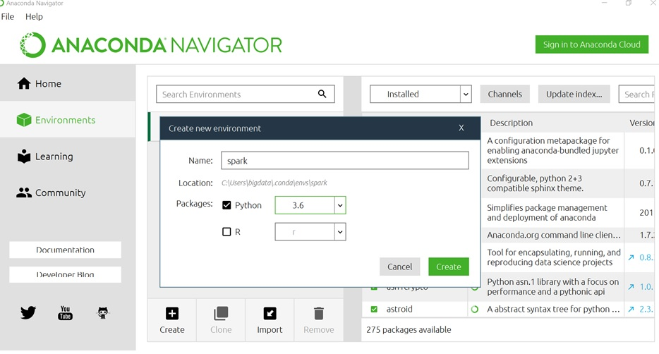

Install Jupyter Notebook under virtual environment Spark, launch Jupyter Notebook after install to test it

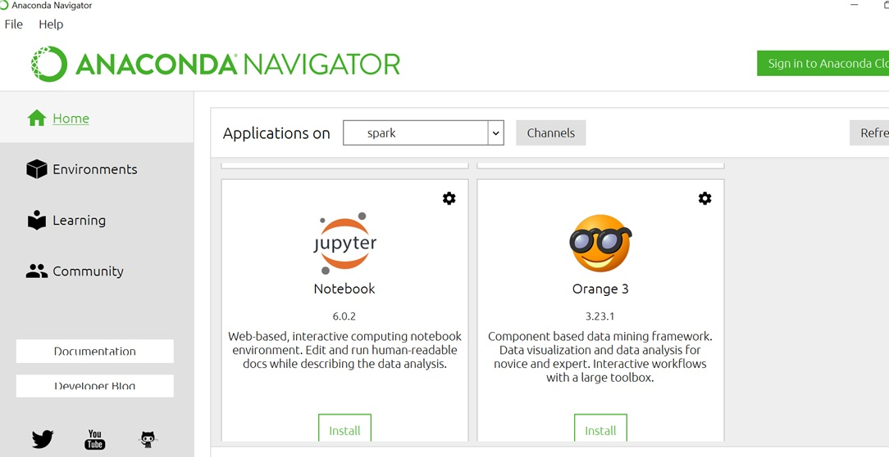

#### Download and install Spark, make sure choose only 3.0.0 with Apache Hadoop 2.7, which the codes of this courses will be running with



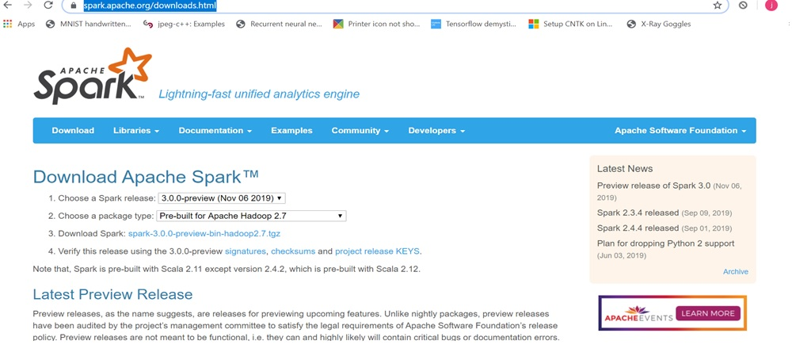

If you are using windows, and you do not have winzip or winrar installed, there are free alternatives of decompressing software that can expand tgz compressed file, that is needed to unpack Spark downloaded tgz file.



For windows, it is needed to setup for Hadoop, by download winutils.exe



Specifically, you can just download below exe file



By now, you have downloaded and extracted Spark, and winutils.exe \(Hadoop utility for windows\), next task is to:

Set up SPARK\_HOME environment variable to point to home dir of Spark, in our case:

SPARK\_HOME=c:\spark\spark

Append %SPARK\_HOME%\bin to the PATH environment variable

Set up HADOOP\_HOME environment variable to point to Hadoop home dir, in our case:

HADOOP\_HOME=c:\winutils

Append %HADOOP\_HOME%\bin to the PATH environment variable

Set up default /tmp/hive directory that Spark needs.  This means, in Windows, for example, you need to create a folder for example

Open a cmd command window as administrator

mkdir c:\tmp\hive

Then set permission by

%HADOOP\_HOME\bin\winutils.exe chmod –R 777 c:\tmp

Also point %TEMP% and %TMP% to c:\tmp

Then you are done with Spark setup.

Download Scala IDE, we will be using Eclipse with Scala plugging.

Download Scala IDE and install your downloads:



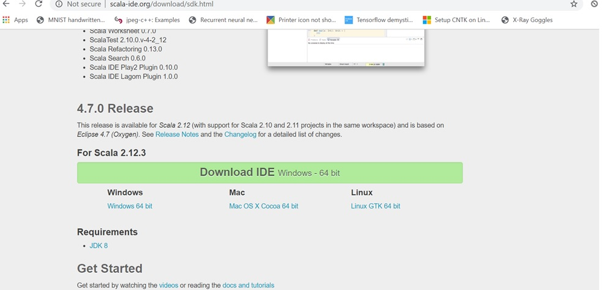

#### Install findspark, add spylon-kernel for scala

Install Python findspark library to be used in standalone Python script or Jupyter notebook to run Spark application outside PySpark.

Install Jupyter notebook Spylon kernel to run Scala code inside Jupyter notebook interactively.

To install findspark library for Python, open an Anaconda command prompt.

Go to virtual environment spark you have created that has Python 3.6 and Jupyter notebook

conda activate spark

For the first time, update pip

pip install pip --upgrade

pip install findspark

Next is to install Spylon library for Jupyter notebook to run Scala commands inside Jupyter-notebook

Open an Anaconda command prompt as administrator

conda activate spark

A

pip install spylon-kernel

Create a kernel spec for Jupyter notebook 

python -m spylon\_kernel install --user

Once you have downloaded the software stated in prior slides:

JDK 1.8.x

Apache Spark

winutils.exe \(for Hadoop on Windows\)

Anaconda Python 3.7

Scala IDE \(Eclipse with Scala plugin\)

I will demonstrate the setup of the Apache Spark complete development environment with Python and Scala live in the class or on the videos.

From this point forward, you shall have a working Apache Spark, complete with Python and Scala development IDE

Jupyter notebook with Python 3 and Scala kernel, and Standalone Eclipse Scala IDE

You are now ready for software application development with Python and Scala with Apache Spark

#### Production Spark Environment Setup

If we use a cloud Spark cluster such as AWS EMR, there will be expenses to run our Spark code.  Therefore, we need to setup our own Spark cluster instead.

We will cover:

Docker deployment of Spark Cluster

Physical deployment of Spark Cluster

#### Create a special docker image from scratch

Docker Install, for our purpose, we only need to install Docker Community Edition \(CE\)

Get Docker CE for CentOS:



Get Docker CE for Debian:



Get Docker CE for Ubuntu:



Docker for Windows 10:



Docker for Mac:



For others:



Non Windows:

After Docker is installed, need to do the following to allow non root user to run Docker container

sudo groupadd docker

sudo usermod -aG docker $USER

exit and log in again

Install docker-compose:



#### Now create customized Apache Spark Docker container

Create an empty directory, name does not matter, cd into that directory afterwards.

mkdir docker\_dir

cd docker\_dir

#### Dockerfile

Create a file called Dockerfile \(name does matter, docker program will look for that file\)

vi  Dockerfile, enter below, then save and exit

FROM openjdk:8-alpine

RUN apk --update add wget tar bash

RUN wget http://apache.mirrors.lucidnetworks.net/spark/spark-3.0.0-preview/spark-3.0.0-preview-bin-hadoop2.7.tgz

RUN tar -xzf spark-3.0.0-preview-bin-hadoop2.7.tgz && \

    mv spark-3.0.0-preview-bin-hadoop2.7 /spark && \

    rm spark-3.0.0-preview-bin-hadoop2.7.tgz

COPY start-master.sh /start-master.sh

COPY start-worker.sh /start-worker.sh

Need to create 2 shell scripts, start-master.sh and start-worker.sh, to start up Spark cluster with master and work nodes

vi start-master.sh, enter below, save and exit

\#!/bin/sh

/spark/bin/spark-class org.apache.spark.deploy.master.Master \

    --ip $SPARK\_LOCAL\_IP \

    --port $SPARK\_MASTER\_PORT \

    --webui-port $SPARK\_MASTER\_WEBUI\_PORT

chmod +x start-master.sh

vi start-worker.sh, enter below, save and exit

\#!/bin/sh

/spark/bin/spark-class org.apache.spark.deploy.worker.Worker \

    --webui-port $SPARK\_WORKER\_WEBUI\_PORT \

    $SPARK\_MASTER

chmod +x start-worker.sh

Then build the docker image to be used in our class.

This is assume you are inside docker\_dir directory, if not, cd into it, because it has the Dockerfile required

Run be[Setup Elipcse Scala IDE](https://app.gitbook.com/@george-jen/s/spark/~/drafts/-M18d7sI3yKXVibSPQQh/setup/untitled#setup-elipcse-scala-ide)low to build Spark cluster docker

 docker build -t spark\_lab/spark:latest

#### docker-compose

In the same docker\_dir directory, create docker-compose.yml

vi docker-compose.yml, add below, save and exit

version: "3.3"

services:

  spark-master:

    image: spark\_lab/spark:latest

    container\_name: spark-master

    hostname: spark-master

    ports:

      - "8080:8080"

      - "7077:7077"

    networks:

      - spark-network

    environment:

      - "SPARK\_LOCAL\_IP=spark-master"

      - "SPARK\_MASTER\_PORT=7077"

      - "SPARK\_MASTER\_WEBUI\_PORT=8080"

    command: "/start-master.sh"  

spark-worker:

    image: spark\_lab/spark:latest

    depends\_on:

      - spark-master

    ports:

      - 8080

    networks:

      - spark-network

    environment:

      - "SPARK\_MASTER=spark://spark-master:7077"

      - "SPARK\_WORKER\_WEBUI\_PORT=8080"

    command: "/start-worker.sh"

networks:

  spark-network:

    driver: bridge

    ipam:

      driver: default

#### Launch custom built Docker container with docker-compose

docker-compose up --scale spark-worker=3

The above commands starts up Spark cluster docker container with 1 spark master node and 3 spark worker nodes

The worker nodes are the ones that run the Spark jobs

Launch a web browser, connect to Master node &lt;IP address&gt;:8080

The IP address can be the localhost or the IP address of the server that runs the docker

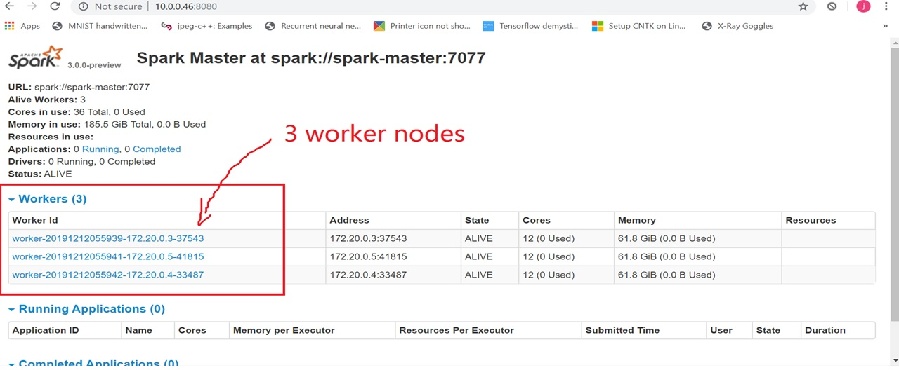

For all the docker containers used in the class, they are available for download

#### Setup Hadoop, Hive and Spark on Linux

#### Setup Hadoop

You can also choose Linux non docker setup to setup Hadoop, Hive and Spark, read on:

#### Install JDK 

Download JDK 8, for example, 

I downloaded: jdk-8u202-linux-x64.tar.gz

Do below:

cd ~/

mkdir java

cd java

tar -xvzf jdk-8u202-linux-x64.tar.gz

cd jdk1.8.0\_202

pwd

/home/bigdata2/java/jdk1.8.0\_202

This is JAVA\_HOME, in my example, JAVA\_HOME=/home/bigdata2/java/jdk1.8.0\_202

vi ~/.bashrc, append following in the end of file ~/.bashrc, in my JAVA\_HOME:

export JAVA\_HOME= =/home/bigdata2/java/jdk1.8.0\_202

export PATH=$JAVA\_HOME/bin:$PATH

Save and exit vi

Run

source ~/.bashrc or log out and log back in.

Now run to confirm

java –version

javac -version

#### Hadoop setup.

Create hadoop folder:

cd ~/

mkdir hadoop

cd hadoop

Download hadoop binary. In this class, we choose Hadoop 2.7.7 for compatibility with Spark, expand the tar.gz.

wget https://archive.apache.org/dist/hadoop/common/hadoop-2.7.7/hadoop-2.7.7.tar.gz

 tar -xvzf hadoop-2.7.7.tar.gz

 cd hadoop-2.7.7

pwd

/home/bigdata2/hadoop/hadoop-2.7.7

This is the HADOOP\_HOME, in my case, HADOOP\_HOME=/home/bigdata2/hadoop/hadoop-2.7.7

Add below lines in ~/.bashrc file

\#\# HADOOP env variables

export HADOOP\_HOME=/home/bigdata2/hadoop/hadoop-2.7.7

export HADOOP\_COMMON\_HOME=$HADOOP\_HOME

export HADOOP\_HDFS\_HOME=$HADOOP\_HOME

export HADOOP\_MAPRED\_HOME=$HADOOP\_HOME

export HADOOP\_YARN\_HOME=$HADOOP\_HOME

export HADOOP\_OPTS="-Djava.library.path=$HADOOP\_HOME/lib/native"

export HADOOP\_COMMON\_LIB\_NATIVE\_DIR=$HADOOP\_HOME/lib/native

export PATH=$PATH:$HADOOP\_HOME/sbin:$HADOOP\_HOME/bin

Then run

source ~/.bashrc or log out and log back in

#### Hadoop configuration:

We need to add a new host name in /etc/hosts, called hadoop.master.lan, in my case:

cat /etc/hosts

…

10.0.0.46 master.hadoop.lan

You need to specify your IP address, not copy 10.0.0.46 in this slide.  Run “ifconfig” to find out the IP address of your host.

Now, configure ssh key based authentication for hadoop account by running the below commands \(replace the hostname or FQDN against the ssh-copy-id command accordingly\).

Also, leave the passphrase filed blank in order to automatically login via ssh.

$ ssh-keygen -t rsa

$ ssh-copy-id master.hadoop.lan

You will see something similar to below:

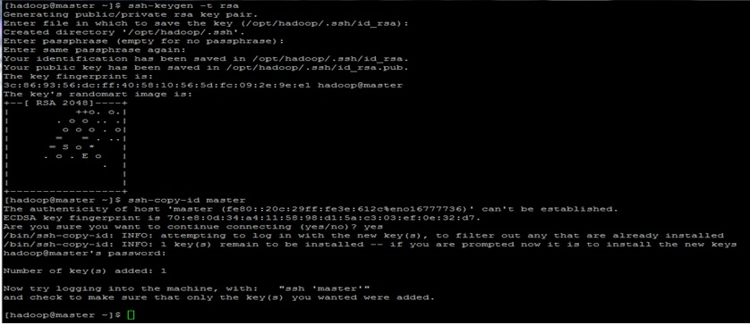

You can test

ssh master.hadoop.lan

You should be able to log in by ssh without password

Continue configure Hadoop:

Hadoop configuration files are located in $HADOOP\_HOME/etc/hadoop folder. Therefore, cd to it

#### $HADOOP\_HOME/etc/hadoop

cd $HADOOP\_HOME[Setup Elipcse Scala IDE](https://app.gitbook.com/@george-jen/s/spark/~/drafts/-M18d7sI3yKXVibSPQQh/setup/untitled#setup-elipcse-scala-ide)/etc/hadoop

Setup slave, place hostname of the slave nodes are, in this case, same hostname because slave is on the same machione.

vi slaves:

localhost

The first to edit is core-site.xml file. This file contains information about the port number used by Hadoop instance, file system allocated memory, data store memory limit and the size of Read/Write buffers.

$ vi etc/hadoop/core-site.xml

Add the following properties between &lt;configuration&gt; ... &lt;/configuration&gt; tags. Use localhost or your machine FQDN, such as hadoop.master.lan for hadoop instance.

&lt;property&gt;

&lt;name&gt;fs.defaultFS&lt;/name&gt;

&lt;value&gt;hdfs://master.hadoop.lan:9000/&lt;/value&gt;

&lt;/property&gt;  

Next open and edit hdfs-site.xml file. The file contains information about the value of replication data, namenode path and datanode path for local file systems.

$ vi etc/hadoop/hdfs-site.xml

Here add the following properties between &lt;configuration&gt; ... &lt;/configuration&gt; tags. On this guide we’ll use /mnt/common/hdfs/ directory to store our hadoop file system.

Replace the dfs.data.dir and dfs.name.dir values accordingly.

&lt;property&gt;

&lt;name&gt;dfs.data.dir&lt;/name&gt;

&lt;value&gt;file:///mnt/common/hdfs/datanode&lt;/value&gt;

&lt;/property&gt;

 &lt;property&gt;

&lt;name&gt;dfs.name.dir&lt;/name&gt;

&lt;value&gt;file:///mnt/common/hdfs/namenode&lt;/value&gt;

&lt;/property&gt;

Because we’ve specified  /mnt/common/hdfs/  as our hadoop file system storage, we need to create those two directories \(datanode and namenode\) from root account and grant all permissions to hadoop account, or whatever the user name that has installed hadoop by executing the below commands.

$ su root

\# mkdir -p /mnt/common/hdfs/namenode

\# mkdir -p /mnt/common/hdfs/datanode

In my case, the user that has installed hadoop is bigdata2

\# chown -R bigdata2:bigdata2 /mnt/common/hdfs/

\# ls -al /opt/ \#Verify permissions

\# exit

\#Exit root account to turn back to bigdata2 user

Please replace user bigdata2 with your user name, do NOT copy bigdata2 user name in this slide.

Next, create the mapred-site.xml file to specify that we are using yarn MapReduce framework.

$ vi etc/hadoop/mapred-site.xml

Add the following excerpt to mapred-site.xml file:

&lt;?xml version="1.0"?&gt; &lt;?xml-stylesheet type="text/xsl" href="configuration.xsl"?&gt;

&lt;configuration&gt;

&lt;property&gt;

&lt;name&gt;mapreduce.framework.name&lt;/name&gt;

&lt;value&gt;yarn&lt;/value&gt;

&lt;/property&gt; &lt;/configuration&gt;

Now, edit yarn-site.xml file with the below statements enclosed between &lt;configuration&gt; ... &lt;/configuration&gt; tags:

$ vi etc/hadoop/yarn-site.xml

Add the following excerpt to yarn-site.xml file:

&lt;property&gt;

&lt;name&gt;yarn.nodemanager.aux-services&lt;/name&gt;

&lt;value&gt;mapreduce\_shuffle&lt;/value&gt;

&lt;/property&gt;

You should see something like below:

\(base\) bigdata2@bigdata2:~/hadoop/hadoop-2.7.7/etc/hadoop$ cat yarn-site.xml

&lt;?xml version="1.0"?&gt;

&lt;!--

  Licensed under the Apache License, Version 2.0 \(the "License"\);

  you may not use this file except in compliance with the License.

  You may obtain a copy of the License at

    http://www.apache.org/licenses/LICENSE-2.0

  Unless required by applicable law or agreed to in writing, software

  distributed under the License is distributed on an "AS IS" BASIS,

  WITHOUT WARRANTIES OR CONDITIONS OF ANY KIND, either express or implied.

  See the License for the specific language governing permissions and

  limitations under the License. See accompanying LICENSE file.

--&gt;

&lt;configuration&gt;

&lt;!-- Site specific YARN configuration properties --&gt;

&lt;property&gt;

&lt;name&gt;yarn.nodemanager.aux-services&lt;/name&gt;

&lt;value&gt;mapreduce\_shuffle&lt;/value&gt;

&lt;/property&gt;

&lt;/configuration&gt;

set Java home variable for Hadoop environment by editing the below line from hadoop-env.sh file.

$ vi $HADOOP\_HOME/etc/hadoop/hadoop-env.sh

Edit the following line to point to your Java system path.

export JAVA\_HOME=/home/bigdata2/java/jdk1.8.0\_202

#### HDFS

Once hadoop single node cluster has been setup it’s time to initialize HDFS file system by formatting the /mnt/common/hdfs/namenode storage directory with the following command:

$ hdfs namenode -format

Now ready to start Hadoop instance.  Before starting, recommend you to log out and log back in to update the environment variables.

#### Start Hadoop:

start-dfs.sh

start-yarn.sh

Or below command start both above:

To check Hadoop instance, run:

jps

4992 SecondaryNameNode

4517 NameNode

5179 ResourceManager

4700 DataNode

5532 NodeManager

59982 jps

This Hadoop instance has 5 java processes:

yarn processes:

NodeManager

ResourceManager

NameNode, SecondaryNameNode are name node, which is master node

DataNode

#### Work with Hadoop and HDFS file system

cd $HADOOP\_HOME

Create a directory on the hdfs file system \(not your local OS file system\)

 hdfs dfs -mkdir /mydir

There is LICENSE.txt in $HADOOP\_HOME directory, copy it into hdfs file system /mydir 

hdfs dfs -put LICENSE.txt /mydir

You can check the existence of the LICENSE.txt in hdfs file system directory /mydir

hdfs dfs -ls /mydir

 After done playing, clean it up:

 hdfs dfs -rm /mydir/\*

 hdfs dfs -rmdir /mydir

You can show the full list of hdfs command by

hdfs dfs -help

When hadoop instance is running, you can connect to default port 50070 on the name node by \(in my host name\) to see information about the name node:

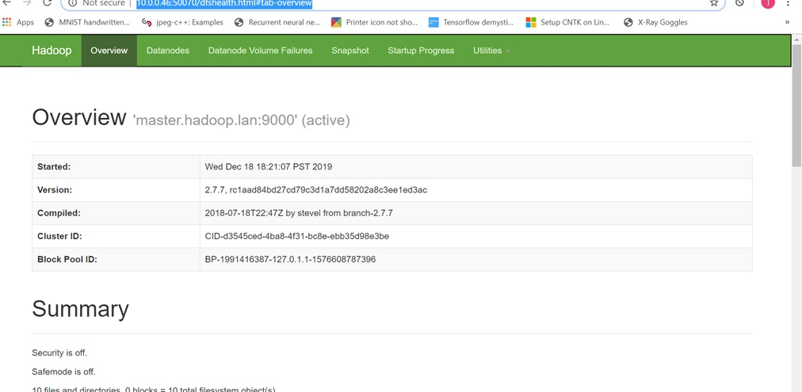

You can see Hadoop cluster wide map reduce jobs stats by connect to port 8088 by http:

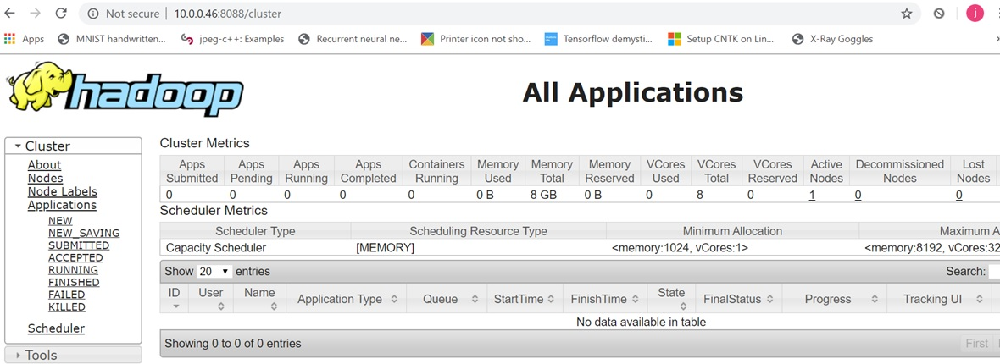

#### Install Hive:

Create a hive directory:

cd ~

mkdir hive

cd hive

Download hive \(in this class, we download hive 3.1.2\), expand hive tar.gz, change name to hive

wget [http://mirrors.ocf.berkeley.edu/apache/hive/hive-3.1.2/apache-hive-3.1.2-bin.tar.gz](http://mirrors.ocf.berkeley.edu/apache/hive/hive-3.1.2/apache-hive-3.1.2-bin.tar.gz)

tar -xvzf ./apache-hive-3.1.2-bin.tar.gz

mv apache-hive-3.1.2-bin hive

cd hive

#### hive home

This is the HIVE\_HOME directory, in my example,  

HIVE\_HOME=/home/bigdata2/hive/hive

pwd /home/bigdata2/hive/hive

Append HIVE\_HOME and hive path to ~/.bashrc, recommend log out and log back in.

export HIVE\_HOME=/home/bigdata2/hive/hive

export PATH=$HIVE\_HOME/bin:$PATH

After log out and log back in, need to create hdfs directory that will host HIVE tables:

 hdfs dfs -mkdir /tmp

 hdfs dfs -mkdir /user

 hdfs dfs -mkdir /user/hive

 hdfs dfs -mkdir /user/hive/warehouse

hdfs dfs -chmod g+w /user/hive/warehouse

hdfs dfs -chmod g+w /tmp

#### Initialize hive schema

schematool -dbType derby -initSchema –verbose

Now you can start use HIVE, which table data are stored on hdfs file system we created earlier.

#### Start hive metastore service.

cd $HIVE\_HOME

hive --service metastore &

Recommend to start it in the background with nohup, which will keep the background process alive even disconnect the ssh window

cd $HIVE\_HOME

nohup hive --service metastore &

Now you can start use HIVE, which table data are stored on hdfs file system we created earlier.

First, start hive metastore service.

cd $HIVE\_HOME

hive --service metastore &

Recommend to start it in the background with nohup, which will keep the background process alive even disconnect the ssh window

cd $HIVE\_HOME

nohup hive --service metastore &

#### Hive client

Then you can launch hive client by:

hive

Logging initialized using configuration in jar:file:/home/bigdata2/hive/hive/lib/hive-common-3.1.2.jar!/hive-log4j2.properties Async: true

Hive Session ID = dda0a3f1-6f8b-4c8b-b565-ddc37cf14b89

Hive-on-MR is deprecated in Hive 2 and may not be available in the future versions. Consider using a different execution engine \(i.e. spark, tez\) or using Hive 1.X releases.

hive&gt; show tables;

OK

x

Time taken: 0.45 seconds, Fetched: 1 row\(s\)

#### Setup Apache Spark

cd ~/

mkdir spark

cd spark

Download spark binary, in our class, we use spark 3.0.0 preview with compatibility to hadoop 2.7, which we already have hadoop 2.7 instance up and running.

wget [http://apache-mirror.8birdsvideo.com/spark/spark-3.0.0-preview/spark-3.0.0-preview-bin-hadoop2.7.tgz](http://apache-mirror.8birdsvideo.com/spark/spark-3.0.0-preview/spark-3.0.0-preview-bin-hadoop2.7.tgz)

Unpack

tar -xvzf spark-3.0.0-preview-bin-hadoop2.7.tgz

Create a shorter name by soft link:

ln -s spark-3.0.0-preview-bin-hadoop2.7 spark

cd spark

#### spark home

Now you are in SPARK\_HOME

In my example, SPARK\_HOME=/home/bigdata2/spark/spark

Append following in ~/.bashrc

export SPARK\_HOME=/home/bigdata2/spark/spark

export PATH=$SPARK\_HOME/bin:$PATH

Log out and log back in.

Now you are ready for works on sparks that will integrate with Hadoop and Hive

Before start spark master service, set following environment manually on command line

export LD\_LIBRARY\_PATH=$HADOOP\_HOME/lib/native

To start SPARK cluster, run:

$SPARK\_HOME/sbin/start-all.sh

Once spark cluster that has master and worker nodes \(in our cluster, Spark master and worker nodes are on the same machine. You can see spark cluster information by connect to the server at port 8080

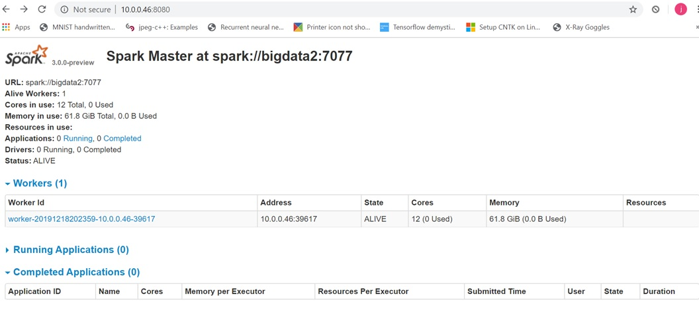

Now the environment is ready for you to start develop spark code on your development workstation and deploy your code to the spark cluster that will run it.

Working on Apache Spark means lots of coding with APIs provided by Apache Spark libraries that include SQL, Machine Learning, Streaming and Graph computing.

Spark supports Scala, Python, Java and R.

In our class, we will only focus on Scala and Python for all hands-on programming.

## Python 3 Crash Course

Python 3 crash courses \(We will spend time on Python crash course live in the class and video\):

Basics

Sequence/Collection/Iterable

Flow Control

Functions

Data Structures

Input/Output

### Basics

Numbers:

&gt;&gt;&gt; 2 + 2

4

&gt;&gt;&gt; 50 - 5\*6

20

&gt;&gt;&gt; \(50 - 5\*6\) / 4

5.0

&gt;&gt;&gt; 8/5  \# division always returns a floating-point number

1.6

### Iterables/Collections

String “hello” or ‘hello’

List  \[‘h’,’e’,’l’,’l’,’o’\]  or \[1,2,3,4,5\]

Tuple  \(1,2,3,4,4\)

Set {1,2,3,4}

Dictionary 

#### Strings:

NOT mutable, change a string variable result in a new string

Need single or double quotes “” or ‘’ to enclose,  for example:  “Hello World” or ‘Hello World’, case sensitive

String is a sequence, iterable

s=‘abc’

s\[0\]=“a”

s\[1\]=“b”

s\[2\]=“c”

It is zero based indexing, index starts from zero

String can be iterated through:

for i in “abc”:

    print\(i\)

Convert to string, use function str\(\)

For example:

n=12345

str\(n\) becomes “12345”

String is an object, meaning it has methods and attributes that can be invoked

To see all methods, type

help\(&lt;string variable&gt;\)

In Jupyter notebook, to see list of methods or attributes

Press shift key after enter &lt;string variable&gt;.

Strings are can be in single quote \(‘\) or double quotes \(“\)

&gt;&gt;&gt; 'spam eggs'  \# single quotes

'spam eggs’

&gt;&gt;&gt; 'doesn\'t'  \# use \' to escape the single quote...

"doesn’t”

&gt;&gt;&gt; "doesn't"  \# ...or use double quotes instead

"doesn’t”

&gt;&gt;&gt; '"Yes," they said.'

'"Yes," they said.’

&gt;&gt;&gt; "\"Yes,\" they said."

'"Yes," they said.’

&gt;&gt;&gt; '"Isn\'t," they said.'

'"Isn\'t," they said.’

&gt;&gt;&gt;”Hello”+” World” Hello World

Strings can be indexed \(subscripted\), with the first character having index 0. There is no separate character type; a character is simply a string of size one:

&gt;&gt;&gt;Word=“Hello World”

&gt;&gt;&gt;Word\[0\]

‘H’

&gt;&gt;&gt;Word\[9\]

‘d’

&gt;&gt;&gt;Word\[-1\]

‘d’

&gt;&gt;&gt;Word\[-11\]

‘H’

&gt;&gt;&gt;Word\[0:\]

‘Hello World’

&gt;&gt;&gt;Word\[:9\]

‘Hello Worl’ \#character at index 9 is not included.

#### List:

Mutable, list can be modified

List needs to be in square bracket \[\], for example:  \[1,2,3,4,5\] or \[‘a’,’b’,’c’\] or \[1,2,3,’a’,’b’,’10’\]

List is a sequence, iterable

l=\[‘a’,’b’,’c’\]

l\[0\]=“a”

l\[1\]=“b”

l\[2\]=“c”

It is zero based indexing, index starts from zero

List can be iterated through:

for i in l:

    print\(i\)

Convert to List, use function list\(\)

For example:

n=12345

list\(n\) becomes \[1,2,3,4,5\]

List is an object, meaning it has methods and attributes that can be invoked

To see all methods, type

help\(&lt;list variable&gt;\)

In Jupyter notebook, to see list of methods or attributes

Press shift key after enter &lt;list variable&gt;.

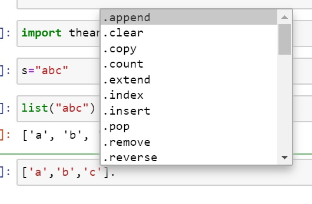

&gt;&gt;&gt; squares = \[1, 4, 9, 16, 25\]

&gt;&gt;&gt; squares

\[1, 4, 9, 16, 25\]

&gt;&gt;&gt; squares\[0\]  \# indexing returns the item

1

&gt;&gt;&gt; squares\[-1\]

25

&gt;&gt;&gt; squares\[-3:\]  \# slicing returns a new list

\[9, 16, 25\]

&gt;&gt;&gt; squares\[:\]

\[1, 4, 9, 16, 25\]

&gt;&gt;&gt; squares + \[36, 49, 64, 81, 100\]

\[1, 4, 9, 16, 25, 36, 49, 64, 81, 100\]

cubes = \[1, 8, 27, 65, 125\]  \# something's wrong here

&gt;&gt;&gt; 4 \*\* 3  \# the cube of 4 is 64, not 65!

64

&gt;&gt;&gt; cubes\[3\] = 64  \# replace the wrong value

&gt;&gt;&gt; cubes \[1, 8, 27, 64, 125\]

&gt;&gt;&gt; cubes.append\(216\)  \# add the cube of 6

&gt;&gt;&gt; cubes.append\(7\*\*3\)  \# and the cube of 7

&gt;&gt;&gt; cubes

\[1, 8, 27, 64, 125, 216, 343\]

&gt;&gt;&gt; letters = \['a', 'b', 'c', 'd', 'e', 'f', 'g'\]

&gt;&gt;&gt; letters

\['a', 'b', 'c', 'd', 'e', 'f', 'g'\]

&gt;&gt;&gt; \# replace some values

&gt;&gt;&gt; letters\[2:5\] = \['C', 'D', 'E'\]

&gt;&gt;&gt; letters

\['a', 'b', 'C', 'D', 'E', 'f', 'g'\]

&gt;&gt;&gt; \# now remove them

&gt;&gt;&gt; letters\[2:5\] = \[\]

&gt;&gt;&gt; letters

\['a', 'b', 'f', 'g'\]

&gt;&gt;&gt; \# clear the list by replacing all the elements with an empty list

&gt;&gt;&gt; letters\[:\] = \[\]

&gt;&gt;&gt; letters

\[\]

&gt;&gt;&gt; letters = \['a', 'b', 'c', 'd'\]

&gt;&gt;&gt; len\(letters\)

4

&gt;&gt;&gt; a = \['a', 'b', 'c'\]

&gt;&gt;&gt; n = \[1, 2, 3\]

&gt;&gt;&gt; x = \[a, n\]

&gt;&gt;&gt; x

\[\['a', 'b', 'c'\], \[1, 2, 3\]\]

&gt;&gt;&gt; x\[0\]

\['a', 'b', 'c'\]

&gt;&gt;&gt; x\[0\]\[1\]

‘b’

\# Fibonacci series:

\# the sum of two elements defines the next

a, b = 0, 1

fib=\[\]

while True:

\#    print\(a\)

    if len\(fib\)&gt;=10:

        break

    else:

        fib.append\(a\)

        a, b = b, a+b print\(fib\[-1\]\)

#### Tuple:

immutable, tuple can not be modified. Modify a tuple variable result in a new tuple.

Tuple usually is in parentheses \(\), for example:  \(1,2,3,4,5\) or \(‘a’,’b’,’c’\) or \(1,2,3,’a’,’b’,’10’\)

However, parentheses is not indicative to tuple, comma is.  Tuple must have comma.

Like list, tuple is a sequence, iterable

t=\(‘a’,’b’,’c’\)

t\[0\]=“a”

t\[1\]=“b”

t\[2\]=“c”

It is zero based indexing, index starts from zero

List can be iterated through:

for i in t:

    print\(i\)

Convert to List, use function tuple\(\)

For example:

n=12345

tuple\(n\) becomes \(1,2,3,4,5\)

Tuple is an object, meaning it has methods and attributes that can be invoked

To see all methods, type

help\(&lt;tuple variable&gt;\)

In Jupyter notebook, to see list of methods or attributes

Press shift key after enter &lt;tuple variable&gt;.

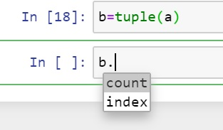

#### Dictionary:

mutable, dictionary can be modified.

Dicitonary is a collection of key value pairs, for example:  {‘a’:1,’b’:2,’c’:3}

Dicitonary keys is a sequence, iterable

d={‘a’:1,’b’:2,’c’:3}

for i in d.keys\(\):

    print\(i\)

d\[‘a’\] is 1, d\[‘b’\] is 2, d\[‘c’\] is 3

Convert to List, use function dict\(\)

d=dict\(a=1,b=2,c=3\)

Above is the same as

d={‘a’:1,’b’:2,’c’:3}

Dictionary is an object, meaning it has methods and attributes that can be invoked

To see all methods, type

help\(&lt;dictionary variable&gt;\)

In Jupyter notebook, to see list of methods or attributes

Press shift key after enter &lt;tuple variable&gt;.

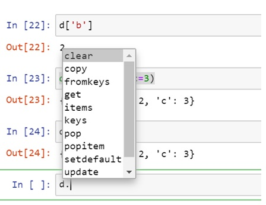

#### Set

Mutable collection data type.  Set can be modified.

Set has unique features:

Set does not contain duplicate elements, every element in a set is unique

Membership testing against a set \(search if a value is an element of a set\) is hashmap, existence meaning search against a set is faster than against a list, which is linear search.

Example:

s={1,2,3,4,5,5}

You notice there are two 5s

When you print out s, you only see one 5, which is

{1, 2, 3, 4, 5}

You can convert a list to a set by using function set\(\), by doing so, you eliminate duplicate elements

l=\[1,2,3,4,5,5\]

set\(l\)

l=\[1,2,3,4,5,5\]

set\(l\)

{1, 2, 3, 4, 5}

To create an empty set, use function set\(\)

s=set\(\)

To add an element ‘a’ into s:

s.add\(‘a’\)

To delete element ‘a’ from s:

s.remove\(‘a’\)

### Flow Control:

#### Conditional statement

if &lt;condition&gt;:

    \#True here

    statements

elif &lt;condition&gt;:

    \#True here

    statements

…

else:

     \#Catch all other here

     statements

Example:

if a\['a'\]==1:

    print\('yes'\)

elif a\['a'\]==2:

    print\('no'\)

else:

    print\('unknown'\)

#### Loop statement -- For statement:

&gt;&gt;&gt; \# Measure some strings:

... words = \['cat', 'window', 'defenestrate'\]

&gt;&gt;&gt; for w in words:

...       print\(w, len\(w\)\)

...

cat 3

window 6 

defenestrate 12

&gt;&gt;&gt; for i in range\(5\):

    print\(i\)

range\(5, 10\)

   5, 6, 7, 8, 9

range\(0, 10, 3\)

   0, 3, 6, 9

range\(-10, -100, -30\)

  -10, -40, -70

&gt;&gt;&gt; a = \['Mary', 'had', 'a', 'little', 'lamb'\]

&gt;&gt;&gt; for i in range\(len\(a\)\):

...       print\(i, a\[i\]\)

### Functions and methods:

Python functions or methods return or do not have to return values

def fib\(n\):    \# write Fibonacci series up to n

    a, b = 0, 1

    while a&lt;n:

        print\(a, end=' '\)

        a,b = b,a+b

        print\(""\)

fib\(10\)

0

1

1

2

3

5 

8

Common functions:

#### map\(func\) and filter\(func\)

Both are first class functions.  First class functions take function as input parameter or output as function.

#### map and filter takes function as input.

#### lambda

lambda functions are nameless function.  lambda functions are usually one line functions.  lambda functions are usually used as input parameter to map and filter function.

For example:

Make every element of list \[1,2,3,4,5\] square

list\(map\(lambda x: x\*\*2,\[1,2,3,4,5\]\)\)

Output:

\[1, 4, 9, 16, 25\]

Filter out odd element, only keep even element of a list

list\(filter\(lambda x:  x%2==0, \[1,2,3,4,5\]\)\)

It output below:

\[2,4\]

#### Data structure:

Besides list, tuple, string, dictionary, set are data structure, you can define class that has attributes

For example

class car\(object\):

    wheel\_number=4

    seal\_row\_number=2

    def \_\_init\_\_\(self,brand\):

        self.brand=brand

wheel\_number, seal\_row\_number are class attributes, class attributes can be of any data type, include

list, tuple, string, dictionary and set

You notice class can also have methods, \_\_init\_\_ is called constructor method, it runs when instantiating a class, for example

small\_car=car\("toyota"\)

small\_car.brand

'toyota’

small\_car.seal\_row\_number

2

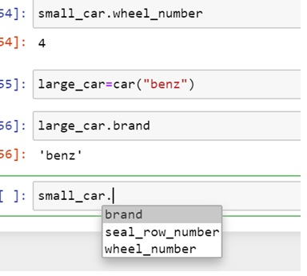

#### Input and if statement:

&gt;&gt;&gt; x = int\(input\("Please enter an integer: "\)\)

Please enter an integer: 42

&gt;&gt;&gt; if x &lt; 0:

...     x = 0

...     print\('Negative changed to zero'\)

... elif x == 0:

...     print\('Zero'\)

... elif x == 1:

...     print\('Single'\)

... else:

...     print\('More'\) ...

#### Input from a file:

\(base\) dv6@dv6:/tmp$ cat test.txt

1 2 3 4 5

6 7 8 9 10

with open\('/tmp/test.txt','r'\) as fp:

    while True:

        line=fp.readline\(\)

        if line:

            line=line.strip\('\n'\)

            print\(line.split\(' '\)\)

        else:

            break

It outputs below:

\['1', '2', '3', '4', '5'\]

\['6', '7', '8', '9', '10'\] 

\[''\]

#### Output to a file:

with open\('/tmp/test.out','w'\) as fp:

    for i in range\(5\):

        fp.write\(str\(i\)\)

It writes into file /tmp/test.out below:

%cat /tmp/test.out

01234

That is enough to start working application development with Spark with Python and will continue have on demand Python crash courses whenever needed during developing Spark application using PySpark

## Scala Crash Courses

#### Scala Crash Exercises:

#### Type of Variable:

#### Mutable and Immutable:

Immutable Variable, contents can only be assigned initially, can not be modified

val x: String=“Jack”

val numbers: Int = 10

val pi: Float=3.14

Mutable Variable:

var x: String=“Dave:

x=“John”

var num: Int=1

Num=2

var pi=3.14

pi=3.1416

Block statements together:

println\({

  val x = 1 + 1

  x + 1

}\) // 3

Function:

\(x: Int\) =&gt; x + 1

val addOne = \(x: Int\) =&gt; x + 1

println\(addOne\(1\)\) // 2

val add = \(x: Int, y: Int\) =&gt; x + y

println\(add\(1, 2\)\) // 3

#### Methods:

def add\(x: Int, y: Int\): Int = x + y

println\(add\(1, 2\)\) // 3

def addThenMultiply\(x: Int, y: Int\)\(multiplier: Int\): Int = \(x + y\) \* multiplier

println\(addThenMultiply\(1, 2\)\(3\)\) // 9

def getSquareString\(input: Double\): String = {

  val square = input \* input

  square.toString

}

println\(getSquareString\(2.5\)\) // 6.25

The last expression in the body is the method’s return value

#### Class:

class Greeter\(prefix: String, suffix: String\) {

  def greet\(name: String\): Unit =

    println\(prefix + name + suffix\)

}

val greeter = new Greeter\("Hello, ", "!"\)

greeter.greet\("Scala developer"\) // Hello, Scala developer!

Case Class \(You can instantiate case classes without the new keyword:\)

case class Point\(x: Int, y: Int\)

val point = Point\(1, 2\)

val anotherPoint = Point\(1, 2\)

val yetAnotherPoint = Point\(2, 2\)

if \(point == anotherPoint\) {

  println\(point + " and " + anotherPoint + " are the same."\)

} else {

  println\(point + " and " + anotherPoint + " are different."\)

} // Point\(1,2\) and Point\(1,2\) are the same.

if \(point == yetAnotherPoint\) {

  println\(point + " and " + yetAnotherPoint + " are the same."\)

} else {

  println\(point + " and " + yetAnotherPoint + " are different."\)

} // Point\(1,2\) and Point\(2,2\) are different.

#### Objects

Objects are single instances of their own definitions.

object IdFactory {

  private var counter = 0

  def create\(\): Int = {

    counter += 1

    counter

  }

}

val newId: Int = IdFactory.create\(\)

println\(newId\) // 1

val newerId: Int = IdFactory.create\(\)

println\(newerId\) // 2

#### Trait

Traits are abstract data types containing certain fields and methods.

trait Greeter {

  def greet\(name: String\): Unit =

    println\("Hello, " + name + "!"\)

}

class DefaultGreeter extends Greeter

class CustomizableGreeter\(prefix: String, postfix: String\) extends Greeter {

  override def greet\(name: String\): Unit = {

    println\(prefix + name + postfix\)

  }

}

val greeter = new DefaultGreeter\(\)

greeter.greet\("Scala developer"\) // Hello, Scala developer!

val customGreeter = new CustomizableGreeter\("How are you, ", "?"\)

customGreeter.greet\("Scala developer"\) // How are you, Scala developer?

In Scala, a tuple is a value that contains a fixed number of elements, each with a distinct type. Tuples are immutable.

val ingredient = \("Sugar" , 25\)

println\(ingredient.\_1\) // Sugar

println\(ingredient.\_2\) // 25

ingredient.getClass //res0: Class\[\_ &lt;: \(String, Int\)\] = class scala.Tuple2

val ingredient1 = \("Sugar" , 25,30\)

ingredient1.getClass //res1: Class\[\_ &lt;: \(String, Int, Int\)\] = class scala.Tuple3

abstract class A {

  val message: String

}

class B extends A {

  val message = "I'm an instance of class B"

}

trait C extends A {

  def loudMessage = message.toUpperCase\(\)

}

class D extends B with C

val d = new D

println\(d.message\)  // I'm an instance of class B

println\(d.loudMessage\)  // I'M AN INSTANCE OF CLASS B

### Working with Apache Spark

That is enough to start working application development with Spark with Scala and will continue have on demand Scala crash courses whenever needed during developing Spark application using Scala

We will first write code in Python and Scala to be running on the development workstation.  Mine is Wondows 10, yours can be Windows 10 or Mac.

First thing, suppress the information logging when running code on Spark:

To %SPARK\_HOME%\conf\

Rename the configuration template file from

Rename log4j.properties.template to log4j.properties

Edit log4j.properties, change “log4j.rootCategory=INFO, console” to “log4j.rootCategory=ERROR, console”

\#log4j.rootCategory=INFO, console

log4j.rootCategory=ERROR, console

The above will turn off logging message from Spark unless  there is error.

#### Run a program to estimate PI, which is 3.14592…

#### First Scala code with Apache Spark using  Eclipse IDE

Start Eclipse Scala Plug-ins, click New-&gt;Scala Project

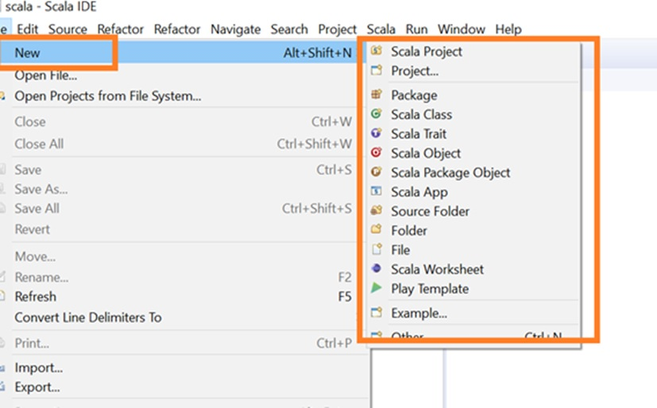

Enter Spark, click Finish

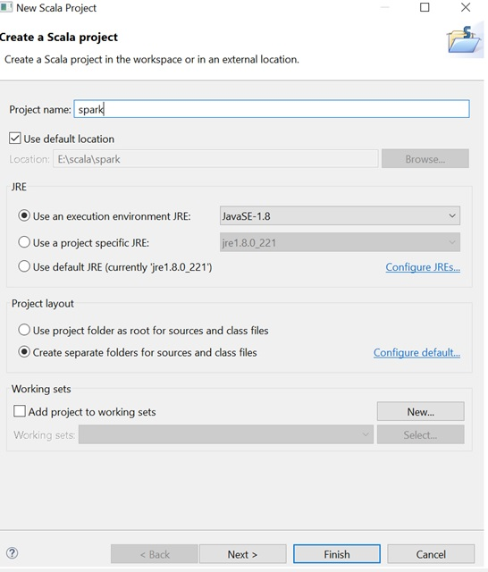

Right click Project name spark you just created, click New-&gt;Package

Enter the name of Package: using reverse domain name, like below, click Finish

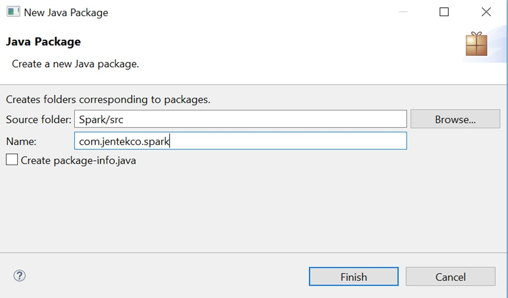

Right mouse click Package name, select New-&gt;Scala Object, enter reverse domain name+name of object which is pi in this instance, click Finish

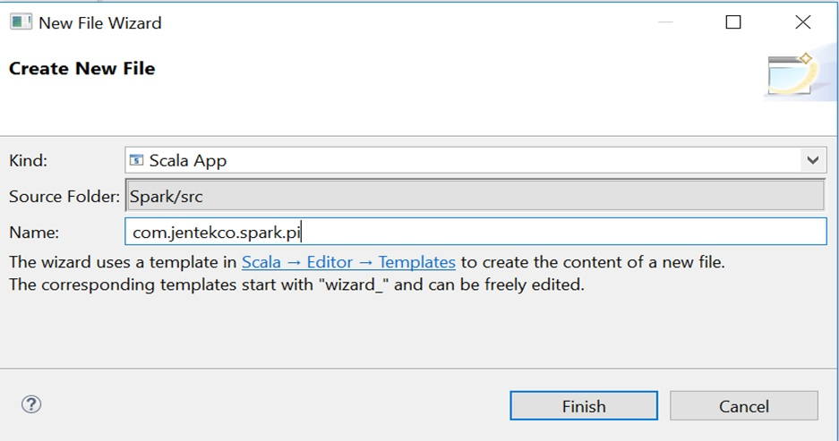

Copy below code after the package line, in my example, “package com.jentekco.spark”

import scala.math.random

import org.apache.spark.\_

import org.apache.log4j.\_

import org.apache.spark.sql.SparkSession

object pi {

    def main\(args: Array\[String\]\): Unit = {

    Logger.getLogger\("org"\).setLevel\(Level.ERROR\)

    val spark = SparkSession

      .builder

      .master\("local"\)

      .appName\("Spark Pi"\)

      .getOrCreate\(\)

    val slices = if \(args.length &gt; 0\) args\(0\).toInt else 2

    val n = math.min\(100000L \* slices, Int.MaxValue\).toInt // avoid overflow

    val count = spark.sparkContext.parallelize\(1 until n, slices\).map { i =&gt;

      val x = random \* 2 - 1

      val y = random \* 2 - 1

      if \(x\*x + y\*y &lt;= 1\) 1 else 0

    }.reduce\(\_ + \_\)

    println\(s"Pi is roughly ${4.0 \* count / \(n - 1\)}"\)

    spark.stop\(\)

  } }

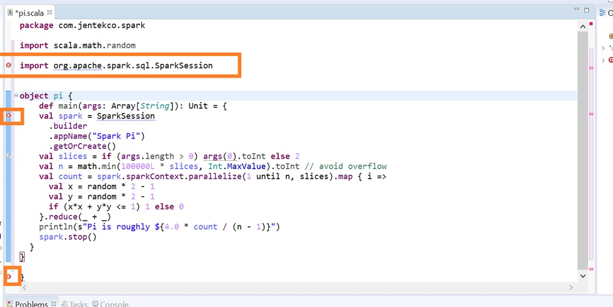

To fix it, right click project spark, choose Properties,

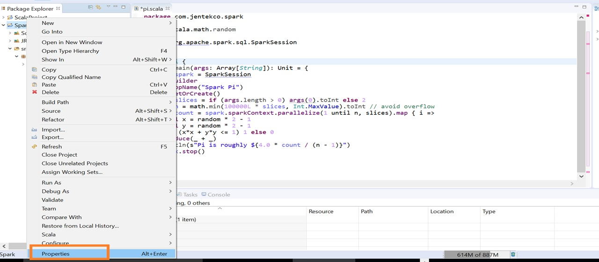

Choose Java Build Path-&gt;Add External JARS

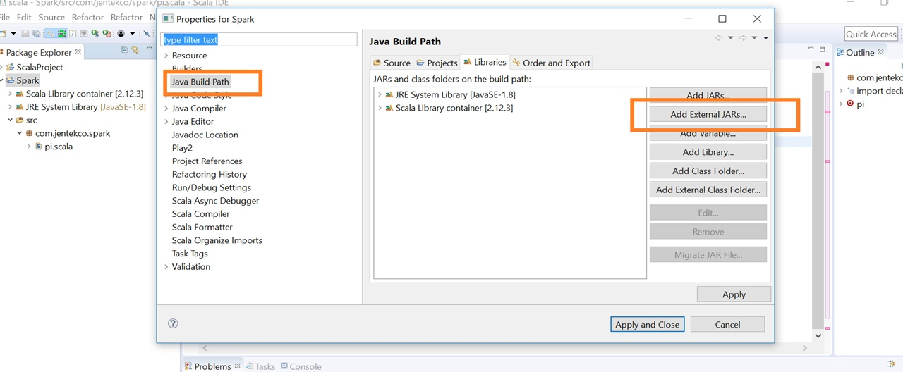

Navigate to the SPARK Home folder, jars sub folder, select all jar files, then click Open

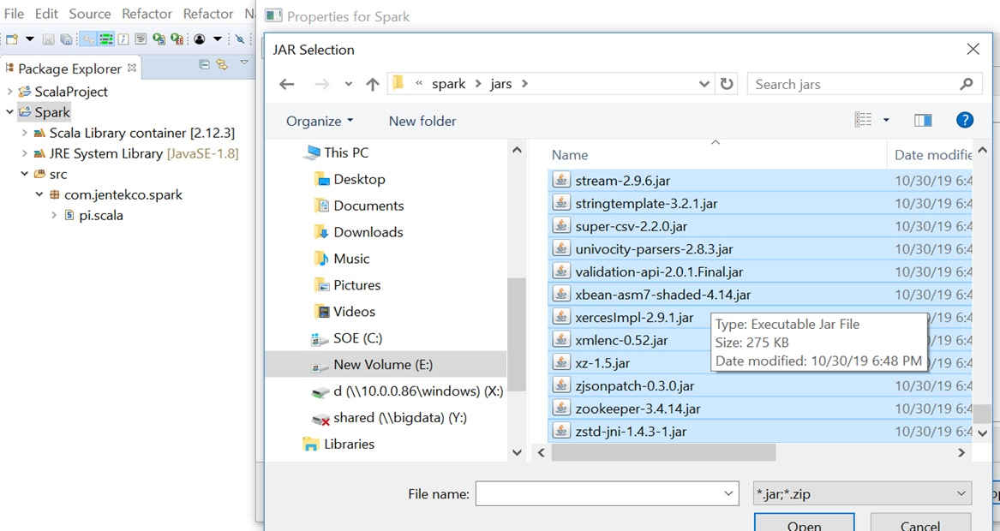

Then the errors go away, Scala code is compiled successfully.

To run the Scala pi program, click Run-&gt;Run Configuration.  In the Name field, enter pi,

in the Project field, enter Spark, in the Main class field, in my example, I enter com.jentekco.spark.pi

Then click Run

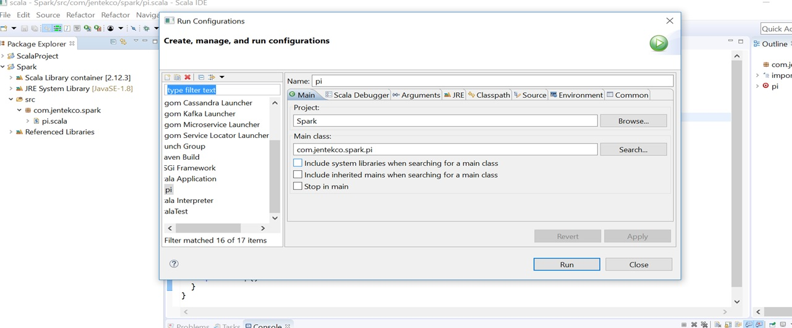

See output in the Console: “Pi is roughly 3.144195720978605”

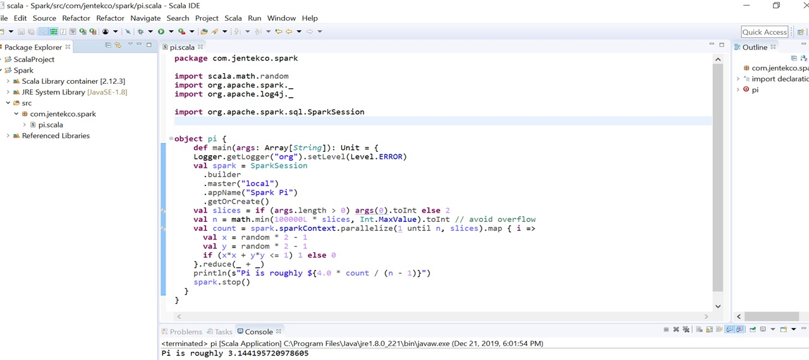

Now that you have done your development and test of the scala project, you need to make a jar file to be deployed to the production. Right mouse click on spark, select Export

Choose JAR file and click Next

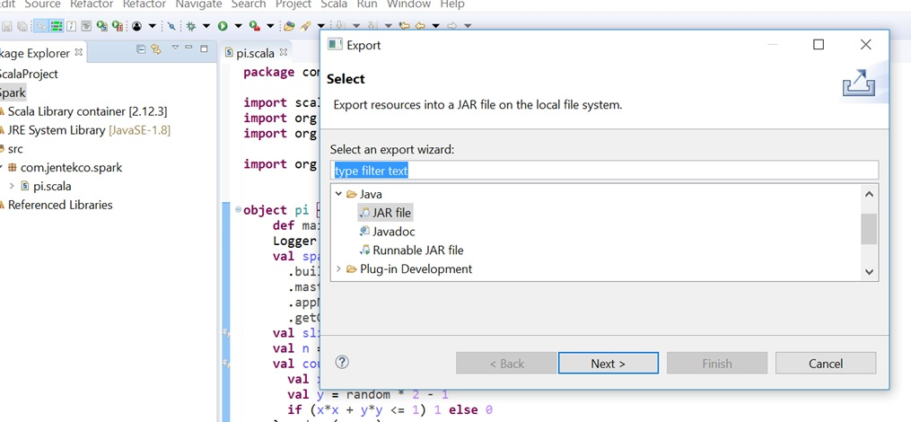

Under the resource to export, select the right project, in this case, spark

Choose proper folder to export pi.jar using Browse button, click Finish when done

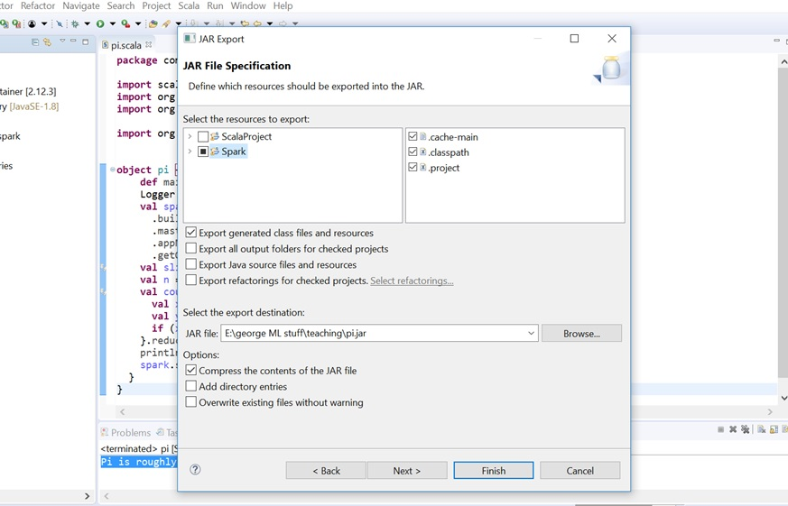

You can run it on your PC which already has spark home, using spark-submit:

E:\george ML stuff\teaching&gt;e:\spark\bin\spark-submit --class com.jentekco.spark.pi pi.jar

Pi is roughly 3.14279571397857

#### Run Scala code with Apache Spark

You can also scp or winscp to the Spark cluster elsewhere, such as in our Linux “production” spark cluster and run it with spark-submit:

\(base\) bigdata2@bigdata2:~/jentekllc/spark$ $SPARK\_HOME/bin/spark-submit --class com.jentekco.spark.pi pi.jar

19/12/21 21:03:20 WARN Utils: Your hostname, bigdata2 resolves to a loopback address: 127.0.1.1; using 10.0.0.46 instead \(on interface enp3s0\)

19/12/21 21:03:20 WARN Utils: Set SPARK\_LOCAL\_IP if you need to bind to another address

Using Spark's default log4j profile: org/apache/spark/log4j-defaults.properties

Pi is roughly 3.146355731778659

#### Python with Apache Spark using Jupyter notebook

Now let’s run the Python version of pi program.  Start Anaconda Navigator, select Virtual Environment spark

Click Jupyter Notebook

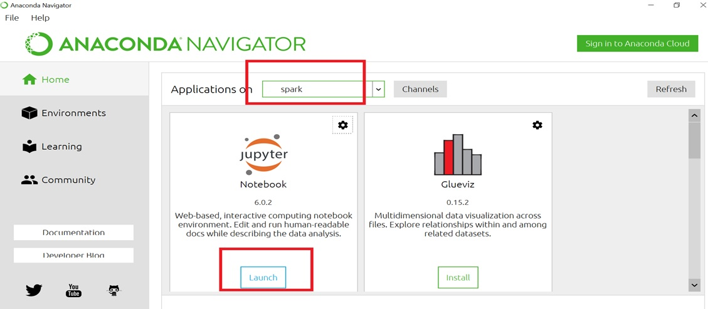

In the Jupyter Notebook, need to import findspark and run findspark.init\(\), which will find where the SPARK\_HOME points to.

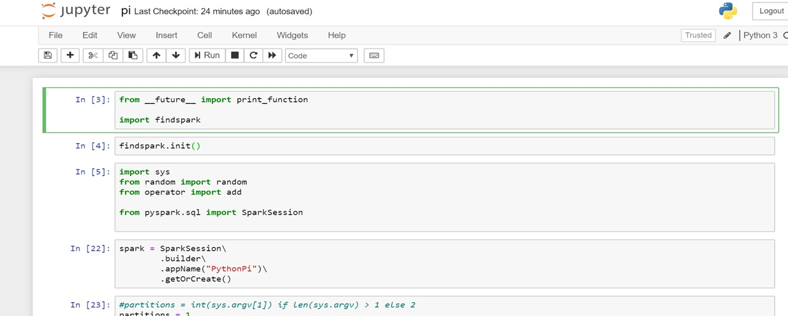

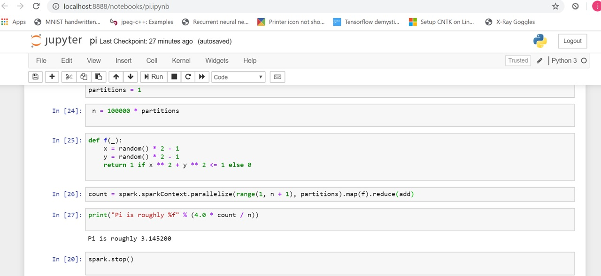

Following is the Python script that runs pi.py, you can simply run:

python pi.py

\#!/usr/bin/env python

\# coding: utf-8

from \_\_future\_\_ import print\_function

import findspark

findspark.init\(\)

import sys

from random import random

from operator import add

from pyspark.sql import SparkSession

spark =SparkSession.builder.appName\("PythonPi"\).getOrCreate\(\)

partitions = 1

n = 100000 \* partitions

def f\(\_\):

    x = random\(\) \* 2 - 1

    y = random\(\) \* 2 - 1

    return 1 if x \*\* 2 + y \*\* 2 &lt;= 1 else 0

count = spark.sparkContext.parallelize\(range\(1, n + 1\), partitions\).map\(f\).reduce\(add\)

print\("Pi is roughly %f" % \(4.0 \* count / n\)\)

spark.stop\(\)

### SPARK SQL

Spark SQL is Apache Spark's module for working with structured data.

Integrated seamlessly mix SQL queries with Spark programs.

Query structured data inside Spark programs, using either SQL or a familiar DataFrame API. Usable in Java, Scala, Python and R.

#### Connect to any data source the same consistent way.

DataFrames and SQL provide a common way to access a variety of data sources, including Hive, Avro, Parquet, ORC, JSON, and JDBC. You can even join data across these sources.

Hive Integration, run SQL or HiveQL queries on existing warehouses.

Spark SQL supports the HiveQL syntax as well as Hive SerDes and UDFs, allowing you to access existing Hive warehouses. 

Spark SQL can use existing Hive metastores, SerDes, and UDFs.

Standard Connectivity, connect through JDBC or ODBC. A server mode provides industry standard JDBC and ODBC connectivity for business intelligence tools.

#### Spark SQL Implementation Example in Scala

package com.jentekco.spark

//George Jen, Jen Tek LLC

import org.apache.spark.\_

import org.apache.spark.SparkContext.\_

import org.apache.spark.rdd.\_

import org.apache.spark.util.LongAccumulator

import org.apache.log4j.\_

import scala.collection.mutable.ArrayBuffer

import org.apache.spark.sql.\_

object ConvertCSV2Parquet {

def main\(args: Array\[String\]\) {

Logger.getLogger\("org"\).setLevel\(Level.ERROR\)

val spark = SparkSession

    .builder

    .appName\("csv2parquet"\)

    .master\("local\[\*\]"\)

    .config\("spark.sql.warehouse.dir", "file:///d:/tmp"\)

    .getOrCreate\(\)

val ds = spark.read.format\("csv"\).option\("header", "true"\).option\("quote", "\""\).load\("D:/teaching/scala/ticker\_symbol.csv"\)

val df: DataFrame = ds.toDF\(\)

df.show\(3, false\)

//When the CSV file was read into DataFrame, all fields are String, below is to cast it to

//what the data should be, such as cast CategoryNumber to Int

val df\_with\_datatype=df.selectExpr\("Ticker",

                  "Name",

                  "Exchange",

                  "CategoryName",

                  "cast\(CategoryNumber as int\) CategoryNumber"\)

df\_with\_datatype.show\(3, false\)

//Save the DataFrame to Parquet format, overwrite if existing.

//Parquet is Columnar, good for Analytics query.

df\_with\_datatype.write.mode\(SaveMode.Overwrite\).parquet\("D:/teaching/scala/ticker\_symbol.parquet"\)

//Read the Parquet data back and run SQL query on it

val read\_parquet\_df = spark.read.parquet\("D:/teaching/scala/ticker\_symbol.parquet"\)

read\_parquet\_df.show\(3, false\)

import spark.implicits.\_

    val TickerSymbol = read\_parquet\_df.toDF\(\)

    TickerSymbol.printSchema\(\)

    TickerSymbol.createOrReplaceTempView\("TickerSymbol"\)

    spark.sql\("SELECT \* from TickerSymbol where Ticker in \('IBM','MSFT','HPQ','GE'\)"\).show\(20,false\)

}

}

#### Run above code in Eclipse IDE

Run the Scala Code in Jupyter Notebook under Spylon Kernel that can execute Scala lines, attached is the Jupyter Notebook in HTML format.

Jupyter Notebook Scala Code is available from my github site:



#### Hive Integration, run SQL or HiveQL queries on existing warehouses.

Spark SQL supports the HiveQL syntax as well as Hive SerDes and UDFs, allowing you to access existing Hive warehouses. 

package com.jentekco.spark

import java.io.File

import org.apache.log4j.\_

import org.apache.spark.sql.{Row, SaveMode, SparkSession}

object SparkHive {

case class Record\(key: Int, value: String\)

 def main\(args: Array\[String\]\): Unit = {

       Logger.getLogger\("org"\).setLevel\(Level.ERROR\)

       val warehouseLocation = new File\("spark-warehouse"\).getAbsolutePath

       val spark = SparkSession

          .builder\(\)

          .config\("spark.master", "local"\)

          .appName\("interfacing spark sql to hive metastore with no configuration file"\)

          .config\("hive.metastore.uris", "thrift://10.0.0.46:9083"\) // replace with your hivemetastore service's thrift url

          .enableHiveSupport\(\) // to enable hive support

          .getOrCreate\(\)

import spark.implicits.\_

    import spark.sql

    sql\("CREATE TABLE IF NOT EXISTS src \(key INT, value STRING\) USING hive"\)

    sql\("LOAD DATA LOCAL INPATH 'D:/spark/examples/src/main/resources/kv1.txt' INTO TABLE src"\)

    // Queries are expressed in HiveQL

    sql\("SELECT \* FROM src"\).show\(\)

    sql\("SELECT COUNT\(\*\) FROM src"\).show\(\)

     val sqlDF = sql\("SELECT key, value FROM src WHERE key &lt; 10 ORDER BY key"\)

    // The items in DataFrames are of type Row, which allows you to access each column by ordinal.

    val stringsDS = sqlDF.map {

      case Row\(key: Int, value: String\) =&gt; s"Key: $key, Value: $value"

    }

    stringsDS.show\(\)

// You can also use DataFrames to create temporary views within a SparkSession.

    val recordsDF = spark.createDataFrame\(\(1 to 100\).map\(i =&gt; Record\(i, s"val\_$i"\)\)\)

    recordsDF.createOrReplaceTempView\("records"\)

    // Queries can then join DataFrame data with data stored in Hive.

    sql\("SELECT \* FROM records r JOIN src s ON r.key = s.key"\).show\(\)

   // Create a Hive managed Parquet table, with HQL syntax instead of the Spark SQL native syntax

    // \`USING hive\`

    sql\("CREATE TABLE IF NOT EXISTS hive\_records\(key int, value string\) STORED AS PARQUET"\)

   // Save DataFrame to the Hive managed table

    val df = spark.table\("src"\)

   df.write.mode\(SaveMode.Overwrite\).saveAsTable\("hive\_records"\)

    // After insertion, the Hive managed table has data now

    sql\("SELECT \* FROM hive\_records"\).show\(\)

// Prepare a Parquet data directory

    val dataDir = "/tmp/parquet\_data"

    spark.range\(10\).write.parquet\(dataDir\)

    // Create a Hive external Parquet table

    sql\(s"CREATE EXTERNAL TABLE IF NOT EXISTS hive\_bigints\(id bigint\) STORED AS PARQUET LOCATION '$dataDir'"\)

    // The Hive external table should already have data

    sql\("SELECT \* FROM hive\_bigints"\).show\(\)

    // Turn on flag for Hive Dynamic Partitioning

    spark.sqlContext.setConf\("hive.exec.dynamic.partition", "true"\)

    spark.sqlContext.setConf\("hive.exec.dynamic.partition.mode", "nonstrict"\)

    // Create a Hive partitioned table using DataFrame API

    df.write.partitionBy\("key"\).format\("hive"\).saveAsTable\("hive\_part\_tbl"\)

    // Partitioned column \`key\` will be moved to the end of the schema.

    sql\("SELECT \* FROM hive\_part\_tbl"\).show\(\)

    spark.stop\(\)

}

}

Scala code is available on my github site:



Python code is available on:



### SPARK Streaming

Spark Streaming can read data from HDFS, Flume, Kafka, Twitter and ZeroMQ. You can also define your own custom data sources.

Spark Streaming runs on Spark's standalone cluster mode or other supported cluster resource managers.

It also includes a local run mode for development. In production, Spark Streaming uses ZooKeeper and HDFS for high availability.

Spark Streaming is an extension of the core Spark API that enables scalable, high-throughput, fault-tolerant stream processing of live data streams. Data can be ingested from many sources like Kafka, Flume, Kinesis, or TCP sockets, and can be processed using complex algorithms expressed with high-level functions like map, reduce, join and window. Finally, processed data can be pushed out to filesystems, databases, and live dashboards. In fact, you can apply Spark’s machine learning and graph processing algorithms on data streams.

Internally, it works as follows. Spark Streaming receives live input data streams and divides the data into batches, which are then processed by the Spark engine to generate the final stream of results in batches.

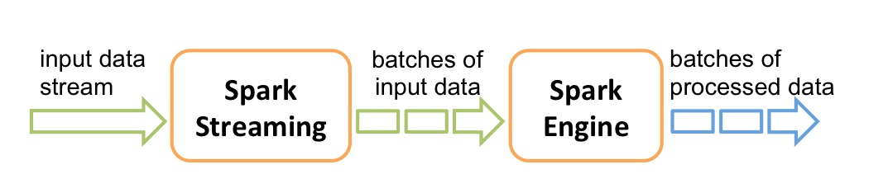

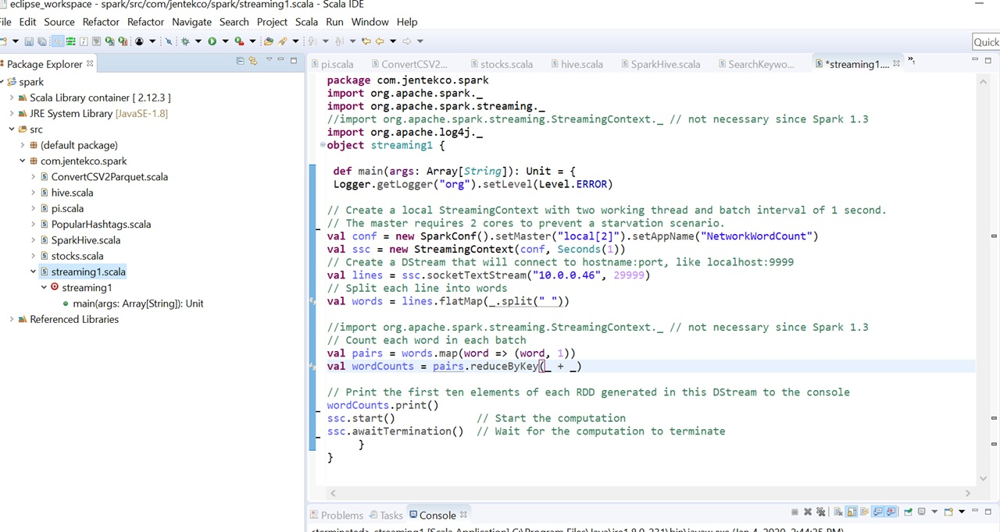

Click run-&gt;run configuration in the Eclipse IDE.

Enter the right name and main class below:

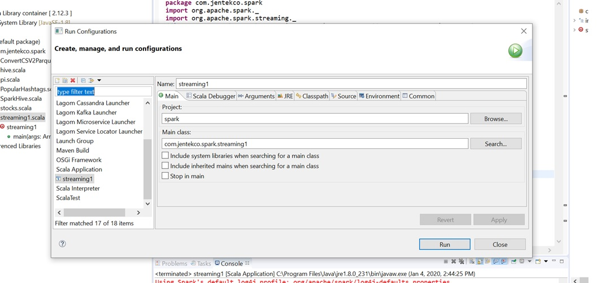

On a linux or mac machine that supports ncat:

Run below, then type some words

\(base\) bigdata2@bigdata2:~/spark/spark/logs$ nc -lk 29999

test test again here I am

test test test again again

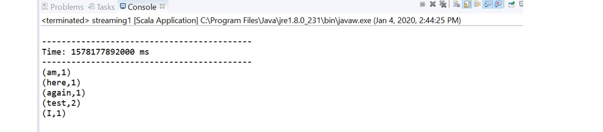

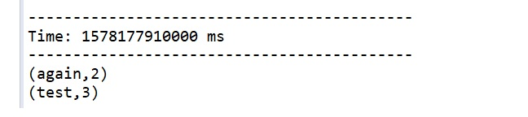

//following is the scala code:

package com.jentekco.spark

import org.apache.spark.\_

import org.apache.spark.streaming.\_

//import org.apache.spark.streaming.StreamingContext.\_ // not necessary since Spark 1.3

import org.apache.log4j.\_

object streaming1 {

 def main\(args: Array\[String\]\): Unit = {

 Logger.getLogger\("org"\).setLevel\(Level.ERROR\)

// Create a local StreamingContext with two working thread and batch interval of 1 second.

// The master requires 2 cores to prevent a starvation scenario.

val conf = new SparkConf\(\).setMaster\("local\[2\]"\).setAppName\("NetworkWordCount"\)

val ssc = new StreamingContext\(conf, Seconds\(1\)\)

// Create a DStream that will connect to hostname:port, like localhost:9999

val lines = ssc.socketTextStream\("10.0.0.46", 29999\)

// Split each line into words

val words = lines.flatMap\(\_.split\(" "\)\)

//import org.apache.spark.streaming.StreamingContext.\_ // not necessary since Spark 1.3

// Count each word in each batch

val pairs = words.map\(word =&gt; \(word, 1\)\)

val wordCounts = pairs.reduceByKey\(\_ + \_\)

// Print the first ten elements of each RDD generated in this DStream to the console

wordCounts.print\(\)

ssc.start\(\)             // Start the computation

ssc.awaitTermination\(\)  // Wait for the computation to terminate

     } }

\#Python code:

import findspark

findspark.init\(\)

import pyspark

from pyspark import SparkConf,SparkContext

from pyspark.streaming import StreamingContext

from pyspark.sql import Row,SQLContext

import sys

import requests

\# Create a local StreamingContext with two working thread and batch interval of 1 second

sc = SparkContext\("local\[2\]", "NetworkWordCount"\)

ssc = StreamingContext\(sc, 1\)

\# Create a DStream that will connect to hostname:port, like localhost:9999

lines = ssc.socketTextStream\("10.0.0.46", 29999\)

words = lines.flatMap\(lambda \_: \_.split\(" "\)\)

\#import org.apache.spark.streaming.StreamingContext.\_ // not necessary since Spark 1.3

\#Count each word in each batch

pairs = words.map\(lambda word: \(word, 1\)\)

wordCounts = pairs.reduceByKey\(lambda x,y:  x+y\)

\#Print the first ten elements of each RDD generated in this DStream to the console

wordCounts.pprint\(\)

ssc.start\(\)             \# Start the computation

ssc.awaitTermination\(\)  \# Wait for the computation to terminate

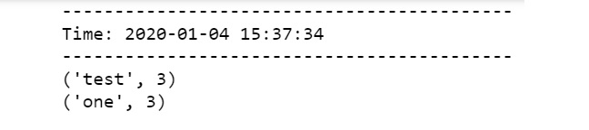

#### Discretized Streams \(DStreams\)

Discretized Stream or DStream is the basic abstraction provided by Spark Streaming. It represents a continuous stream of data, either the input data stream received from source, or the processed data stream generated by transforming the input stream.

Internally, a DStream is represented by a continuous series of RDDs, which is Spark's abstraction of an immutable, distributed dataset \(see Spark Programming Guide for more details\).

Each RDD in a DStream contains data from a certain interval, as shown in the following figure.

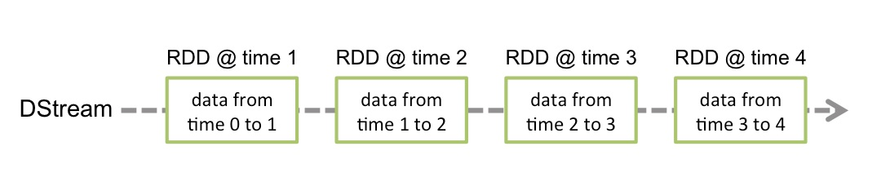

#### Transformations on DStreams

Similar to that of RDDs, transformations allow the data from the input DStream to be modified. DStreams support many of the transformations available on normal Spark RDD’s. Some of the common ones are as follows

#### map\(func\)  

Return a new DStream by passing each element of the source DStream through a function   func.

flatMap\(func\)  

Similar to map, but each input item can be mapped to 0 or more output items.

#### filter\(func\)  

Return a new DStream by selecting only the records of the source DStream on which func   returns true.

#### repartition\(numPartitions\)  

Changes the level of parallelism in this DStream by creating more or fewer partitions.

#### union\(otherStream\)  

Return a new DStream that contains the union of the elements in the source DStream and   other DStream.

#### count\(\)  

Return a new DStream of single-element RDDs by counting the number of elements in each   RDD of the source DStream.

#### reduce\(func\)  

Return a new DStream of single-element RDDs by aggregating the elements in each RDD of   the source DStream using a function func \(which takes two arguments and returns one\). The   function should be associative and commutative so that it can be computed in parallel.

#### countByValue\(\)  

When called on a DStream of elements of type K, return a new DStream of \(K, Long\) pairs where   the value of each key is its frequency in each RDD of the source DStream.

#### reduceByKey\(func, \[numTasks\]\)  

When called on a DStream of \(K, V\) pairs, return a new DStream of \(K, V\)   pairs where the values for each key are aggregated using the given reduce   function. Note: By default, this uses Spark's default number of parallel tasks \(2   for local mode, and in cluster mode the number is determined by the config   property spark.default.parallelism\) to do the grouping. You can pass an optional   numTasks argument to set a different number of tasks.

#### join\(otherStream, \[numTasks\]\)  

When called on two DStreams of \(K, V\) and \(K, W\) pairs, return a new   DStream of \(K, \(V, W\)\) pairs with all pairs of elements for each key.

#### cogroup\(otherStream, \[numTasks\]\)  

When called on a DStream of \(K, V\) and \(K, W\) pairs, return a new DStream of   \(K, Seq\[V\], Seq\[W\]\) tuples.

#### transform\(func\)  

Return a new DStream by applying a RDD-to-RDD function to every RDD of   the source DStream.  This can be used to do arbitrary RDD operations on the   DStream.

#### updateStateByKey\(func\)  

Return a new "state" DStream where the state for each key is updated by   applying the given function on the previous state of the key and the new values   for the key. This can be used to maintain arbitrary state data for each key.

#### repartition\(numPartitions\)  

Changes the level of parallelism in this DStream by creating more or fewer partitions.  By default, Spark set the number of partitions to number of CPU cores \(threads\) in the Spark machine for parallelism.  Each partition can be processed by one CPU core \(thread\)

#### Examples

import org.apache.spark.\_

import org.apache.spark.SparkContext.\_

import org.apache.spark.streaming.\_

import org.apache.spark.streaming.StreamingContext.\_

import org.apache.log4j.{Level, Logger}

val getSomeData = spark.range\(100\)

//Default partition is number of CPU "cores \(threads really\)" in the machine that runs Spark

getSomeData.rdd.getNumPartitions

val rePartition = getSomeData.repartition\(numPartitions = 6\)

union\(otherStream\)  Return a new DStream that contains   the union of the elements in the source   DStream and other DStream.

Example:

val getSomeData = spark.range\(5\)

val getSomeData1 = spark.range\(10,15\)

getSomeData.collect\(\).foreach\(println\)

getSomeData1.collect\(\).foreach\(println\)

val unionData=getSomeData.union\(getSomeData1\)

unionData.collect\(\).foreach\(println\)

join\(otherStream, \[numTasks\]\)  When called on two DStreams of \(K, V\) and \(K, W\) pairs, return   a new DStream of \(K, \(V, W\)\) pairs with all pairs of elements for   each key.

Example:

val data=spark.sparkContext.parallelize\(Seq\(\("sun",1\),\("mon",2\),\("tue",3\), \("wed",4\),\("thur",5\)\)\)

val data1=spark.sparkContext.parallelize\(Seq\(\("sun",0\),\("mon",1\),\("tue",2\), \("wed",3\),\("thur",4\)\)\)

val join\_data=data.join\(data1\)

join\_data.collect\(\).foreach\(println\)

\(mon,\(2,1\)\)

\(sun,\(1,0\)\)

\(thur,\(5,4\)\)

\(wed,\(4,3\)\)

\(tue,\(3,2\)\)

cogroup\(otherStream, \[numTasks\]\)  When called on a DStream of \(K, V\) and \(K, W\) pairs, return a new   DStream of \(K, Seq\[V\], Seq\[W\]\) tuples.

Example:

val cogroup\_data=data.cogroup\(data1\)

cogroup\_data.collect\(\).foreach\(println\)

\(mon,\(CompactBuffer\(2\),CompactBuffer\(1\)\)\)

\(sun,\(CompactBuffer\(1\),CompactBuffer\(0\)\)\)

\(thus,\(CompactBuffer\(5\),CompactBuffer\(4\)\)\)

\(wed,\(CompactBuffer\(4\),CompactBuffer\(3\)\)\)

\(tue,\(CompactBuffer\(3\),CompactBuffer\(2\)\)\)

//According to Spark's documentation, it is an alternative to ArrayBuffer that results in better performance because it allocates less memory.

transform\(func\)  Return a new DStream by applying a RDD-to-RDD function to every   RDD of   the source DStream.  This can be used to do arbitrary RDD   operations on the DStream.

Note: difference between transform and Map is former is on RDD level, latter is on element of RDD level.

Example:

val data5=spark.sparkContext.parallelize\(Seq\(\("This is a test"\),\("test again"\)\)\)

val conf = new SparkConf\(\).setMaster\("local\[2\]"\).setAppName\("NetworkWordCount"\)

sc.stop\(\)

val ssc = new StreamingContext\(conf, Seconds\(1\)\)

// Create a DStream that will connect to hostname:port, like localhost:9999

val lines = ssc.socketTextStream\("10.0.0.46", 29999\)

lines.transform\(rdd=&gt;\(rdd.union\(data5\)\)\)

updateStateByKey\(func\)  Return a new "state" DStream where the state for each key is updated by   applying the given function on the previous state of the key and the new values   for the key. This can be used to maintain arbitrary state data for each key.

Example:

import org.apache.spark.\_

import org.apache.spark.SparkContext.\_

import org.apache.spark.streaming.\_

import org.apache.spark.streaming.StreamingContext.\_

import org.apache.log4j.{Level, Logger}

class wordCountClass extends Serializable {

def flatMap\(lines: org.apache.spark.streaming.dstream.DStream\[String\]\): org.apache.spark.streaming.dstream.DStream\[String\] = {

    val results=lines.flatMap\(\_.split\(" "\)\)

    results

}

def map\(words: org.apache.spark.streaming.dstream.DStream\[String\]\): org.apache.spark.streaming.dstream.DStream\[\(String, Int\)\] = {

    val wordPair=words.map\(x=&gt;\(x,1\)\)

    wordPair

}

def reduceByKey\(wordPair: org.apache.spark.streaming.dstream.DStream\[\(String, Int\)\]\): org.apache.spark.streaming.dstream.DStream\[\(String, Int\)\]={

    val wordCounts=wordPair.reduceByKey\(\(a,b\)=&gt;\(a+b\)\)

    wordCounts

}

}

val wordCountObject = new wordCountClass\(\)

val updateFunc = \(values: Seq\[Int\],state: Option\[Int\]\)=&gt;{

      val currentCount = values.foldLeft\(0\)\(\_ + \_\)

      val previousCount = state.getOrElse\(0\)

      Some\(currentCount + previousCount\)

    }

val sparkConf = new SparkConf\(\).setAppName\("HdfsWordCount"\)

sc.stop\(\)

val ssc = new StreamingContext\(sparkConf, Seconds\(2\)\)

ssc.checkpoint\("/tmp"\)

val lines = ssc.textFileStream\("/tmp/"\)

val words=wordCountObject.flatMap\(lines\)

val wordMap=wordCountObject.map\(words\)

val wordCounts = wordCountObject.reduceByKey\(wordMap\)

val updateWordCounts=wordCounts.updateStateByKey\[Int\]\(updateFunc\)

val wordCountObject = new wordCountClass\(\)

val updateFunc = \(values: Seq\[Int\],state: Option\[Int\]\)=&gt;{

      val currentCount = values.foldLeft\(0\)\(\_ + \_\)

      val previousCount = state.getOrElse\(0\)

      Some\(currentCount + previousCount\)

    }

val sparkConf = new SparkConf\(\).setAppName\("HdfsWordCount"\)

sc.stop\(\)

val ssc = new StreamingContext\(sparkConf, Seconds\(2\)\)

ssc.checkpoint\("/tmp"\)

val lines = ssc.textFileStream\("/tmp/"\)

val words=wordCountObject.flatMap\(lines\)

val wordMap=wordCountObject.map\(words\)

val wordCounts = wordCountObject.reduceByKey\(wordMap\)

val updateWordCounts=wordCounts.updateStateByKey\[Int\]\(updateFunc\)

#### Window Operations

Spark Streaming also provides windowed computations, which allow you to apply transformations over a sliding window of data. The following figure illustrates this sliding window

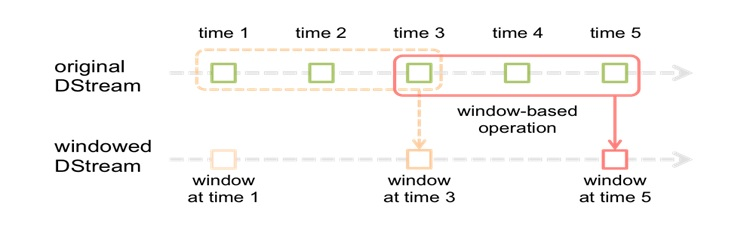

The window slides over a source DStream, the source RDDs that fall within the window are combined and operated upon to produce the RDDs of the windowed DStream. In this specific case, the operation is applied over the last 3 time units of data, and slides by 2 time units. This shows that any window operation needs to specify two parameters.

window length - The duration of the window \(3 in the figure\).

sliding interval - The interval at which the window operation is performed \(2 in the figure\).

Example:

// Reduce last 30 seconds of data, every 10 seconds

val windowedWordCounts = pairs.reduceByKeyAndWindow\(\(a:Int,b:Int\) =&gt; \(a + b\), Seconds\(30\), Seconds\(10\)\)

package com.jentekco.spark

import org.apache.spark.\_

import org.apache.spark.streaming.\_

//import org.apache.spark.streaming.StreamingContext.\_ // not necessary since Spark 1.3

import org.apache.log4j.\_

object WordCount {

  def main\(args: Array\[String\]\): Unit = {

     Logger.getLogger\("org"\).setLevel\(Level.ERROR\)

//    if \(args.length &lt; 1\) {

//      System.err.println\("Usage: HdfsWordCount &lt;directory&gt;"\)

//      System.exit\(1\)

//    }

    //StreamingExamples.setStreamingLogLevels\(\)

    val sparkConf = new SparkConf\(\).setMaster\("local\[2\]"\).setAppName\("HdfsWordCount"\)

    // Create the context

    val ssc = new StreamingContext\(sparkConf, Seconds\(2\)\)

// Create the FileInputDStream on the directory and use the

    // stream to count words in new files created

//    val lines = ssc.textFileStream\(args\(0\)\)

    val lines = ssc.textFileStream\("hdfs://10.0.0.46:9000/tmp/spark/"\)

    val words = lines.flatMap\(\_.split\(" "\)\)

    val wordCounts = words.map\(x =&gt; \(x, 1\)\).reduceByKeyAndWindow\(\(a:Int,b:Int\) =&gt; \(a + b\), Seconds\(30\), Seconds\(10\)\)

    wordCounts.print\(100\)

    ssc.start\(\)

    ssc.awaitTermination\(\)

  } }

#### Transformation 

window\(windowLength, slideInterval\)  Return a new DStream which is computed based on windowed   batches of the source DStream.

#### countByWindow\(windowLength, slideInterval\) 

  Return a sliding window count of elements in the stream.

#### reduceByWindow\(func, windowLength, slideInterval\) 

  Return a new single-element stream, created by aggregating   elements in the stream over a sliding interval using func. The   function should be associative and commutative so that it can be   computed correctly in parallel.

#### reduceByKeyAndWindow\(func, windowLength, slideInterval, \[numTasks\]\) 

  When called on a DStream of \(K, V\) pairs, returns a new DStream   of \(K, V\) pairs where the values for each key are aggregated using   the given reduce function func over batches in a sliding window.   Note: By default, this uses Spark's default number of parallel tasks   \(2 for local mode, and in cluster mode the number is determined by   the config property spark.default.parallelism\) to do the grouping.   You can pass an optional numTasks argument to set a different   number of tasks.

#### reduceByKeyAndWindow\(func, invFunc, windowLength, slideInterval, \[numTasks\]\) 

  A more efficient version of the above reduceByKeyAndWindow\(\) where   the reduce value of each window is calculated incrementally using the   reduce values of the previous window. This is done by reducing the new   data that enters the sliding window, and “inverse reducing” the old data   that leaves the window. An example would be that of “adding” and   “subtracting” counts of keys as the window slides. However, it is   applicable only to “invertible reduce functions”, that is, those reduce   functions which have a corresponding “inverse reduce” function \(taken as   parameter invFunc\). Like in reduceByKeyAndWindow, the number of   reduce tasks is configurable through an optional argument. Note that   checkpointing must be enabled for using this operation.

Note: similar to updateStateByKey, to main state for such as running total

#### countByValueAndWindow\(windowLength, slideInterval, \[numTasks\]\) 

  When called on a DStream of \(K, V\) pairs, returns a new DStream of \(K,   Long\) pairs where the value of each key is its frequency within a sliding   window. Like in reduceByKeyAndWindow, the number of reduce tasks is   configurable through an optional argument.

#### window\(windowLength, slideInterval\)  Return a new DStream which is computed based on windowed   batches of the source DStream.

#### Examples

val lines = ssc.textFileStream\("hdfs://10.0.0.46:9000/tmp/spark/"\)

val line\_window=lines.window\(Seconds\(20\),Seconds\(20\)\)

countByWindow\(windowLength, slideInterval\) 

  Return a sliding window count of elements in the stream.

Example:

val lines = ssc.textFileStream\("hdfs://10.0.0.46:9000/tmp/spark/"\)

val count\_window=lines.countByWindow\(Seconds\(20\), Seconds\(20\)\)

reduceByWindow\(func, windowLength, slideInterval\)  Return a new single-element stream, created by aggregating elements in the stream over a   sliding interval using func. The function should be associative and commutative so that it   can be computed correctly in parallel.

Example:

import org.apache.spark.\_

import org.apache.spark.SparkContext.\_

import org.apache.spark.streaming.\_

import org.apache.spark.streaming.StreamingContext.\_

import org.apache.log4j.{Level, Logger}

val sparkConf = new SparkConf\(\).setMaster\("local\[2\]"\).setAppName\(“ReduceByWindowExample"\)

    // Create the context

sc.stop\(\)

val ssc = new StreamingContext\(sparkConf, Seconds\(1\)\)

val messages1 = ssc.textFileStream\("hdfs://10.0.0.46:9000/tmp/spark/"\)

val messages2  = ssc.textFileStream\("hdfs://10.0.0.46:9000/tmp/spark/"\)

val messages3 = messages1.union\(messages2\)

val messages=messages3.map\(x=&gt;\(x,x\)\)

val msgs: org.apache.spark.streaming.dstream.DStream\[\(String, String\)\] = messages

type T = \(String, String\)

val reduceFn: \(T, T\) =&gt; T = {

  case in @ \(\(k1, v1\), \(k2, v2\)\) =&gt;

    println\(s"&gt;&gt;&gt; input: $in"\)

    \(k2, s"$v1 + $v2"\)

}

val windowedMsgs: org.apache.spark.streaming.dstream.DStream\[\(String, String\)\] =

 msgs.reduceByWindow\(reduceFn, windowDuration = Seconds\(10\), slideDuration = Seconds\(5\)\)

#### reduceByKeyAndWindow\(func, invFunc, windowLength, slideInterval, \[numTasks\]\) 

  A more efficient version of the above reduceByKeyAndWindow\(\) where   the reduce value of each window is calculated incrementally using the   reduce values of the previous window. This is done by reducing the new   data that enters the sliding window, and “inverse reducing” the old data   that leaves the window. An example would be that of “adding” and   “subtracting” counts of keys as the window slides. However, it is   applicable only to “invertible reduce functions”, that is, those reduce   functions which have a corresponding “inverse reduce” function \(taken as   parameter invFunc\). Like in reduceByKeyAndWindow, the number of   reduce tasks is configurable through an optional argument. Note that   checkpointing must be enabled for using this operation.

Example:

val lines = ssc.textFileStream\("hdfs://10.0.0.46:9000/tmp/spark/"\)

val words = lines.flatMap\(\_.split\(" "\)\)

val wordCounts = words.map\(x=&gt;\(x,1\)\).reduceByKeyAndWindow\(\(x,y\)=&gt;\(x+y\),\(x,y\)=&gt;\(x-y\),Seconds\(30\),Seconds\(10\)\)

#### countByValueAndWindow\(windowLength, slideInterval, \[numTasks\]\) 

  When called on a DStream of \(K, V\) pairs, returns a new DStream of \(K,   Long\) pairs where the value of each key is its frequency within a sliding   window. Like in reduceByKeyAndWindow, the number of reduce tasks is   configurable through an optional argument.

Example:

val lines = ssc.textFileStream\("hdfs://10.0.0.46:9000/tmp/spark/"\)

val words = lines.flatMap\(\_.split\(" "\)\)

val wordsCountByValueAndWindow=words.map\(x=&gt;\(x,1\)\).countByValueAndWindow\(Seconds\(30\),Seconds\(10\)\)

#### Join Operations

you can perform different kinds of joins in Spark Streaming.

Example:

val messages1 = ssc.textFileStream\("hdfs://10.0.0.46:9000/tmp/spark/"\)

val messages2  = ssc.textFileStream\("hdfs://10.0.0.46:9000/tmp/spark/"\)

val messages11=messages1.map\(x=&gt;\(x,x\)\)

val messages22=messages2.map\(x=&gt;\(x,x\)\)

val messages4=messages11.join\(messages22\)

Window stream joins example:

val messages11=messages1.map\(x=&gt;\(x,x\)\).window\(Seconds\(30\),Seconds\(10\)\)

val messages22=messages2.map\(x=&gt;\(x,x\)\).window\(Seconds\(30\),Seconds\(10\)\)

val messages4=messages11.join\(messages22\)

//Note: window parameters for both stream must be the same, otherwise:

val messages11=messages1.map\(x=&gt;\(x,x\)\).window\(Seconds\(30\),Seconds\(10\)\)

val messages22=messages2.map\(x=&gt;\(x,x\)\).window\(Seconds\(60\),Seconds\(20\)\)

val messages4=messages11.join\(messages22\)

Error:

java.lang.IllegalArgumentException: requirement failed: Some of the DStreams have different slide durations

Transform window message

val data=spark.sparkContext.parallelize\(Seq\(\("This is a test"\),\("test again"\)\)\)

val data\_pair=data.map\(x=&gt;\(x,x\)\)

val messages1 = ssc.textFileStream\("hdfs://10.0.0.46:9000/tmp/spark/"\)

val messages11=messages1.map\(x=&gt;\(x,x\)\).window\(Seconds\(30\),Seconds\(10\)\)

val joinedStream = messages11.transform { rdd =&gt; rdd.join\(data\_pair\) }

#### print\(n\)  

Prints the first ten elements \(default to 10\) of every batch of data in a DStream on the   driver node running the streaming application. This is useful for development and   debugging.

Python API This is called pprint\(\) in the Python API.

#### saveAsTextFiles\(prefix, \[suffix\]\) 

  Save this DStream's contents as text files. The file name at each batch interval is   generated based on prefix and suffix: "prefix-TIME\_IN\_MS\[.suffix\]".

#### saveAsObjectFiles\(prefix, \[suffix\]\) 

  Save this DStream's contents as SequenceFiles of serialized Java objects. The file   name at   each batch interval is generated based on prefix and suffix:

  "prefix-TIME\_IN\_MS\[.suffix\]".

Python API This is not available in the Python API.

#### saveAsHadoopFiles\(prefix, \[suffix\]\) 

  Save this DStream's contents as Hadoop files. The file name at each batch interval is   generated based on prefix and suffix: "prefix-TIME\_IN\_MS\[.suffix\]".

Python API This is not available in the Python API.

#### foreachRDD\(func\) 

The most generic output operator that applies a function, func, to each RDD generated from the stream. This function should push the data in each RDD to an external system, such as saving the RDD to files, or writing it over the network to a database. Note that the function func is executed in the driver process running the streaming application, and will usually have RDD actions in it that will force the computation of the streaming RDDs.

#### print\(n\)  

Prints the first ten elements \(default to 10\) of every   batch of data in a DStream on the driver node running   the streaming application. This is useful for   development and debugging.

Example:

val messages1 = ssc.textFileStream\("hdfs://10.0.0.46:9000/tmp/spark/"\)

val messages1w=messages1.window\(Seconds\(30\),Seconds\(10\)\)

messages1w.print\(\)

saveAsTextFiles\(prefix, \[suffix\]\) 

  Save this DStream's contents as text files. The file name at   each batch interval is generated based on prefix and suffix:   "prefix-TIME\_IN\_MS\[.suffix\]".

You just need to supply prefix \(path\) and suffix of file, Spark fills in TIME\_IN\_MS as part of the file name

Example:

messages1w.saveAsTextFiles\("hdfs://10.0.0.46:9000/tmp/spark/output“,”csv”\)

Note:

Spark will place the file in the format in &lt;TIME\_IN\_MS&gt; generated.

#### saveAsObjectFiles\(prefix, \[suffix\]\) 

  Save this DStream's contents as SequenceFiles of serialized Java objects. The file   name at each batch interval is generated based on prefix and suffix:

  "prefix-TIME\_IN\_MS\[.suffix\]".

Python API This is not available in the Python API.

#### saveAsHadoopFiles\(prefix, \[suffix\]\) 

  Save this DStream's contents as Hadoop files. The file name at each batch interval is   generated based on prefix and suffix: "prefix-TIME\_IN\_MS\[.suffix\]".

Python API This is not available in the Python API.

Same as saveAsTextFiles, see prior example

#### Spark Streaming with Twitter, you can get public tweets by using Twitter API.

To start, register a developer account at

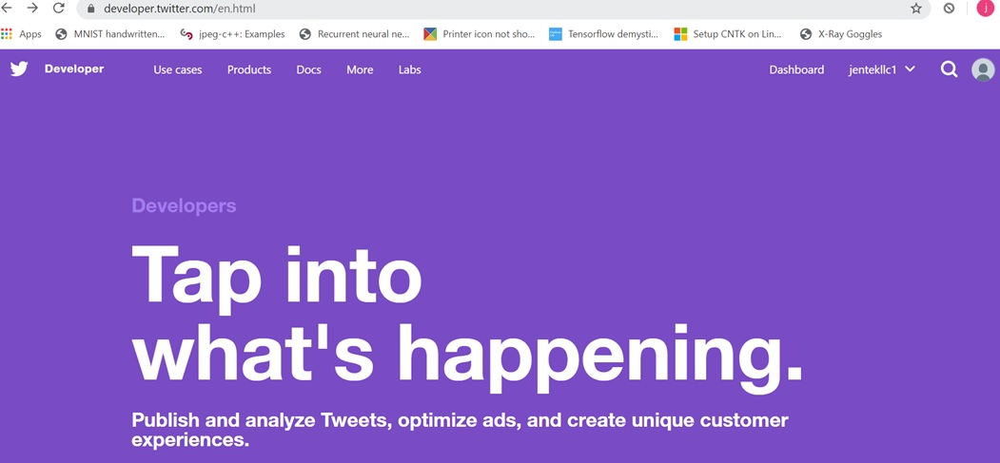

To have consumer key, consumer secret key, access token and access secret, you will need to create an app and you will need to provide a web site URL, it does not have to be working.

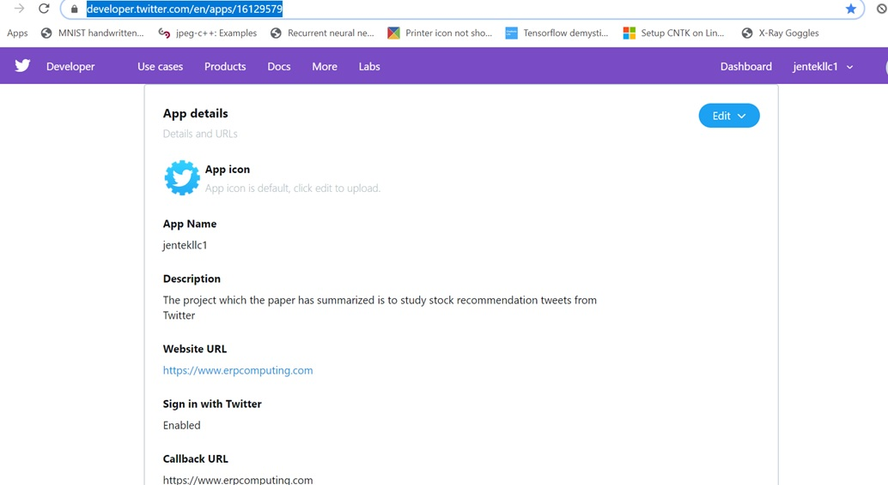

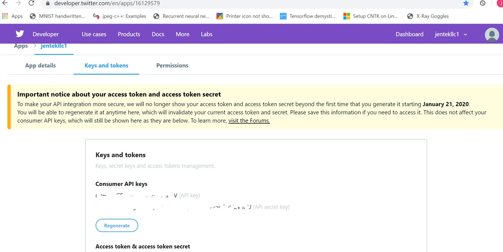

Spark streaming use case with scala with Twitter

Get twitter streaming tweets that contains that contains “New York” or “San Francisco” case insensitive

package com.jentekco.spark

import org.apache.spark.\_

import org.apache.spark.SparkContext.\_

import org.apache.spark.streaming.\_

import org.apache.spark.streaming.twitter.\_

import org.apache.spark.streaming.StreamingContext.\_

import org.apache.log4j.{Level, Logger}

/\*\* Listens to a stream of Tweets only contains “new york" or “san francisco" case insensitive

you can change it to whatever keyword you want to limit to

 \*/

object SearchKeywordTweets {

  /\*\*

You will need to include external jar files for you to be able to import org.apache.spark.streaming.twitter.\_

they are:

dstream-twitter\_&lt;your version of Scala&gt;-SNAPSHOT.jar

twitter4j-core-4.0.4.jar

twitter4j-stream-4.0.4.jar

They are downloadable online, you need to search and download

\*/

def main\(args: Array\[String\]\) {

    Logger.getLogger\("org"\).setLevel\(Level.ERROR\)

/\*public static JavaReceiverInputDStream&lt;twitter4j.Status&gt; createStream\(JavaStreamingContext jssc\)

Create a input stream that returns tweets received from Twitter using Twitter4J's default OAuth authentication;

this requires the system properties twitter4j.oauth.consumerKey, twitter4j.oauth.consumerSecret, twitter4j.oauth.accessToken and twitter4j.oauth.accessTokenSecret. Storage level of the data will be the default StorageLevel.MEMORY\_AND\_DISK\_SER\_2.

\*/

    val ssc = new StreamingContext\("local\[\*\]", "SearchTwitterTweets", Seconds\(1\)\)

System.setProperty\("twitter4j.oauth.consumerKey",“&lt;your Twitter consumer key&gt;"\)

 System.setProperty\("twitter4j.oauth.consumerSecret", “&lt;your Twitter consumer secret&gt;"\)

 System.setProperty\("twitter4j.oauth.accessToken", “&lt;your twitter access token&gt;"\)

 System.setProperty\("twitter4j.oauth.accessTokenSecret", “&lt;your twitter token secret&gt;"\)

val tweets = TwitterUtils.createStream\(ssc, None\)

    // Extract the text

    val tweets\_collection = tweets.map\(each\_tweet =&gt; each\_tweet.getText\(\)\)

    //Set your search criteria to only retain these meet your search condition

    val focus\_tweets\_collection=tweets\_collection.filter\(text=&gt;text.toLowerCase.contains\("new york"\) \| text.toLowerCase.contains\("san francisco"\)\)

//Display your result

    focus\_tweets\_collection.print\(\)

    ssc.checkpoint\("d:/checkpoint/"\)

    ssc.start\(\)

    ssc.awaitTermination\(\)

  } 

}

Run the prior scala code

#### Spark streaming use case with Python

Get twitter streaming tweets that using tweepy, a Python twitter API, download tweets and store into HIVE table using HQL \(Hive SQL\)



import findspark

findspark.init\(\)

import pyspark

from pyspark.sql import SparkSession

import datetime

spark = SparkSession \

          .builder \

          .config\("spark.master", "local"\) \

          .appName\("interfacing spark sql to hive metastore with no configuration file"\) \

          .config\("hive.metastore.uris", "thrift://10.0.0.46:9083"\) \

          .enableHiveSupport\(\) \

          .getOrCreate\(\)

sc=spark.sparkContext

sc.setLogLevel\("ERROR"\)

class MyListener\(StreamListener\):

    def \_\_init\_\_\(self, api=None\):

        super\(\).\_\_init\_\_\(\)

    def on\_status\(self, status\):

        text = status.text

        created = str\(status.created\_at\)

        record = {'Text': text, 'Created At': created}

\#Save to HIVE table tweets       

        filtered\_data="".join\(list\(filter\(lambda x: x!="@" and x!="'" and x!='"' \

                                          and x!="\n" and x!='{' and x!='}' and x!='\(' and x!='\)',text\)\)\)

        print\(filtered\_data\)

        spark.sql\("INSERT INTO tweets values \('"+created+"','"+filtered\_data+"'\)"\)

def on\_error\(self, status\):

        print \('Something wrong with status', status\)

    def on\_limit\(self, status\):

        print \('Over the threshold', status\)

    def on\_timeout\(self, status\):

        print \('Timeout...'\)

stream = Stream\(auth=auth, listener=MyListener\(\)\)

stream.filter\(track=\['stock market'\]\)

Run it:

Ciena CIEN Outpaces Stock Market Gains: What You Should Know https://t.co/XFAL2xutM8

RT AnnaApp91838450: BREAKING: Stock Market Soars After Trump Speech To The Nation https://t.co/0F9KOlHiesEat Your Heart Out CorruptDemoc…

Veeva Systems VEEV Outpaces Stock Market Gains: What You Should Know https://t.co/871ROpHNpT

Randy\_Hedgehog\_ Dolan\_\_Ryan CaptainCons We are at Peace. Look at the stock market reaction. No casualties and we… https://t.co/JEfDOxkHI4

Innoviva INVA Outpaces Stock Market Gains: What You Should Know https://t.co/EIN4xgGC0y

Lrihendry ROHLL5 PRESIDENT TRUMP has been in OFFICE for 3 years and these five things are true. Lowest Unemploym… [https://t.co/ht8cAE7Ifp](https://t.co/ht8cAE7Ifp) …

### GRAPHX

GraphX is a new component in Spark for graphs and graph-parallel computation. At a high level, GraphX extends the Spark RDD by introducing a new Graph abstraction: a directed multigraph with properties attached to each vertex and edge.

To support graph computation, GraphX exposes a set of fundamental operators \(e.g., subgraph, joinVertices, and aggregateMessages\) as well as an optimized variant of the Pregel API.

In addition, GraphX includes a growing collection of graph algorithms and builders to simplify graph analytics tasks.

Example:

Let’s define a simple org chart:

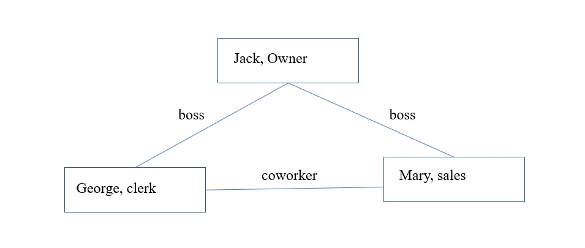

Let’s add one more person, sherry, Jacks’ wife

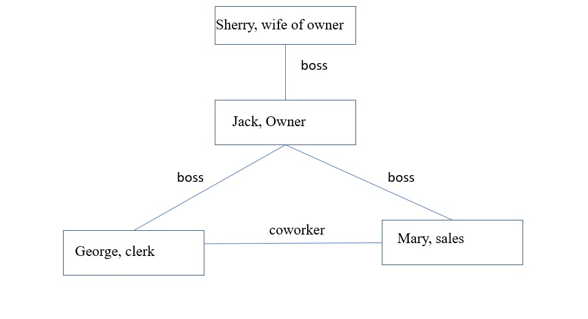

Here we have data:

The box:

Sherry, wife of owner

Jack, owner

George, clerk

Mary, sales

The line, indicates the relationship in the org chart:

Jack, owner is boss of George, clerk

Jack, owner is boss of Mary, sales

Sherry, wife of owner is boss of Jack, owner

George, clerk is coworker of Mary, sales

First, I try it on an SQL database.  Any database would do.   Just happen to have Postgres SQL on my machine, therefore, use it:

1st, create 2 tables: 

Vertex:  stores the id, name, title formation.  Vertex stores the box or node

Edge:  Stores source id, destination id and relationship, Edge stores the line, or relationship

create table vertex

\(

id bigint,

property\_name  text,

property\_title text

\);

create table edge

\(

src\_id bigint,

dest\_id bigint,

relationship  text

\);

Then add data into Vertex and Edge tables

The box:

Sherry, wife of owner

Jack, owner

George, clerk

Mary, sales

The line, indicates the relationship in the org chart:

Jack, owner is boss of George, clerk

Jack, owner is boss of Mary, sales

Sherry, wife of owner is boss of Jack, owner

insert into vertex values \(1,'Jack','owner'\),\(2, 'George', 'clerk'\), \(3, 'Mary', 'Sales’\), \(4, ‘Shrry’, ‘wife of owner’\);

insert into edge values \(1,2,'boss'\), \(1,3,'boss'\), \(2,3,'coworker’\),\(4,1,’boss’\);

Then I construct the SQL query as below:

select \* from vertex;

 id \| property\_name \| property\_title

----+---------------+----------------

  1 \| Jack          \| owner

  2 \| George        \| clerk

  3 \| Mary          \| Sales

  4 \| shrry         \| wife of owner

\(4 rows\)

select \* from edge;

 src\_id \| dest\_id \| relationship

--------+---------+--------------

      1 \|       2 \| boss

      1 \|       3 \| boss

      2 \|       3 \| coworker

      4 \|       1 \| boss

\(4 rows\)

-- here is the Graph query

with x as \(SELECT e.src\_id, e.dest\_id, e.relationship,

src.property\_name src\_name,

src.property\_title src\_title,

dst.property\_name dest\_name,

dst.property\_title dest\_title

FROM edge AS e LEFT JOIN vertex AS src ON e.src\_id = src.id

LEFT JOIN vertex AS dst ON e.dest\_id = dst.id\)

select src\_name \|\| ', ' \|\| src\_title \|\| ', is ‘

                \|\| relationship \|\| ' of ' \|\| dest\_name \|\| ', ‘

                \|\| dest\_title

from x;

                   ?column?

----------------------------------------------

 shrry, wife of owner, is boss of Jack, owner

 Jack, owner, is boss of George, clerk

 Jack, owner, is boss of Mary, Sales

 George, clerk, is coworker of Mary, Sales

\(4 rows\)

Now switch to Spark GraphX with Scala:

import org.apache.spark.\_

import org.apache.spark.graphx.\_

import org.apache.spark.rdd.RDD

import org.apache.log4j.\_

import org.apache.spark.sql.\_

import org.apache.spark.graphx.{Graph, VertexRDD}

import org.apache.spark.graphx.util.GraphGenerators

Logger.getLogger\("org"\).setLevel\(Level.ERROR\)

val spark = SparkSession

    .builder

    .appName\("graphx"\)

    .master\("local\[\*\]"\)

    .config\("spark.sql.warehouse.dir", "file:///tmp"\)

    .getOrCreate\(\)

val sc=spark.sparkContext

val users: RDD\[\(VertexId, \(String, String\)\)\] =

  sc.parallelize\(Array\(\(1L, \("jack", "owner"\)\), \(2L, \("george", "clerk"\)\),

                       \(3L, \("mary", "sales"\)\), \(4L, \("sherry", "owner wife"\)\)\)\)

val relationships: RDD\[Edge\[String\]\] =

  sc.parallelize\(Array\(Edge\(1L, 2L, "boss"\),    Edge\(1L, 3L, "boss"\),

                       Edge\(2L, 3L, "coworker"\), Edge\(4L, 1L, "boss"\)\)\)

val defaultUser = \("", "Missing"\)

val graph = Graph\(users, relationships, defaultUser\)

/\*

The EdgeTriplet class extends the Edge class by adding the srcAttr and dstAttr members

which contain the source and destination properties respectively.

We can use the triplet view of a graph to render a collection of strings describing relationships between users.

\*/

val facts: RDD\[String\] =

  graph.triplets.map\(triplet =&gt;

    triplet.srcAttr.\_1 + ", "+ triplet.srcAttr.\_2 + " is the " + triplet.attr + " of " + triplet.dstAttr.\_1+", "+triplet.dstAttr.\_2\)

facts.collect.foreach\(println\(\_\)\)

Run the above scala code, output below:

jack, owner is the boss of george, clerk

jack, owner is the boss of mary, sales

george, clerk is the coworker of mary, sales

sherry, owner wife is the boss of jack, owner

facts: org.apache.spark.rdd.RDD\[String\] = MapPartitionsRDD\[20\] at map at &lt;console&gt;:43

If this is a complex charts, Spark Graphx is the perfect platform to compute the inter-relationships because of its distributed, in memory computing nature.

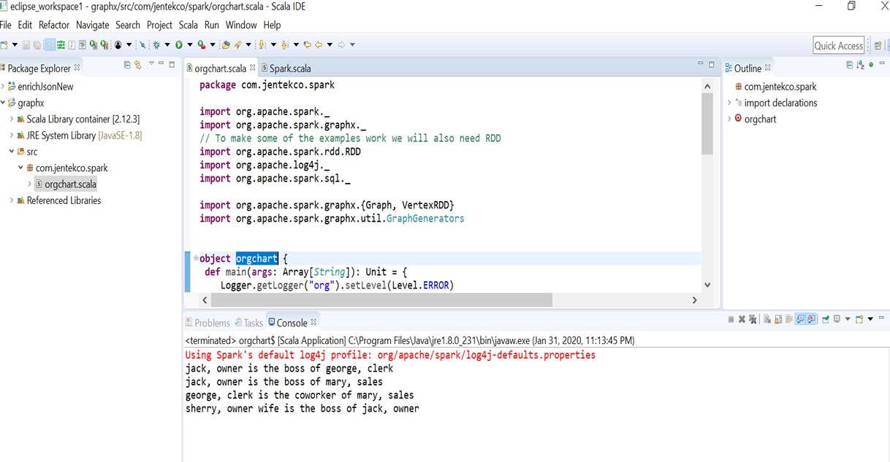

#### Enrich JSON

JSON \(JavaScript Object Notation\) is a lightweight data-interchange format. It is easy for humans to read and write. It is easy for machines to parse and generate. 

One of the Json representation is a collection of name/value pairs. In various languages, this is realized as an object, record, struct, dictionary, hash table, keyed list, or associative arra

Json is one of the major data representations for both Human being and machine.  Social media companies sends you streaming data if you request them through their API, for example, Twitter can stream you tweets in Json.

However, after all, Json is just a text string, just a text string that has to follow given syntaxt in order for the machine to parse it.  We human being can read a Json even it is syntactically incorrect.

The use case I would like to demonstrate is to add information to a given Json string and produce a new json string contains additional information, i.e, to enrich a Json.

Following is record 1

{

    "visitorId": "v1",

    "products": \[{

         "id": "i1",

         "interest": 0.68

    }, {

         "id": "i2",

         "interest": 0.42

    }\]

}

Following is record 2:

{

    "visitorId": "v2",

    "products": \[{

         "id": "i1",

         "interest": 0.78

    }, {

         "id": "i3",

         "interest": 0.11

    }\] }

Following is dimension definition:

"i1” is  "Nike Shoes"

"i2" is "Umbrella“

"i3"  is "Jeans“

Now define enrichment task: Turn the record 1, based upon dimension defined earlier, add a “name” attribute:

{

    "visitorId": "v1",

    "products": \[{

         "id": "i1",

         "interest": 0.68

    }, {

         "id": "i2",

         "interest": 0.42

    }\]

}

Into

{

    "visitorId": "v1",

    "products": \[{

         "id": "i1",

         “name”: “Nike Shoes”,

         "interest": 0.68

    }, {

         "id": "i2",

         “name”: “Unbrella”,

         "interest": 0.42

    }\]

}

Also, enrich record 2 the same way:

{

    "visitorId": "v2",

    "products": \[{

         "id": "i1",

         "interest": 0.78

    }, {

         "id": "i3",

         "interest": 0.11

    }\]

}

Into:

{

    "visitorId": "v2",

    "products": \[{

         "id": "i1",

         “name”:  “Nike Shoes”,

         "interest": 0.78

    }, {

         "id": "i3",

         “name”:  “Jeans”,

         "interest": 0.11

    }\]

}

I am going to use Scala for the Json enrichment task.  Why Scala? Two reasons:

Scala has wealth of Json library that can parse and extract Json string easily.

Apache Spark has its own library and methods to read and parse Json through Spark SQL.

I will use 2 approaches to accomplish the Json enrichment task defined earlier.

Approach that does not use Apache Spark

Approach that uses Apache Spark SQL

Here is the non spark approach, by using json4s library:

import $ivy.\`org.json4s::json4s-jackson:3.7.0-M2\`

import org.json4s.\_

import org.json4s.jackson.JsonMethods.\_

import org.json4s.DefaultFormats

import org.json4s.jackson.Serialization

import org.json4s.jackson.Serialization.write

implicit val formats = org.json4s.DefaultFormats

//define original record 1 and record 2

val rec1: String = """{

    "visitorId": "v1",

    "products": \[{

         "id": "i1",

         "interest": 0.68

    }, {

         "id": "i2",

         "interest": 0.42

    }\]

}"""

 val rec2: String = """{

    "visitorId": "v2",

    "products": \[{

         "id": "i1",

         "interest": 0.78

    }, {

         "id": "i3",

         "interest": 0.11

    }\]

}"""

val visitsData: Seq\[String\] = Seq\(rec1, rec2\)

      for \(i&lt;-0 until visitsData.size\)

      {

        println\(visitsData\(i\)\)

        println\(" "\)

      }

//Define dimension into key value pair map

val productIdToNameMap = Map\("i1" -&gt; "Nike Shoes", "i2" -&gt; "Umbrella", "i3" -&gt; "Jeans"\)

// define case class that matches the structure of original Json record.  You need that case class to extract Json attribute later on

case class v\_rec\(

    id: String,

    interest: Double

    \)

    case class p\_rec\(

        visitorId: String, products: Array\[v\_rec\]

    \)

//define New case class that will match new enriched Json string, that has added name field, you need that new case class to create a new, enriched Json string that has an added name key value pair

case class v\_rec\_new\(

        id: String,

        name: String,

        interest: Double

      \)

    case class p\_rec\_new\(

        visitorId: String, products: Array\[v\_rec\_new\]

      \)

var jString: Array\[String\]=Array\[String\]\(\)

var enrichedJson:Array\[String\]=Array\[String\]\(\)

//Below starts parse, extract original Json record, generate new enriched Json string

for \(js&lt;-visitsData\)

    {

      var jObj=parse\(js\)

      var eJ=jObj.extract\[p\_rec\]

      var jStringJ=parse\(rec1\)

      for \(i&lt;-0 until eJ.products.size\)

       {

           var prodName:String="Invalid Product"

           //if there is no such product, show Invalid Product

           if \(productIdToNameMap contains \(eJ.products\(i\).id.toString\)\)               

               prodName=productIdToNameMap\(eJ.products\(i\).id.toString\)

           var newRec=p\_rec\_new\(visitorId=eJ.visitorId,products=Array\(v\_rec\_new\(eJ.products\(i\).id.toString,

           prodName,eJ.products\(i\).interest        

           \)

           \)

           \)  

//Now Json Serilizing it

            val newRecStr = write\(newRec\)

           jString:+=newRecStr

       }

      for \(x&lt;-0 until jString.size\)

      {  

          if \(x==0\)

            jStringJ=parse\(jString\(x\)\)

          else

          {

            jStringJ=jStringJ merge parse\(jString\(x\)\)

          }

      }

// Finally, print the new enriched Json string out

      enrichedJson:+=write\(jStringJ\)       

      jString=Array\[String\]\(\)

  }

Running the prior Scala code will produce below output:

{"visitorId":"v1","products":\[{"id":"i1","name":"Nike Shoes","interest":0.68},{"id":"i2","name":"Umbrella","interest":0.42}\]}

{"visitorId":"v2","products":\[{"id":"i1","name":"Nike Shoes","interest":0.78},{"id":"i3","name":"Jeans","interest":0.11}\]}

Next, I will demonstrate to do the same enrichment on the same Json record and produce the same output, by using Apache Spark SQL.

import org.apache.spark.\_

import org.apache.spark.SparkContext.\_

import org.apache.spark.rdd.\_

import org.apache.spark.util.LongAccumulator

import org.apache.log4j.\_

import scala.collection.mutable.ArrayBuffer

import org.apache.spark.sql.\_

import org.apache.spark.sql.functions.\_

//original Json record 1

val rec1: String = """{

    "visitorId": "v1",

    "products": \[{

         "id": "i1",

         "interest": 0.68

    }, {

         "id": "i2",

         "interest": 0.42

    }\]

}"""

//original Json record 2

val rec2: String = """{

    "visitorId": "v2",

    "products": \[{

         "id": "i1",

         "interest": 0.78

    }, {

         "id": "i3",

"interest": 0.11

    }\]

}"""

val visitsData: Seq\[String\] = Seq\(rec1, rec2\)

//define product id to name key value pair map

val productIdToNameMap = Map\("i1" -&gt; "Nike Shoes", "i2" -&gt; "Umbrella", "i3" -&gt; "Jeans"\)

/\*

Now solution starts

\*/

import spark.implicits.\_

import spark.sql

productIdToNameMap.toSeq.toDF\("id","name"\).createOrReplaceTempView\("prodRec"\)

for \(i&lt;-visitsData\)

    {

   println\("Original Json String is: \n"\)

    println\(i\)

    println\("\n"\)

    var rec=spark.read.json\(Seq\(i\).toDS\)

    rec.createOrReplaceTempView\("dfVisitsTable"\)

   val productsArr=sql \("SELECT products FROM dfVisitsTable"\).withColumn\("products", explode\($"products"\)\).select\("products.\*"\)

productsArr.createOrReplaceTempView\("productsArr"\)

//  Need to do outer join in case the product id in the record is not valid, if product id not found in the MAP,

//  return invalid product

    val enrichedProducts=sql\("select a.id, if \(b.name is not null, b.name, 'invalid product'\) name, a.interest from productsArr a full outer join prodRec b on a.id=b.id"\)

val enrichedRecord=rec.select\("VisitorId"\).join\(enrichedProducts\)

enrichedRecord.createOrReplaceTempView\("enrichedRec"\)

val enrichedJson=sql\("select visitorId, collect\_list\(struct\(id, name, interest\)\) products from enrichedRec group by visitorId"\).toJSON.collect.mkString\("",",",""\)

    println\("Enriched Json String is:\n"\)

    println\(enrichedJson\)

    println\(" "\)

    println\(" "\)

    }

Executing prior Spark Scala code produces below output:

Original Json String is:

{

    "visitorId": "v1",

    "products": \[{

         "id": "i1",

         "interest": 0.68

    }, {

         "id": "i2",

         "interest": 0.42

    }\]

}

Enriched Json String is:

{"visitorId":"v1","products":\[{"name":"Jeans"},{"id":"i1","name":"Nike Shoes","interest":0.68},{"id":"i2","name":"Umbrella","interest":0.42}\]}

Original Json String is:

{

    "visitorId": "v2",

    "products": \[{

         "id": "i1",

         "interest": 0.78

    }, {

         "id": "i3",

         "interest": 0.11

    }\]

}

Enriched Json String is:

{"visitorId":"v2","products":\[{"id":"i3","name":"Jeans","interest":0.11},{"id":"i1","name":"Nike Shoes","interest":0.78},{"name":"Umbrella"}\]}

Both approaches, Scala only without Spark and Scala with Spark produce the same result.  Which method would I recommend?  In the production environment with large number of Json records, thinking about millions or billions of Json records to be processed, Apache Spark is a way to go. 

A scala program in itself is no different from a Java program, in fact, they are the same because both will be compiled into Java byte code and run on JVM. Scala program is just a monolithic program without parallelism unless you code it that way.  Writing a Scala program with Apache Spark will take advantages of Spark distributed computing framework and rich library of Spark SQL, that processes, for example, Json enrichment task in a few SQL queries executed by Apache Spark, in parallel, across Spark worker nodes.

## Machine Learning

MLlib is Spark’s machine learning \(ML\) library. Its goal is to make practical machine learning scalable and easy. At a high level, it provides tools such as:

ML Algorithms:    classification, regression, clusteringe, colaborative filtering

Featurization:       feature extraction, transformation, dimensionality   reduction, and selection

Pipelines:   tools for constructing, evaluating, and tuning ML   Pipelines

Persistence:   saving and load algorithms, models, and Pipelines

Utilities:   linear algebra, statistics, data handling, etc.

#### Classification and regression

#### Binary Classification linear SVMs  

logistic regression   

decision trees

 naive Bayes

#### Multiclass Classification  

decision trees

 naive Bayes

#### Regression  

linear least squares

 Lasso

  ridge regression

  decision trees

#### Correlation

Calculating the correlation between two series of data is a common operation in Statistics.   Correlation is to measure if two variables or two feature columns tend to move in together in same or opposite direction.  The idea is to detect if one variable or feature column can be predicted by another variable or feature column.

Spark.ml has correlation methods for Pearson’s and Spearman’s correlation.

Pearson correlation for checking correlation between two continuous variables \(or feature columns\)

Spearman correlation for checking correlation between two ordinal variables

Spearman correlation evaluates the monotonic relationship between two continuous or ordinal variables. In a monotonic relationship, the variables tend to change together, but not necessarily at a constant rate. The Spearman correlation coefficient is based on the ranked values for each variable rather than the raw data.

import org.apache.spark.ml.linalg.{Matrix, Vectors}

import org.apache.spark.ml.stat.Correlation

import org.apache.spark.sql.Row

val data = Seq\(

  Vectors.sparse\(4, Seq\(\(0, 1.0\), \(3, -2.0\)\)\),

  Vectors.dense\(4.0, 5.0, 0.0, 3.0\),

  Vectors.dense\(6.0, 7.0, 0.0, 8.0\),

  Vectors.sparse\(4, Seq\(\(0, 9.0\), \(3, 1.0\)\)\)

\)

val df = data.map\(Tuple1.apply\).toDF\("features"\)

val Row\(coeff1: Matrix\) = Correlation.corr\(df, "features"\).head

println\(s"Pearson correlation matrix:\n $coeff1"\)

val Row\(coeff2: Matrix\) = Correlation.corr\(df, "features", "spearman"\).head

println\(s"Spearman correlation matrix:\n $coeff2"\)

Hypothesis testing in statistics is to determine whether a result is statistically significant, whether this result occurred by chance or not. spark.ml currently supports Pearson’s Chi-squared tests for independence.

ChiSquareTest conducts Pearson’s independence test for every feature against the label. For each feature, the \(feature, label\) pairs are converted into a contingency matrix for which the Chi-squared statistic is computed. All label and feature values must be categorical.

The Chi Square statistic is commonly used for testing relationships between categorical variables or feature columns. The null hypothesis of the Chi-Square test is that no relationship exists on the categorical variables in the population; they are independent.

import org.apache.spark.ml.linalg.{Vector, Vectors}

import org.apache.spark.ml.stat.ChiSquareTest

val data = Seq\(

  \(0.0, Vectors.dense\(0.5, 10.0\)\),

  \(0.0, Vectors.dense\(1.5, 20.0\)\),

  \(1.0, Vectors.dense\(1.5, 30.0\)\),

  \(0.0, Vectors.dense\(3.5, 30.0\)\),

  \(0.0, Vectors.dense\(3.5, 40.0\)\),

  \(1.0, Vectors.dense\(3.5, 40.0\)\)

\)

val df = data.toDF\("label", "features"\)

val chi = ChiSquareTest.test\(df, "features", "label"\).head

println\(s"pValues = ${chi.getAs\[Vector\]\(0\)}"\)

println\(s"degreesOfFreedom ${chi.getSeq\[Int\]\(1\).mkString\("\[", ",", "\]"\)}"\)

println\(s"statistics ${chi.getAs\[Vector\]\(2\)}"\)

ML data sources:

Parquet, CSV, JSON, JDBC and images \(JPG and PNG\)

Image data source

This image data source is used to load image files from a directory, it can load compressed image \(jpeg, png, etc.\) into raw image representation via ImageIO in Java library. The loaded DataFrame has one StructType column: “image”, containing image data stored as image schema. The schema of the image column is:

origin: StringType \(represents the file path of the image\)

height: IntegerType \(height of the image\)

width: IntegerType \(width of the image\)

nChannels: IntegerType \(number of image channels\)

mode: IntegerType \(OpenCV-compatible type\)

data: BinaryType \(Image bytes in OpenCV-compatible order: row-wise BGR in most cases\)

val df = spark.read.format\("image"\).option\("dropInvalid", true\).load\("/home/dv6/spark/spark/data/mllib/images/origin/kittens"\)

df.select\("image.origin", "image.width", "image.height"\).show\(truncate=false\)

+-------------------------------------------------------------------------------------+-----+------+

\|origin                                                                               width\|height\|

+-------------------------------------------------------------------------------------+-----+------+

\|file:///home/dv6/spark/spark/data/mllib/images/origin/kittens/54893.jpg              \|300  \|311   \|

\|file:///home/dv6/spark/spark/data/mllib/images/origin/kittens/DP802813.jpg           \|199  \|313   \|

\|file:///home/dv6/spark/spark/data/mllib/images/origin/kittens/29.5.a\_b\_EGDP022204.jpg\|300  \|200   \|

\|file:///home/dv6/spark/spark/data/mllib/images/origin/kittens/DP153539.jpg           \|300  \|296   \|

+-------------------------------------------------------------------------------------+-----+------+

MLlib standardizes APIs for machine learning algorithms to make it easier to combine multiple algorithms into a single pipeline, or workflow. This section covers the key concepts introduced by the Pipelines API, where the pipeline concept is mostly inspired by the scikit-learn project.

#### DataFrame: 

This ML API uses DataFrame from Spark SQL as an ML dataset, which can hold a variety of data types. E.g., a DataFrame could have different columns storing text, feature vectors, true labels, and predictions.

#### Transformer: 

A Transformer is an algorithm which can transform one DataFrame into another DataFrame. E.g., an ML model is a Transformer which transforms a DataFrame with features into a DataFrame with predictions.

#### Estimator: 

An Estimator is an algorithm which can be fit on a DataFrame to produce a Transformer. E.g., a learning algorithm is an Estimator which trains on a DataFrame and produces a model.

#### Pipeline: 

A Pipeline chains multiple Transformers and Estimators together to specify an ML workflow.

#### Parameter: 

All Transformers and Estimators now share a common API for specifying parameters.

Methods for Pipeline components:

A Transformer is an abstraction that includes feature transformers and learned models. Technically, a Transformer implements a method transform\(\), which converts one DataFrame into another, generally by appending one or more columns. For example:

A feature transformer might take a DataFrame, read a column \(e.g., text\), map it into a new column \(e.g., feature vectors\), and output a new DataFrame with the mapped column appended.

A learning model might take a DataFrame, read the column containing feature vectors, predict the label for each feature vector, and output a new DataFrame with predicted labels appended as a column.

Estimators

Estimator implements a method fit\(\), which accepts a DataFrame and produces a Model, which is a Transformer. For example, a learning algorithm such as LogisticRegression is an Estimator, and calling fit\(\) trains a LogisticRegressionModel, which is a Model and hence a Transformer.

Pipeline

In machine learning, it is common to run a sequence of algorithms to process and learn from data. E.g., a simple text document processing workflow might include several stages:

Split each document’s text into words.

Convert each document’s words into a numerical feature vector.

Learn a prediction model using the feature vectors and labels.

MLlib represents such a workflow as a Pipeline, which consists of a sequence of PipelineStages \(Transformers and Estimators\) to be run in a specific order. We will use this simple workflow as a running example in this section.

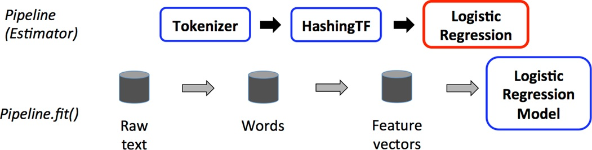

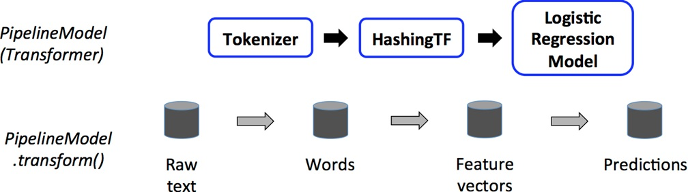

import org.apache.spark.ml.{Pipeline, PipelineModel}

import org.apache.spark.ml.classification.LogisticRegression

import org.apache.spark.ml.feature.{HashingTF, Tokenizer}

import org.apache.spark.ml.linalg.Vector

import org.apache.spark.sql.Row

// Prepare training documents from a list of \(id, text, label\) tuples.

val training = spark.createDataFrame\(Seq\(

  \(0L, "a b c d e spark", 1.0\),

  \(1L, "b d", 0.0\),

  \(2L, "spark f g h", 1.0\),

  \(3L, "hadoop mapreduce", 0.0\)

\)\).toDF\("id", "text", "label"\)

// Configure an ML pipeline, which consists of three stages: tokenizer, hashingTF, and lr.

val tokenizer = new Tokenizer\(\)

  .setInputCol\("text"\)

  .setOutputCol\("words"\)

val hashingTF = new HashingTF\(\)

  .setNumFeatures\(1000\)

  .setInputCol\(tokenizer.getOutputCol\)

  .setOutputCol\("features"\)

val lr = new LogisticRegression\(\)

  .setMaxIter\(10\)

  .setRegParam\(0.001\)

val pipeline = new Pipeline\(\)

  .setStages\(Array\(tokenizer, hashingTF, lr\)\)

// Fit the pipeline to training documents.

val model = pipeline.fit\(training\)

// Now we can optionally save the fitted pipeline to disk

model.write.overwrite\(\).save\("/tmp/spark-logistic-regression-model"\)

// We can also save this unfit pipeline to disk

pipeline.write.overwrite\(\).save\("/tmp/unfit-lr-model"\)

// And load it back in during production

val sameModel = PipelineModel.load\("/tmp/spark-logistic-regression-model"\)

// Prepare test documents, which are unlabeled \(id, text\) tuples.

val test = spark.createDataFrame\(Seq\(

  \(4L, "spark i j k"\),

  \(5L, "l m n"\),

  \(6L, "spark hadoop spark"\),

  \(7L, "apache hadoop"\)

\)\).toDF\("id", "text"\)

// Make predictions on test documents.

sameModel.transform\(test\)

  .select\("id", "text", "probability", "prediction"\)

  .collect\(\)

  .foreach { case Row\(id: Long, text: String, prob: Vector, prediction: Double\) =&gt;

    println\(s"\($id, $text\) --&gt; prob=$prob, prediction=$prediction"\)

  }

\(4, spark i j k\) --&gt; prob=\[0.15964077387874118,0.8403592261212589\], prediction=1.0

\(5, l m n\) --&gt; prob=\[0.8378325685476612,0.16216743145233875\], prediction=0.0

\(6, spark hadoop spark\) --&gt; prob=\[0.06926633132976273,0.9307336686702373\], prediction=1.0 \(7, apache hadoop\) --&gt; prob=\[0.9821575333444208,0.01784246665557917\], prediction=0.0

#### Extracting, transforming and selecting features

Extraction:   Extracting features from “raw” data

Transformation:   Scaling, converting, or modifying features

Selection:   Selecting a subset from a larger set of features

#### Locality Sensitive Hashing \(LSH\):

  This class of algorithms combines aspects of feature   transformation with other algorithms.

Extraction:

#### TF-IDF

Term frequency-inverse document frequency \(TF-IDF\) is a feature vectorization method widely used in text mining to reflect the importance of a term to a document in the corpus.

TF-IDF

Term frequency-inverse document frequency \(TF-IDF\) is a feature vectorization method widely used in text mining to reflect the importance of a term to a document in the corpus.

TF: Both HashingTF and CountVectorizer can be used to generate the term frequency vectors.

HashingTF:

HashingTF is a Transformer which takes sets of terms and converts those sets into fixed-length feature vectors. In text processing, a “set of terms” might be a bag of words. HashingTF utilizes the hashing trick.

#### CountVectorizer:

CountVectorizer converts text documents to vectors of term counts.

IDF: IDF is an Estimator which is fit on a dataset and produces an IDFModel. The IDFModel takes feature vectors \(generally created from HashingTF or CountVectorizer\) and scales each feature. Intuitively, it down-weights features which appear frequently in a corpus.

import org.apache.spark.ml.feature.{HashingTF, IDF, Tokenizer}

val sentenceData = spark.createDataFrame\(Seq\(

  \(0.0, "Hi I heard about Spark"\),

  \(0.0, "I wish Java could use case classes"\),

  \(1.0, "Logistic regression models are neat"\)

\)\).toDF\("label", "sentence"\)

val tokenizer = new Tokenizer\(\).setInputCol\("sentence"\).setOutputCol\("words"\)

val wordsData = tokenizer.transform\(sentenceData\)

wordsData.show\(false\)

Examples

Assume that we have the following DataFrame with columns id and category:

id \| category

----\|----------

 0  \| a

 1  \| b

 2  \| c

 3  \| a

 4  \| a

 5  \| c

category is a string column with three labels: “a”, “b”, and “c”. Applying StringIndexer with category as the input column and categoryIndex as the output column, we should get the following:

id \| category \| categoryIndex

----\|----------\|---------------

 0  \| a        \| 0.0

 1  \| b        \| 2.0

 2  \| c        \| 1.0

 3  \| a        \| 0.0

 4  \| a        \| 0.0

 5  \| c        \| 1.0

“a” gets index 0 because it is the most frequent, followed by “c” with index 1 and “b” with index 2.

+-----+-----------------------------------+------------------------------------------+

\|label\|sentence                           \|words                                     \|

+-----+-----------------------------------+------------------------------------------+

\|0.0  \|Hi I heard about Spark             \|\[hi, i, heard, about, spark\]              \|

\|0.0  \|I wish Java could use case classes \|\[i, wish, java, could, use, case, classes\]\|

\|1.0  \|Logistic regression models are neat\|\[logistic, regression, models, are, neat\] \|

+-----+-----------------------------------+------------------------------------------+

val hashingTF = new HashingTF\(\)

  .setInputCol\("words"\).setOutputCol\("rawFeatures"\).setNumFeatures\(20\)

val featurizedData = hashingTF.transform\(wordsData\)

featurizedData.show\(false\)

+-----+-----------------------------------+------------------------------------------+-----------------------------------------+

\|label\|sentence                           \|words                                     \|rawFeatures                              \|

+-----+-----------------------------------+------------------------------------------+-----------------------------------------+

\|0.0  \|Hi I heard about Spark             \|\[hi, i, heard, about, spark\]              \|\(20,\[0,5,9,17\],\[1.0,1.0,1.0,2.0\]\)        \|

\|0.0  \|I wish Java could use case classes \|\[i, wish, java, could, use, case, classes\]\|\(20,\[2,7,9,13,15\],\[1.0,1.0,3.0,1.0,1.0\]\) \|

\|1.0  \|Logistic regression models are neat\|\[logistic, regression, models, are, neat\] \|\(20,\[4,6,13,15,18\],\[1.0,1.0,1.0,1.0,1.0\]\)\|

+-----+-----------------------------------+------------------------------------------+-----------------------------------------+

val idf = new IDF\(\).setInputCol\("rawFeatures"\).setOutputCol\("features"\)

val idfModel = idf.fit\(featurizedData\)

val rescaledData = idfModel.transform\(featurizedData\)

rescaledData.select\("label", "features"\).show\(false\)

+-----+----------------------------------------------------------------------------------------------------------------------+

\|label\|features                                                                                                              \|

+-----+----------------------------------------------------------------------------------------------------------------------+

\|0.0  \|\(20,\[0,5,9,17\],\[0.6931471805599453,0.6931471805599453,0.28768207245178085,1.3862943611198906\]\)                        \|

\|0.0  \|\(20,\[2,7,9,13,15\],\[0.6931471805599453,0.6931471805599453,0.8630462173553426,0.28768207245178085,0.28768207245178085\]\) \|

\|1.0  \|\(20,\[4,6,13,15,18\],\[0.6931471805599453,0.6931471805599453,0.28768207245178085,0.28768207245178085,0.6931471805599453\]\)\|

+-----+----------------------------------------------------------------------------------------------------------------------+

val model = word2Vec.fit\(documentDF\)

val result = model.transform\(documentDF\)

result.show\(false\)

+------------------------------------------+---------------------------------------------------------------+

\|text                                      \|result                                                         \|

+------------------------------------------+---------------------------------------------------------------+

\|\[Hi, I, heard, about, Spark\]              \|\[0.03173386193811894,0.009443491697311401,0.024377789348363876\]\|

\|\[I, wish, Java, could, use, case, classes\]\|\[0.025682436302304268,0.0314303718706859,-0.01815584538105343\] \|

\|\[Logistic, regression, models, are, neat\] \|\[0.022586782276630402,-0.01601201295852661,0.05122732147574425\]\|

+------------------------------------------+---------------------------------------------------------------+

CountVectorizer and CountVectorizerModel aim to help convert a collection of text documents to vectors of token counts. When an a-priori dictionary is not available, CountVectorizer can be used as an Estimator to extract the vocabulary, and generates a CountVectorizerModel. The model produces sparse representations for the documents over the vocabulary, which can then be passed to other algorithms like LDA.

During the fitting process, CountVectorizer will select the top vocabSize words ordered by term frequency across the corpus. An optional parameter minDF also affects the fitting process by specifying the minimum number \(or fraction if &lt; 1.0\) of documents a term must appear in to be included in the vocabulary. Another optional binary toggle parameter controls the output vector. If set to true all nonzero counts are set to 1. This is especially useful for discrete probabilistic models that model binary, rather than integer, counts.

id \| texts

----\|----------

 0  \| Array\("a", "b", "c"\)

 1  \| Array\("a", "b", "b", "c", "a"\)

each row in texts is a document of type Array\[String\]. Invoking fit of CountVectorizer produces a CountVectorizerModel with vocabulary \(a, b, c\). Then the output column "vector" after transformation contains:

id \| texts                           \| vector

----\|---------------------------------\|---------------

 0  \| Array\("a", "b", "c"\)            \| \(3,\[0,1,2\],\[1.0,1.0,1.0\]\)  1  \| Array\("a", "b", "b", "c", "a"\)  \| \(3,\[0,1,2\],\[2.0,2.0,1.0\]\)

import org.apache.spark.ml.feature.{CountVectorizer, CountVectorizerModel}

val df = spark.createDataFrame\(Seq\(

  \(0, Array\("a", "b", "c"\)\),

  \(1, Array\("a", "b", "b", "c", "a"\)\)

\)\).toDF\("id", "words"\)

// fit a CountVectorizerModel from the corpus

val cvModel: CountVectorizerModel = new CountVectorizer\(\)

  .setInputCol\("words"\)

  .setOutputCol\("features"\)

  .setVocabSize\(3\)

  .setMinDF\(2\)

  .fit\(df\)

// alternatively, define CountVectorizerModel with a-priori vocabulary

val cvm = new CountVectorizerModel\(Array\("a", "b", "c"\)\)

  .setInputCol\("words"\)

  .setOutputCol\("features"\)

cvModel.transform\(df\).show\(false\)

+---+---------------+-------------------------+

\|id \|words          \|features                 \|

+---+---------------+-------------------------+

\|0  \|\[a, b, c\]      \|\(3,\[0,1,2\],\[1.0,1.0,1.0\]\)\|

\|1  \|\[a, b, b, c, a\]\|\(3,\[0,1,2\],\[2.0,2.0,1.0\]\)\|

+---+---------------+-------------------------+

cvm.transform\(df\).show\(false\)

+---+---------------+-------------------------+

\|id \|words          \|features                 \|

+---+---------------+-------------------------+

\|0  \|\[a, b, c\]      \|\(3,\[0,1,2\],\[1.0,1.0,1.0\]\)\|

\|1  \|\[a, b, b, c, a\]\|\(3,\[0,1,2\],\[2.0,2.0,1.0\]\)\|

+---+---------------+-------------------------+

Feature hashing projects a set of categorical or numerical features into a feature vector of specified dimension \(typically substantially smaller than that of the original feature space\). This is done using the hashing trick to map features to indices in the feature vector.

The FeatureHasher transformer operates on multiple columns. Each column may contain either numeric or categorical features. Behavior and handling of column data types is as follows:

Numeric columns: For numeric features, the hash value of the column name is used to map the feature value to its index in the feature vector. By default, numeric features are not treated as categorical \(even when they are integers\). To treat them as categorical, specify the relevant columns using the categoricalCols parameter.

String columns: For categorical features, the hash value of the string “column\_name=value” is used to map to the vector index, with an indicator value of 1.0. Thus, categorical features are “one-hot” encoded \(similarly to using OneHotEncoder with dropLast=false\).

Boolean columns: Boolean values are treated in the same way as string columns. That is, boolean features are represented as “column\_name=true” or “column\_name=false”, with an indicator value of 1.0.

Null \(missing\) values are ignored \(implicitly zero in the resulting feature vector\).

Tokenization is the process of taking text \(such as a sentence\) and breaking it into individual terms \(usually words\). A simple Tokenizer class provides this functionality. The example below shows how to split sentences into sequences of words.

RegexTokenizer allows more advanced tokenization based on regular expression \(regex\) matching. By default, the parameter “pattern” \(regex, default: "\\s+"\) is used as delimiters to split the input text. Alternatively, users can set parameter “gaps” to false indicating the regex “pattern” denotes “tokens” rather than splitting gaps, and find all matching occurrences as the tokenization result.

import org.apache.spark.ml.feature.{RegexTokenizer, Tokenizer}

import org.apache.spark.sql.SparkSession

import org.apache.spark.sql.functions.\_

val sentenceDataFrame = spark.createDataFrame\(Seq\(

  \(0, "Hi I heard about Spark"\),

  \(1, "I wish Java could use case classes"\),

  \(2, "Logistic,regression,models,are,neat"\)

\)\).toDF\("id", "sentence"\)

val tokenizer = new Tokenizer\(\).setInputCol\("sentence"\).setOutputCol\("words"\)

val regexTokenizer = new RegexTokenizer\(\)

  .setInputCol\("sentence"\)

  .setOutputCol\("words"\)

  .setPattern\("\\W"\) // alternatively .setPattern\("\\w+"\).setGaps\(false\)

val countTokens = udf { \(words: Seq\[String\]\) =&gt; words.length }

val tokenized = tokenizer.transform\(sentenceDataFrame\)

tokenized.select\("sentence", "words"\)

    .withColumn\("tokens", countTokens\(col\("words"\)\)\).show\(false\)

+-----------------------------------+------------------------------------------+------+

\|sentence                           \|words                                     \|tokens\|

+-----------------------------------+------------------------------------------+------+

\|Hi I heard about Spark             \|\[hi, i, heard, about, spark\]              \|5     \|

\|I wish Java could use case classes \|\[i, wish, java, could, use, case, classes\]\|7     \|

\|Logistic,regression,models,are,neat\|\[logistic,regression,models,are,neat\]     \|1     \|

+-----------------------------------+------------------------------------------+------+

val regexTokenized = regexTokenizer.transform\(sentenceDataFrame\)

regexTokenized.select\("sentence", "words"\)

    .withColumn\("tokens", countTokens\(col\("words"\)\)\).show\(false\)

+-----------------------------------+------------------------------------------+------+

\|sentence                           \|words                                     \|tokens\|

+-----------------------------------+------------------------------------------+------+

\|Hi I heard about Spark             \|\[hi, i, heard, about, spark\]              \|5     \|

\|I wish Java could use case classes \|\[i, wish, java, could, use, case, classes\]\|7     \|

\|Logistic,regression,models,are,neat\|\[logistic, regression, models, are, neat\] \|5     \|

Stop words are words which should be excluded from the input, typically because the words appear frequently and don’t carry as much meaning.

StopWordsRemover takes as input a sequence of strings \(e.g. the output of a Tokenizer\) and drops all the stop words from the input sequences. The list of stopwords is specified by the stopWords parameter. Default stop words for some languages are accessible by calling StopWordsRemover.loadDefaultStopWords\(language\), for which available options are “danish”, “dutch”, “english”, “finnish”, “french”, “german”, “hungarian”, “italian”, “norwegian”, “portuguese”, “russian”, “spanish”, “swedish” and “turkish”. A boolean parameter caseSensitive indicates if the matches should be case sensitive \(false by default\).

Examples

Assume that we have the following DataFrame with columns id and raw:

 id \| raw

----\|----------

 0  \| \[I, saw, the, red, baloon\]

 1  \| \[Mary, had, a, little, lamb\]

Applying StopWordsRemover with raw as the input column and filtered as the output column, we should get the following:

 id \| raw                         \| filtered

----\|-----------------------------\|--------------------

 0  \| \[I, saw, the, red, baloon\]  \|  \[saw, red, baloon\]

 1  \| \[Mary, had, a, little, lamb\]\|\[Mary, little, lamb\]

import org.apache.spark.ml.feature.StopWordsRemover

val remover = new StopWordsRemover\(\)

  .setInputCol\("raw"\)

  .setOutputCol\("filtered"\)

val dataSet = spark.createDataFrame\(Seq\(

  \(0, Seq\("I", "saw", "the", "red", "balloon"\)\),

  \(1, Seq\("Mary", "had", "a", "little", "lamb"\)\)

\)\).toDF\("id", "raw"\)

remover.transform\(dataSet\).show\(false\)

+---+----------------------------+--------------------+

\|id \|raw                         \|filtered            \|

+---+----------------------------+--------------------+

\|0  \|\[I, saw, the, red, balloon\] \|\[saw, red, balloon\] \|

\|1  \|\[Mary, had, a, little, lamb\]\|\[Mary, little, lamb\]\|

+---+----------------------------+--------------------+

An n-gram is a sequence of n tokens \(typically words\) for some integer n. The NGram class can be used to transform input features into n-grams.

NGram takes as input a sequence of strings \(e.g. the output of a Tokenizer\). The parameter n is used to determine the number of terms in each n-gram. The output will consist of a sequence of n-grams where each n-gram is represented by a space-delimited string of n consecutive words. If the input sequence contains fewer than n strings, no output is produced.

import org.apache.spark.ml.feature.NGram

val wordDataFrame = spark.createDataFrame\(Seq\(

  \(0, Array\("Hi", "I", "heard", "about", "Spark"\)\),

  \(1, Array\("I", "wish", "Java", "could", "use", "case", "classes"\)\),

  \(2, Array\("Logistic", "regression", "models", "are", "neat"\)\)

\)\).toDF\("id", "words"\)

val ngram = new NGram\(\).setN\(2\).setInputCol\("words"\).setOutputCol\("ngrams"\)

val ngramDataFrame = ngram.transform\(wordDataFrame\)

ngramDataFrame.select\("ngrams"\).show\(false\)

+------------------------------------------------------------------+

\|ngrams                                                            \|

+------------------------------------------------------------------+

\|\[Hi I, I heard, heard about, about Spark\]                         \|

\|\[I wish, wish Java, Java could, could use, use case, case classes\]\|

\|\[Logistic regression, regression models, models are, are neat\]    \|

+------------------------------------------------------------------+

+-----------------------------------+------------------------------------------+------+

Binarization is the process of thresholding numerical features to binary \(0/1\) features.

Binarizer takes the common parameters inputCol and outputCol, as well as the threshold for binarization. Feature values greater than the threshold are binarized to 1.0; values equal to or less than the threshold are binarized to 0.0. Both Vector and Double types are supported for inputCol.  

import org.apache.spark.ml.feature.Binarizer

val data = Array\(\(0, 0.1\), \(1, 0.8\), \(2, 0.2\)\)

val dataFrame = spark.createDataFrame\(data\).toDF\("id", "feature"\)

val binarizer: Binarizer = new Binarizer\(\)

  .setInputCol\("feature"\)

  .setOutputCol\("binarized\_feature"\)

  .setThreshold\(0.5\)

val binarizedDataFrame = binarizer.transform\(dataFrame\)

println\(s"Binarizer output with Threshold = ${binarizer.getThreshold}"\)

binarizedDataFrame.show\(\)

Binarizer output with Threshold = 0.5

+---+-------+-----------------+

\| id\|feature\|binarized\_feature\|

+---+-------+-----------------+

\|  0\|    0.1\|              0.0\|

\|  1\|    0.8\|              1.0\|

\|  2\|    0.2\|              0.0\| +---+-------+-----------------+

#### PCA

PCA is a statistical procedure that uses an orthogonal transformation to convert a set of observations of possibly correlated variables into a set of values of linearly uncorrelated variables called principal components. A PCA class trains a model to project vectors to a low-dimensional space using PCA. The example below shows how to project 5-dimensional feature vectors into 3-dimensional principal components.

import org.apache.spark.ml.feature.PCA

import org.apache.spark.ml.linalg.Vectors

val data = Array\(

  Vectors.sparse\(5, Seq\(\(1, 1.0\), \(3, 7.0\)\)\),

  Vectors.dense\(2.0, 0.0, 3.0, 4.0, 5.0\),

  Vectors.dense\(4.0, 0.0, 0.0, 6.0, 7.0\)

\)

val df = spark.createDataFrame\(data.map\(Tuple1.apply\)\).toDF\("features"\)

df.show\(false\)

+---------------------+

\|features             \|

+---------------------+

\|\(5,\[1,3\],\[1.0,7.0\]\)  \|

\|\[2.0,0.0,3.0,4.0,5.0\]\|

\|\[4.0,0.0,0.0,6.0,7.0\]\|

+---------------------+

val pca = new PCA\(\)

  .setInputCol\("features"\)

  .setOutputCol\("pcaFeatures"\)

  .setK\(3\)

  .fit\(df\)

val result = pca.transform\(df\).select\("pcaFeatures"\)

result.show\(false\)

+-----------------------------------------------------------+

\|pcaFeatures                                                \|

+-----------------------------------------------------------+

\|\[1.6485728230883807,-4.013282700516296,-5.524543751369388\] \|

\|\[-4.645104331781534,-1.1167972663619026,-5.524543751369387\]\|

\|\[-6.428880535676489,-5.337951427775355,-5.524543751369389\] \|

+-----------------------------------------------------------+

Polynomial expansion is the process of expanding your features into a polynomial space, which is formulated by an n-degree combination of original dimensions. A PolynomialExpansion class provides this functionality. The example below shows how to expand your features into a 3-degree polynomial space.

import org.apache.spark.ml.feature.PolynomialExpansion

import org.apache.spark.ml.linalg.Vectors

val data = Array\(

  Vectors.dense\(2.0, 1.0\),

  Vectors.dense\(0.0, 0.0\),

  Vectors.dense\(3.0, -1.0\)

\)

val df = spark.createDataFrame\(data.map\(Tuple1.apply\)\).toDF\("features"\)

val polyExpansion = new PolynomialExpansion\(\)

  .setInputCol\("features"\)

  .setOutputCol\("polyFeatures"\)

  .setDegree\(3\)

val polyDF = polyExpansion.transform\(df\)

polyDF.show\(false\)

+----------+------------------------------------------+

\|features  \|polyFeatures                              \|

+----------+------------------------------------------+

\|\[2.0,1.0\] \|\[2.0,4.0,8.0,1.0,2.0,4.0,1.0,2.0,1.0\]     \|

\|\[0.0,0.0\] \|\[0.0,0.0,0.0,0.0,0.0,0.0,0.0,0.0,0.0\]     \|

\|\[3.0,-1.0\]\|\[3.0,9.0,27.0,-1.0,-3.0,-9.0,1.0,3.0,-1.0\]\|

+----------+------------------------------------------+

import org.apache.spark.ml.feature.StringIndexer

val df = spark.createDataFrame\(

  Seq\(\(0, "a"\), \(1, "b"\), \(2, "c"\), \(3, "a"\), \(4, "a"\), \(5, "c"\)\)

\).toDF\("id", "category"\)

val indexer = new StringIndexer\(\)

  .setInputCol\("category"\)

  .setOutputCol\("categoryIndex"\)

val indexed = indexer.fit\(df\).transform\(df\)

indexed.show\(\)

+---+--------+-------------+

\| id\|category\|categoryIndex\|

+---+--------+-------------+

\|  0\|       a\|          0.0\|

\|  1\|       b\|          2.0\|

\|  2\|       c\|          1.0\|

\|  3\|       a\|          0.0\|

\|  4\|       a\|          0.0\|

\|  5\|       c\|          1.0\|

+---+--------+-------------+

Symmetrically to StringIndexer, IndexToString maps a column of label indices back to a column containing the original labels as strings. A common use case is to produce indices from labels with StringIndexer, train a model with those indices and retrieve the original labels from the column of predicted indices with IndexToString.

Examples

Building on the StringIndexer example, let’s assume we have the following DataFrame with columns id and categoryIndex:

 id \| categoryIndex

----\|---------------

 0  \| 0.0

 1  \| 2.0

 2  \| 1.0

 3  \| 0.0

 4  \| 0.0

 5  \| 1.0

Applying IndexToString with categoryIndex as the input column, originalCategory as the output column, we are able to retrieve our original labels \(they will be inferred from the columns’ metadata\):

 id \| categoryIndex \| originalCategory

----\|---------------\|-----------------

 0  \| 0.0           \| a

 1  \| 2.0           \| b

 2  \| 1.0           \| c

 3  \| 0.0           \| a

 4  \| 0.0           \| a  

5  \| 1.0           \| c

import org.apache.spark.ml.attribute.Attribute

import org.apache.spark.ml.feature.{IndexToString, StringIndexer}

val df = spark.createDataFrame\(Seq\(

  \(0, "a"\),

  \(1, "b"\),

  \(2, "c"\),

  \(3, "a"\),

  \(4, "a"\),

  \(5, "c"\)

\)\).toDF\("id", "category"\)

val indexer = new StringIndexer\(\)

  .setInputCol\("category"\)

  .setOutputCol\("categoryIndex"\)

  .fit\(df\)

val indexed = indexer.transform\(df\)

println\(s"Transformed string column '${indexer.getInputCol}' " +

    s"to indexed column '${indexer.getOutputCol}'"\)

indexed.show\(\)

Transformed string column 'category' to indexed column 'categoryIndex'

+---+--------+-------------+

\| id\|category\|categoryIndex\|

+---+--------+-------------+

\|  0\|       a\|          0.0\|

\|  1\|       b\|          2.0\|

\|  2\|       c\|          1.0\|

\|  3\|       a\|          0.0\|

\|  4\|       a\|          0.0\|

\|  5\|       c\|          1.0\|

+---+--------+-------------+

val inputColSchema = indexed.schema\(indexer.getOutputCol\)

println\(s"StringIndexer will store labels in output column metadata: " +

    s"${Attribute.fromStructField\(inputColSchema\).toString}\n"\)

val converter = new IndexToString\(\)

  .setInputCol\("categoryIndex"\)

  .setOutputCol\("originalCategory"\)

val converted = converter.transform\(indexed\)

println\(s"Transformed indexed column '${converter.getInputCol}' back to original string " +

    s"column '${converter.getOutputCol}' using labels in metadata"\)

converted.select\("id", "categoryIndex", "originalCategory"\).show\(\)

StringIndexer will store labels in output column metadata: {"vals":\["a","c","b"\],"type":"nominal","name":"categoryIndex"}

Transformed indexed column 'categoryIndex' back to original string column 'originalCategory' using labels in metadata

+---+-------------+----------------+

\| id\|categoryIndex\|originalCategory\|

+---+-------------+----------------+

\|  0\|          0.0\|               a\|

\|  1\|          2.0\|               b\|

\|  2\|          1.0\|               c\|

\|  3\|          0.0\|               a\|

\|  4\|          0.0\|               a\|

\|  5\|          1.0\|               c\| 

+---+-------------+----------------+

#### One-hot encoding 

One-hot encoding maps a categorical feature, represented as a label index, to a binary vector with at most a single one-value indicating the presence of a specific feature value from among the set of all feature values. This encoding allows algorithms which expect continuous features, such as Logistic Regression, to use categorical features. For string type input data, it is common to encode categorical features using StringIndexer first.

OneHotEncoderEstimator can transform multiple columns, returning an one-hot-encoded output vector column for each input column. It is common to merge these vectors into a single feature vector using VectorAssembler.

import org.apache.spark.ml.feature.OneHotEncoderEstimator

val df = spark.createDataFrame\(Seq\(

  \(0.0, 1.0\),

  \(1.0, 0.0\),

  \(2.0, 1.0\),

  \(0.0, 2.0\),

  \(0.0, 1.0\),

  \(2.0, 0.0\)

\)\).toDF\("categoryIndex1", "categoryIndex2"\)

val encoder = new OneHotEncoderEstimator\(\)

  .setInputCols\(Array\("categoryIndex1", "categoryIndex2"\)\)

  .setOutputCols\(Array\("categoryVec1", "categoryVec2"\)\)

val model = encoder.fit\(df\)

val encoded = model.transform\(df\)

encoded.show\(\)

+--------------+--------------+-------------+-------------+

\|categoryIndex1\|categoryIndex2\| categoryVec1\| categoryVec2\|

+--------------+--------------+-------------+-------------+

\|           0.0\|           1.0\|\(2,\[0\],\[1.0\]\)\|\(2,\[1\],\[1.0\]\)\|

\|           1.0\|           0.0\|\(2,\[1\],\[1.0\]\)\|\(2,\[0\],\[1.0\]\)\|

\|           2.0\|           1.0\|    \(2,\[\],\[\]\)\|\(2,\[1\],\[1.0\]\)\|

\|           0.0\|           2.0\|\(2,\[0\],\[1.0\]\)\|    \(2,\[\],\[\]\)\|

\|           0.0\|           1.0\|\(2,\[0\],\[1.0\]\)\|\(2,\[1\],\[1.0\]\)\|

\|           2.0\|           0.0\|    \(2,\[\],\[\]\)\|\(2,\[0\],\[1.0\]\)\|

+--------------+--------------+-------------+-------------+

Explain:

One hot encoding scheme:

0  -&gt; 10

1  -&gt; 01

2  -&gt; empty

1st value in the vector means length of code, which is 2

2nd array has indice where value is non 0

3rd array is the non zero value on the indice on 2nd array

VectorIndexer helps index categorical features in datasets of Vectors. It can both automatically decide which features are categorical and convert original values to category indices. Specifically, it does the following:

Take an input column of type Vector and a parameter maxCategories.

Decide which features should be categorical based on the number of distinct values, where features with at most maxCategories are declared categorical.

Compute 0-based category indices for each categorical feature.

Index categorical features and transform original feature values to indices.

Indexing categorical features allows algorithms such as Decision Trees and Tree Ensembles to treat categorical features appropriately, improving performance.

import org.apache.spark.ml.feature.VectorIndexer

val data = spark.read.format\("libsvm"\).load\("file:///home/dv6/spark/spark/data/mllib/sample\_libsvm\_data.txt"\)

val indexer = new VectorIndexer\(\)

  .setInputCol\("features"\)

  .setOutputCol\("indexed"\)

  .setMaxCategories\(10\)

val indexerModel = indexer.fit\(data\)

val categoricalFeatures: Set\[Int\] = indexerModel.categoryMaps.keys.toSet

println\(s"Chose ${categoricalFeatures.size} " +

  s"categorical features: ${categoricalFeatures.mkString\(", "\)}"\)

// Create new column "indexed" with categorical values transformed to indices

val indexedData = indexerModel.transform\(data\)

indexedData.show\(\)

Chose 351 categorical features: 645, 69, 365, 138, 101, 479, 333, 249, 0, 555, 666, 88, 170, 115, 276, 308, 5, 449, 120, 247, 614, 677, 202, 10, 56, 533, 142, 500, 340, 670, 174, 42, 417, 24, 37, 25, 257, 389, 52, 14, 504, 110, 587, 619, 196, 559, 638, 20, 421, 46, 93, 284, 228, 448, 57, 78, 29, 475, 164, 591, 646, 253, 106, 121, 84, 480, 147, 280, 61, 221, 396, 89, 133, 116, 1, 507, 312, 74, 307, 452, 6, 248, 60, 117, 678, 529, 85, 201, 220, 366, 534, 102, 334, 28, 38, 561, 392, 70, 424, 192, 21, 137, 165, 33, 92, 229, 252, 197, 361, 65, 97, 665, 583, 285, 224, 650, 615, 9, 53, 169, 593, 141, 610, 420, 109, 256, 225, 339, 77, 193, 669, 476, 642, 637, 590, 679, 96, 393, 647, 173, 13, 41, 503, 134, 73, 105, 2, 508, 311, 558, 674, 530, 586, 618, 166, 32, 34, 148, 45, 161, 279, 64, 689, 17, 149, 584, 562, 176, 423, 191, 22, 44, 59, 118, 281, 27, 641, 71, 391, 12, 445, 54, 313, 611, 144, 49, 335, 86, 672, 172, 113, 681, 219, 419, 81, 230, 362, 451, 76, 7, 39, 649, 98, 616, 477, 367, 535, 103, 140, 621, 91, 66, 251, 668, 198, 108, 278, 223, 394, 306, 135, 563, 226, 3, 505, 80, 167, 35, 473, 675, 589, 162, 531, 680, 255, 648, 112, 617, 194, 145, 48, 557, 690, 63, 640, 18, 282, 95, 310, 50, 67, 199, 673, 16, 585, 502, 338, 643, 31, 336, 613, 11, 72, 175, 446, 612, 143, 43, 250, 231, 450, 99, 363, 556, 87, 203, 671, 688, 104, 368, 588, 40, 304, 26, 258, 390, 55, 114, 171, 139, 418, 23, 8, 75, 119, 58, 667, 478, 536, 82, 620, 447, 36, 168, 146, 30, 51, 190, 19, 422, 564, 305, 107, 4, 136, 506, 79, 195, 474, 664, 532, 94, 283, 395, 332, 528, 644, 47, 15, 163, 200, 68, 62, 277, 691, 501, 90, 111, 254, 227, 337, 122, 83, 309, 560, 639, 676, 222, 592, 364, 100

+-----+--------------------+--------------------+

\|label\|            features\|             indexed\|

+-----+--------------------+--------------------+

\|  0.0\|\(692,\[127,128,129...\|\(692,\[127,128,129...\|

\|  1.0\|\(692,\[158,159,160...\|\(692,\[158,159,160...\|

\|  1.0\|\(692,\[124,125,126...\|\(692,\[124,125,126...\|

+-----+--------------------+--------------------+ 

only showing top 3 rows

Interaction is a Transformer which takes vector or double-valued columns, and generates a single vector column that contains the product of all combinations of one value from each input column.

For example, if you have 2 vector type columns each of which has 3 dimensions as input columns, then you’ll get a 9-dimensional vector as the output column.

Examples

Assume that we have the following DataFrame with the columns “id1”, “vec1”, and “vec2”:

id1\|vec1          \|vec2         

  ---\|--------------\|--------------

  1  \|\[1.0,2.0,3.0\] \|\[8.0,4.0,5.0\]

  2  \|\[4.0,3.0,8.0\] \|\[7.0,9.0,8.0\]

  3  \|\[6.0,1.0,9.0\] \|\[2.0,3.0,6.0\]

  4  \|\[10.0,8.0,6.0\]\|\[9.0,4.0,5.0\]

  5  \|\[9.0,2.0,7.0\] \|\[10.0,7.0,3.0\]

  6  \|\[1.0,1.0,4.0\] \|\[2.0,8.0,4.0\]

Applying Interaction with those input columns, then interactedCol as the output column contains:

  id1\|vec1          \|vec2          \|interactedCol                                        

  ---\|--------------\|--------------\|------------------------------------------------------

  1  \|\[1.0,2.0,3.0\] \|\[8.0,4.0,5.0\] \|\[8.0,4.0,5.0,16.0,8.0,10.0,24.0,12.0,15.0\]           

  2  \|\[4.0,3.0,8.0\] \|\[7.0,9.0,8.0\] \|\[56.0,72.0,64.0,42.0,54.0,48.0,112.0,144.0,128.0\]    

  3  \|\[6.0,1.0,9.0\] \|\[2.0,3.0,6.0\] \|\[36.0,54.0,108.0,6.0,9.0,18.0,54.0,81.0,162.0\]       

  4  \|\[10.0,8.0,6.0\]\|\[9.0,4.0,5.0\] \|\[360.0,160.0,200.0,288.0,128.0,160.0,216.0,96.0,120.0\]

  5  \|\[9.0,2.0,7.0\] \|\[10.0,7.0,3.0\]\|\[450.0,315.0,135.0,100.0,70.0,30.0,350.0,245.0,105.0\]

  6  \|\[1.0,1.0,4.0\] \|\[2.0,8.0,4.0\] \|\[12.0,48.0,24.0,12.0,48.0,24.0,48.0,192.0,96.0\]

import org.apache.spark.ml.feature.Interaction

import org.apache.spark.ml.feature.VectorAssembler

val df = spark.createDataFrame\(Seq\(

  \(1, 1, 2, 3, 8, 4, 5\),

  \(2, 4, 3, 8, 7, 9, 8\),

  \(3, 6, 1, 9, 2, 3, 6\),

  \(4, 10, 8, 6, 9, 4, 5\),

  \(5, 9, 2, 7, 10, 7, 3\),

  \(6, 1, 1, 4, 2, 8, 4\)

\)\).toDF\("id1", "id2", "id3", "id4", "id5", "id6", "id7"\)

val assembler1 = new VectorAssembler\(\).

  setInputCols\(Array\("id2", "id3", "id4"\)\).

  setOutputCol\("vec1"\)

val assembled1 = assembler1.transform\(df\)

val assembler2 = new VectorAssembler\(\).

  setInputCols\(Array\("id5", "id6", "id7"\)\).

  setOutputCol\("vec2"\)

val assembled2 = assembler2.transform\(assembled1\).select\("id1", "vec1", "vec2"\)

val interaction = new Interaction\(\)

  .setInputCols\(Array\("id1", "vec1", "vec2"\)\)

  .setOutputCol\("interactedCol"\)

val interacted = interaction.transform\(assembled2\)

interacted.show\(truncate = false\)

+---+--------------+--------------+------------------------------------------------------+

\|id1\|vec1          \|vec2          \|interactedCol                                         \|

+---+--------------+--------------+------------------------------------------------------+

\|1  \|\[1.0,2.0,3.0\] \|\[8.0,4.0,5.0\] \|\[8.0,4.0,5.0,16.0,8.0,10.0,24.0,12.0,15.0\]            \|

\|2  \|\[4.0,3.0,8.0\] \|\[7.0,9.0,8.0\] \|\[56.0,72.0,64.0,42.0,54.0,48.0,112.0,144.0,128.0\]     \|

\|3  \|\[6.0,1.0,9.0\] \|\[2.0,3.0,6.0\] \|\[36.0,54.0,108.0,6.0,9.0,18.0,54.0,81.0,162.0\]        \|

\|4  \|\[10.0,8.0,6.0\]\|\[9.0,4.0,5.0\] \|\[360.0,160.0,200.0,288.0,128.0,160.0,216.0,96.0,120.0\]\|

\|5  \|\[9.0,2.0,7.0\] \|\[10.0,7.0,3.0\]\|\[450.0,315.0,135.0,100.0,70.0,30.0,350.0,245.0,105.0\] \|

\|6  \|\[1.0,1.0,4.0\] \|\[2.0,8.0,4.0\] \|\[12.0,48.0,24.0,12.0,48.0,24.0,48.0,192.0,96.0\]       \|

+---+--------------+--------------+------------------------------------------------------+

Normalizer is a Transformer which transforms a dataset of Vector rows, normalizing each Vector to have unit norm. It takes parameter p, which specifies the p-norm used for normalization. \(p=2 by default.\) This normalization can help standardize your input data and improve the behavior of learning algorithms

import org.apache.spark.ml.feature.Normalizer

import org.apache.spark.ml.linalg.Vectors

val dataFrame = spark.createDataFrame\(Seq\(

  \(0, Vectors.dense\(1.0, 0.5, -1.0\)\),

  \(1, Vectors.dense\(2.0, 1.0, 1.0\)\),

  \(2, Vectors.dense\(4.0, 10.0, 2.0\)\)

\)\).toDF\("id", "features"\)

// Normalize each Vector using $L^1$ norm.

val normalizer = new Normalizer\(\)

  .setInputCol\("features"\)

  .setOutputCol\("normFeatures"\)

  .setP\(1.0\)

val l1NormData = normalizer.transform\(dataFrame\)

println\("Normalized using L^1 norm"\)

l1NormData.show\(\).

Normalized using L^1 norm

+---+--------------+------------------+

\| id\|      features\|      normFeatures\|

+---+--------------+------------------+

\|  0\|\[1.0,0.5,-1.0\]\|    \[0.4,0.2,-0.4\]\|

\|  1\| \[2.0,1.0,1.0\]\|   \[0.5,0.25,0.25\]\|

\|  2\|\[4.0,10.0,2.0\]\|\[0.25,0.625,0.125\]

\| +---+--------------+------------------+

// Normalize each Vector using $L^\infty$ norm.

val lInfNormData = normalizer.transform\(dataFrame, normalizer.p -&gt; Double.PositiveInfinity\)

println\("Normalized using L^inf norm"\)

lInfNormData.show\(\)

Normalized using L^inf norm

+---+--------------+--------------+

\| id\|      features\|  normFeatures\|

+---+--------------+--------------+

\|  0\|\[1.0,0.5,-1.0\]\|\[1.0,0.5,-1.0\]\|

\|  1\| \[2.0,1.0,1.0\]\| \[1.0,0.5,0.5\]\|

\|  2\|\[4.0,10.0,2.0\]\| \[0.4,1.0,0.2\]\|

+---+--------------+--------------+

#### StandardScaler 

transforms a dataset of Vector rows, normalizing each feature to have unit standard deviation and/or zero mean. It takes parameters:

withStd: True by default. Scales the data to unit standard deviation.

withMean: False by default. Centers the data with mean before scaling. It will build a dense output, so take care when applying to sparse input.

StandardScaler is an Estimator which can be fit on a dataset to produce a StandardScalerModel; this amounts to computing summary statistics. The model can then transform a Vector column in a dataset to have unit standard deviation and/or zero mean features.

import org.apache.spark.ml.feature.StandardScaler

val dataFrame = spark.read.format\("libsvm"\).load\("file:///home/dv6/spark/spark/data/mllib/sample\_libsvm\_data.txt"\)

val scaler = new StandardScaler\(\)

  .setInputCol\("features"\)

  .setOutputCol\("scaledFeatures"\)

  .setWithStd\(true\)

  .setWithMean\(false\)

// Compute summary statistics by fitting the StandardScaler.

val scalerModel = scaler.fit\(dataFrame\)

// Normalize each feature to have unit standard deviation.

val scaledData = scalerModel.transform\(dataFrame\)

scaledData.show\(3\)

+-----+--------------------+--------------------+

\|label\|            features\|      scaledFeatures\|

+-----+--------------------+--------------------+

\|  0.0\|\(692,\[127,128,129...\|\(692,\[127,128,129...\|

\|  1.0\|\(692,\[158,159,160...\|\(692,\[158,159,160...\|

\|  1.0\|\(692,\[124,125,126...\|\(692,\[124,125,126...\|

+-----+--------------------+--------------------+

 only showing top 3 rows

#### MinMaxScaler 

transforms a dataset of Vector rows, rescaling each feature to a specific range \(often \[0, 1\]\). It takes parameters:

min: 0.0 by default. Lower bound after transformation, shared by all features.

max: 1.0 by default. Upper bound after transformation, shared by all features.

MinMaxScaler computes summary statistics on a data set and produces a MinMaxScalerModel. The model can then transform each feature individually such that it is in the given range.

import org.apache.spark.ml.feature.MinMaxScaler

import org.apache.spark.ml.linalg.Vectors

val dataFrame = spark.createDataFrame\(Seq\(

  \(0, Vectors.dense\(1.0, 0.1, -1.0\)\),

  \(1, Vectors.dense\(2.0, 1.1, 1.0\)\),

  \(2, Vectors.dense\(3.0, 10.1, 3.0\)\)

\)\).toDF\("id", "features"\)

val scaler = new MinMaxScaler\(\)

  .setInputCol\("features"\)

  .setOutputCol\("scaledFeatures"\)

// Compute summary statistics and generate MinMaxScalerModel

val scalerModel = scaler.fit\(dataFrame\)

// rescale each feature to range \[min, max\].

val scaledData = scalerModel.transform\(dataFrame\)

println\(s"Features scaled to range: \[${scaler.getMin}, ${scaler.getMax}\]"\)

scaledData.select\("features", "scaledFeatures"\).show\(\)

Features scaled to range: \[0.0, 1.0\]

+--------------+--------------+

\|      features\|scaledFeatures\|

+--------------+--------------+

\|\[1.0,0.1,-1.0\]\| \[0.0,0.0,0.0\]\|

\| \[2.0,1.1,1.0\]\| \[0.5,0.1,0.5\]\|

\|\[3.0,10.1,3.0\]\| \[1.0,1.0,1.0\]\|

+--------------+--------------+

MaxAbsScaler transforms a dataset of Vector rows, rescaling each feature to range \[-1, 1\] by dividing through the maximum absolute value in each feature. It does not shift/center the data, and thus does not destroy any sparsity.

MaxAbsScaler computes summary statistics on a data set and produces a MaxAbsScalerModel. The model can then transform each feature individually to range \[-1, 1\].

import org.apache.spark.ml.linalg.Vectors

val dataFrame = spark.createDataFrame\(Seq\(

  \(0, Vectors.dense\(1.0, 0.1, -8.0\)\),

  \(1, Vectors.dense\(2.0, 1.0, -4.0\)\),

  \(2, Vectors.dense\(4.0, 10.0, 8.0\)\)

\)\).toDF\("id", "features"\)

val scaler = new MaxAbsScaler\(\)

  .setInputCol\("features"\)

  .setOutputCol\("scaledFeatures"\)

// Compute summary statistics and generate MaxAbsScalerModel

val scalerModel = scaler.fit\(dataFrame\)

// rescale each feature to range \[-1, 1\]

val scaledData = scalerModel.transform\(dataFrame\)

scaledData.select\("features", "scaledFeatures"\).show\(\)

+--------------+----------------+

\|      features\|  scaledFeatures\|

+--------------+----------------+

\|\[1.0,0.1,-8.0\]\|\[0.25,0.01,-1.0\]\|

\|\[2.0,1.0,-4.0\]\|  \[0.5,0.1,-0.5\]\|

\|\[4.0,10.0,8.0\]\|   \[1.0,1.0,1.0\]\|

+--------------+----------------+

#### Bucketizer 

transforms a column of continuous features to a column of feature buckets, where the buckets are specified by users. It takes a parameter:

splits: Parameter for mapping continuous features into buckets. With n+1 splits, there are n buckets. A bucket defined by splits x,y holds values in the range \[x,y\) except the last bucket, which also includes y. Splits should be strictly increasing. Values at -inf, inf must be explicitly provided to cover all Double values; Otherwise, values outside the splits specified will be treated as errors. Two examples of splits are Array\(Double.NegativeInfinity, 0.0, 1.0, Double.PositiveInfinity\) and Array\(0.0, 1.0, 2.0\).

Note that if you have no idea of the upper and lower bounds of the targeted column, you should add Double.NegativeInfinity and Double.PositiveInfinity as the bounds of your splits to prevent a potential out of Bucketizer bounds exception.

Note also that the splits that you provided have to be in strictly increasing order, i.e. s0 &lt; s1 &lt; s2 &lt; ... &lt; sn.

import org.apache.spark.ml.feature.Bucketizer

val splits = Array\(Double.NegativeInfinity, -0.5, 0.0, 0.5, Double.PositiveInfinity\)

val data = Array\(-999.9, -0.5, -0.3, 0.0, 0.2, 999.9\)

val dataFrame = spark.createDataFrame\(data.map\(Tuple1.apply\)\).toDF\("features"\)

val bucketizer = new Bucketizer\(\)

  .setInputCol\("features"\)

  .setOutputCol\("bucketedFeatures"\)

  .setSplits\(splits\)

// Transform original data into its bucket index.

val bucketedData = bucketizer.transform\(dataFrame\)

println\(s"Bucketizer output with ${bucketizer.getSplits.length-1} buckets"\)

bucketedData.show\(\)

Bucketizer output with 4 buckets

+--------+----------------+

\|features\|bucketedFeatures\|

+--------+----------------+

\|  -999.9\|             0.0\|

\|    -0.5\|             1.0\|

\|    -0.3\|             1.0\|

\|     0.0\|             2.0\|

\|     0.2\|             2.0\|

\|   999.9\|             3.0\|

+--------+----------------+

val splitsArray = Array\(

  Array\(Double.NegativeInfinity, -0.5, 0.0, 0.5, Double.PositiveInfinity\),

  Array\(Double.NegativeInfinity, -0.3, 0.0, 0.3, Double.PositiveInfinity\)\)

val data2 = Array\(

  \(-999.9, -999.9\),

  \(-0.5, -0.2\),

  \(-0.3, -0.1\),

  \(0.0, 0.0\),

  \(0.2, 0.4\),

  \(999.9, 999.9\)\)

val dataFrame2 = spark.createDataFrame\(data2\).toDF\("features1", "features2"\)

val bucketizer2 = new Bucketizer\(\)

  .setInputCols\(Array\("features1", "features2"\)\)

  .setOutputCols\(Array\("bucketedFeatures1", "bucketedFeatures2"\)\)

  .setSplitsArray\(splitsArray\)

// Transform original data into its bucket index.

val bucketedData2 = bucketizer2.transform\(dataFrame2\)

println\(s"Bucketizer output with \[" +

  s"${bucketizer2.getSplitsArray\(0\).length-1}, " +

  s"${bucketizer2.getSplitsArray\(1\).length-1}\] buckets for each input column"\)

bucketedData2.show\(\)

Bucketizer output with \[4, 4\] buckets for each input column

+---------+---------+-----------------+-----------------+

\|features1\|features2\|bucketedFeatures1\|bucketedFeatures2\|

+---------+---------+-----------------+-----------------+

\|   -999.9\|   -999.9\|              0.0\|              0.0\|

\|     -0.5\|     -0.2\|              1.0\|              1.0\|

\|     -0.3\|     -0.1\|              1.0\|              1.0\|

\|      0.0\|      0.0\|              2.0\|              2.0\|

\|      0.2\|      0.4\|              2.0\|              3.0\|

\|    999.9\|    999.9\|              3.0\|              3.0\|

+---------+---------+-----------------+-----------------+

ElementwiseProduct multiplies each input vector by a provided “weight” vector, using element-wise multiplication. In other words, it scales each column of the dataset by a scalar multiplier. This represents the Hadamard product between the input vector, v and transforming vector, w, to yield a result vector.

import org.apache.spark.ml.feature.ElementwiseProduct

import org.apache.spark.ml.linalg.Vectors

// Create some vector data; also works for sparse vectors

val dataFrame = spark.createDataFrame\(Seq\(

  \("a", Vectors.dense\(1.0, 2.0, 3.0\)\),

  \("b", Vectors.dense\(4.0, 5.0, 6.0\)\)\)\).toDF\("id", "vector"\)

val transformingVector = Vectors.dense\(0.0, 1.0, 2.0\)

val transformer = new ElementwiseProduct\(\)

  .setScalingVec\(transformingVector\)

  .setInputCol\("vector"\)

  .setOutputCol\("transformedVector"\)

// Batch transform the vectors to create new column:

transformer.transform\(dataFrame\).show\(\)

+---+-------------+-----------------+

\| id\|       vector\|transformedVector\|

+---+-------------+-----------------+

\|  a\|\[1.0,2.0,3.0\]\|    \[0.0,2.0,6.0\]\|

\|  b\|\[4.0,5.0,6.0\]\|   \[0.0,5.0,12.0\]

\| +---+-------------+-----------------+

#### SQLTransformer 

implements the transformations which are defined by SQL statement. Currently, we only support SQL syntax like "SELECT ... FROM \_\_THIS\_\_ ..." where "\_\_THIS\_\_" represents the underlying table of the input dataset. The select clause specifies the fields, constants, and expressions to display in the output, and can be any select clause that Spark SQL supports. Users can also use Spark SQL built-in function and UDFs to operate on these selected columns. For example, SQLTransformer supports statements like:

SELECT a, a + b AS a\_b FROM \_\_THIS\_\_

SELECT a, SQRT\(b\) AS b\_sqrt FROM \_\_THIS\_\_ where a &gt; 5

SELECT a, b, SUM\(c\) AS c\_sum FROM \_\_THIS\_\_ GROUP BY a, b

SQLTransformer implements the transformations which are defined by SQL statement. Currently, we only support SQL syntax like "SELECT ... FROM \_\_THIS\_\_ ..." where "\_\_THIS\_\_" represents the underlying table of the input dataset. The select clause specifies the fields, constants, and expressions to display in the output, and can be any select clause that Spark SQL supports. Users can also use Spark SQL built-in function and UDFs to operate on these selected columns. For example, SQLTransformer supports statements like:

SELECT a, a + b AS a\_b FROM \_\_THIS\_\_

SELECT a, SQRT\(b\) AS b\_sqrt FROM \_\_THIS\_\_ where a &gt; 5

SELECT a, b, SUM\(c\) AS c\_sum FROM \_\_THIS\_\_ GROUP BY a, b

Examples

Assume that we have the following DataFrame with columns id, v1 and v2:

 id \|  v1 \|  v2

----\|-----\|-----

 0  \| 1.0 \| 3.0 

 2  \| 2.0 \| 5.0

This is the output of the SQLTransformer with statement "SELECT \*, \(v1 + v2\) AS v3, \(v1 \* v2\) AS v4 FROM \_\_THIS\_\_":

 id \|  v1 \|  v2 \|  v3 \|  v4

----\|-----\|-----\|-----\|-----

 0  \| 1.0 \| 3.0 \| 4.0 \| 3.0  2  \| 2.0 \| 5.0 \| 7.0 \|10.0

import org.apache.spark.ml.feature.SQLTransformer

val df = spark.createDataFrame\(

  Seq\(\(0, 1.0, 3.0\), \(2, 2.0, 5.0\)\)\).toDF\("id", "v1", "v2"\)

val sqlTrans = new SQLTransformer\(\).setStatement\(

  "SELECT \*, \(v1 + v2\) AS v3, \(v1 \* v2\) AS v4 FROM \_\_THIS\_\_"\)

sqlTrans.transform\(df\).show\(\)

+---+---+---+---+----+

\| id\| v1\| v2\| v3\|  v4\|

+---+---+---+---+----+

\|  0\|1.0\|3.0\|4.0\| 3.0\|

\|  2\|2.0\|5.0\|7.0\|10.0\| 

+---+---+---+---+----+

#### VectorAssembler 

is a transformer that combines a given list of columns into a single vector column. It is useful for combining raw features and features generated by different feature transformers into a single feature vector, in order to train ML models like logistic regression and decision trees. VectorAssembler accepts the following input column types: all numeric types, boolean type, and vector type. In each row, the values of the input columns will be concatenated into a vector in the specified order.

Examples

Assume that we have a DataFrame with the columns id, hour, mobile, userFeatures, and clicked:

 id \| hour \| mobile \| userFeatures     \| clicked

----\|------\|--------\|------------------\|---------

 0  \| 18   \| 1.0    \| \[0.0, 10.0, 0.5\] \| 1.0

userFeatures is a vector column that contains three user features. We want to combine hour, mobile, and userFeatures into a single feature vector called features and use it to predict clicked or not. If we set VectorAssembler’s input columns to hour, mobile, and userFeatures and output column to features, after transformation we should get the following DataFrame:

 id \| hour \| mobile \| userFeatures     \| clicked \| features

----\|------\|--------\|------------------\|---------\|-----------------------------

 0  \| 18   \| 1.0    \| \[0.0, 10.0, 0.5\] \| 1.0     \| \[18.0, 1.0, 0.0, 10.0, 0.5\]

import org.apache.spark.ml.feature.VectorAssembler

import org.apache.spark.ml.linalg.Vectors

val dataset = spark.createDataFrame\(

  Seq\(\(0, 18, 1.0, Vectors.dense\(0.0, 10.0, 0.5\), 1.0\)\)

\).toDF\("id", "hour", "mobile", "userFeatures", "clicked"\)

val assembler = new VectorAssembler\(\)

  .setInputCols\(Array\("hour", "mobile", "userFeatures"\)\)

  .setOutputCol\("features"\)

val output = assembler.transform\(dataset\)

println\("Assembled columns 'hour', 'mobile', 'userFeatures' to vector column 'features'"\)

output.select\("features", "clicked"\).show\(false\)

Assembled columns 'hour', 'mobile', 'userFeatures' to vector column 'features’

+-----------------------+-------+

\|features               \|clicked\|

+-----------------------+-------+

\|\[18.0,1.0,0.0,10.0,0.5\]\|1.0   

 \| +-----------------------+-------+

It can sometimes be useful to explicitly specify the size of the vectors for a column of VectorType. For example, VectorAssembler uses size information from its input columns to produce size information and metadata for its output column. While in some cases this information can be obtained by inspecting the contents of the column, in a streaming dataframe the contents are not available until the stream is started. VectorSizeHint allows a user to explicitly specify the vector size for a column so that VectorAssembler, or other transformers that might need to know vector size, can use that column as an input.

To use VectorSizeHint a user must set the inputCol and size parameters. Applying this transformer to a dataframe produces a new dataframe with updated metadata for inputCol specifying the vector size. Downstream operations on the resulting dataframe can get this size using the meatadata.

VectorSizeHint can also take an optional handleInvalid parameter which controls its behaviour when the vector column contains nulls or vectors of the wrong size. By default handleInvalid is set to “error”, indicating an exception should be thrown. This parameter can also be set to “skip”, indicating that rows containing invalid values should be filtered out from the resulting dataframe, or “optimistic”, indicating that the column should not be checked for invalid values and all rows should be kept. Note that the use of “optimistic” can cause the resulting dataframe to be in an inconsistent state, me:aning the metadata for the column VectorSizeHint was applied to does not match the contents of that column. Users should take care to avoid this kind of inconsistent state.

import org.apache.spark.ml.feature.{VectorAssembler, VectorSizeHint}

import org.apache.spark.ml.linalg.Vectors

val dataset = spark.createDataFrame\(

  Seq\(

    \(0, 18, 1.0, Vectors.dense\(0.0, 10.0, 0.5\), 1.0\),

    \(0, 18, 1.0, Vectors.dense\(0.0, 10.0\), 0.0\)\)

\).toDF\("id", "hour", "mobile", "userFeatures", "clicked"\)

val sizeHint = new VectorSizeHint\(\)

  .setInputCol\("userFeatures"\)

  .setHandleInvalid\("skip"\)

  .setSize\(3\)

val datasetWithSize = sizeHint.transform\(dataset\)

println\("Rows where 'userFeatures' is not the right size are filtered out"\)

datasetWithSize.show\(false\)

Rows where 'userFeatures' is not the right size are filtered out

+---+----+------+--------------+-------+

\|id \|hour\|mobile\|userFeatures  \|clicked\|

+---+----+------+--------------+-------+

\|0  \|18  \|1.0   \|\[0.0,10.0,0.5\]\|1.0    \|

+---+----+------+--------------+-------+

// This dataframe can be used by downstream transformers as before

val output = assembler.transform\(datasetWithSize\)

println\("Assembled columns 'hour', 'mobile', 'userFeatures' to vector column 'features'"\)

output.select\("features", "clicked"\).show\(false\)

Assembled columns 'hour', 'mobile', 'userFeatures' to vector column 'features’

+-----------------------+-------+

\|features               \|clicked\|

+-----------------------+-------+

\|\[18.0,1.0,0.0,10.0,0.5\]\|1.0    \|

+-----------------------+-------+

#### QuantileDiscretizer 

takes a column with continuous features and outputs a column with binned categorical features. The number of bins is set by the numBuckets parameter. It is possible that the number of buckets used will be smaller than this value, for example, if there are too few distinct values of the input to create enough distinct quantiles.

Examples

Assume that we have a DataFrame with the columns id, hour:

 id \| hour

----\|------

 0  \| 18.0

----\|------

 1  \| 19.0

----\|------

 2  \| 8.0

----\|------

 3  \| 5.0

----\|------

 4  \| 2.2

hour is a continuous feature with Double type. We want to turn the continuous feature into a categorical one. Given numBuckets = 3, we should get the following DataFrame:

 id \| hour \| result

----\|------\|------

 0  \| 18.0 \| 2.0

----\|------\|------

 1  \| 19.0 \| 2.0

----\|------\|------

 2  \| 8.0  \| 1.0

----\|------\|------

 3  \| 5.0  \| 1.0

----\|------\|------

 4  \| 2.2  \| 0.0 

import org.apache.spark.ml.feature.QuantileDiscretizer

val data = Array\(\(0, 18.0\), \(1, 19.0\), \(2, 8.0\), \(3, 5.0\), \(4, 2.2\)\)

val df = spark.createDataFrame\(data\).toDF\("id", "hour"\)

val discretizer = new QuantileDiscretizer\(\)

  .setInputCol\("hour"\)

  .setOutputCol\("result"\)

  .setNumBuckets\(3\)

val result = discretizer.fit\(df\).transform\(df\)

result.show\(false\)

+---+----+------+

\|id \|hour\|result\|

+---+----+------+

\|0  \|18.0\|2.0   \|

\|1  \|19.0\|2.0   \|

\|2  \|8.0 \|1.0   \|

\|3  \|5.0 \|1.0   \|

\|4  \|2.2 \|0.0   \|

+---+----+------+

The Imputer estimator completes missing values in a dataset, either using the mean or the median of the columns in which the missing values are located. The input columns should be of DoubleType or FloatType. Currently Imputer does not support categorical features and possibly creates incorrect values for columns containing categorical features. Imputer can impute custom values other than ‘NaN’ by .setMissingValue\(custom\_value\). For example, .setMissingValue\(0\) will impute all occurrences of \(0\).

Note all null values in the input columns are treated as missing, and so are also imputed.

Examples

Suppose that we have a DataFrame with the columns a and b:

      a     \|      b     

------------\|-----------

     1.0    \| Double.NaN

     2.0    \| Double.NaN

 Double.NaN \|     3.0  

     4.0    \|     4.0  

     5.0    \|     5.0  

In this example, Imputer will replace all occurrences of Double.NaN \(the default for the missing value\) with the mean \(the default imputation strategy\) computed from the other values in the corresponding columns. In this example, the surrogate values for columns a and b are 3.0 and 4.0 respectively. After transformation, the missing values in the output columns will be replaced by the surrogate value for the relevant column.

      a     \|      b     \| out\_a \| out\_b  

------------\|------------\|-------\|-------

     1.0    \| Double.NaN \|  1.0  \|  4.0

     2.0    \| Double.NaN \|  2.0  \|  4.0

 Double.NaN \|     3.0    \|  3.0  \|  3.0

     4.0    \|     4.0    \|  4.0  \|  4.0      

   5.0    \|     5.0    \|  5.0  \|  5.0

import org.apache.spark.ml.feature.\_

val df = spark.createDataFrame\(Seq\(

  \(1.0, Double.NaN\),

  \(2.0, Double.NaN\),

  \(Double.NaN, 3.0\),

  \(4.0, 4.0\),

  \(5.0, 5.0\)

\)\).toDF\("a", "b"\)

val imputer = new Imputer\(\)

  .setInputCols\(Array\("a", "b"\)\)

  .setOutputCols\(Array\("out\_a", "out\_b"\)\)

val model = imputer.fit\(df\)

model.transform\(df\).show\(\)

+---+---+-----+-----+

\|  a\|  b\|out\_a\|out\_b\|

+---+---+-----+-----+

\|1.0\|NaN\|  1.0\|  4.0\|

\|2.0\|NaN\|  2.0\|  4.0\|

\|NaN\|3.0\|  3.0\|  3.0\|

\|4.0\|4.0\|  4.0\|  4.0\|

\|5.0\|5.0\|  5.0\|  5.0\| 

+---+---+-----+-----+

#### VectorSlicer 

is a transformer that takes a feature vector and outputs a new feature vector with a sub-array of the original features. It is useful for extracting features from a vector column.

VectorSlicer accepts a vector column with specified indices, then outputs a new vector column whose values are selected via those indices. There are two types of indices,

Integer indices that represent the indices into the vector, setIndices\(\).

String indices that represent the names of features into the vector, setNames\(\). This requires the vector column to have an AttributeGroup since the implementation matches on the name field of an Attribute.

Examples

Suppose that we have a DataFrame with the column userFeatures:

 userFeatures

------------------

 \[0.0, 10.0, 0.5\]

userFeatures is a vector column that contains three user features. Assume that the first column of userFeatures are all zeros, so we want to remove it and select only the last two columns. The VectorSlicer selects the last two elements with setIndices\(1, 2\) then produces a new vector column named features:

 userFeatures     \| features

------------------\|-----------------------------

 \[0.0, 10.0, 0.5\] \| \[10.0, 0.5\]

Suppose also that we have potential input attributes for the userFeatures, i.e. \["f1", "f2", "f3"\], then we can use setNames\("f2", "f3"\) to select them.

 userFeatures     \| features

------------------\|-----------------------------

 \[0.0, 10.0, 0.5\] \| \[10.0, 0.5\]  \["f1", "f2", "f3"\] \| \["f2", "f3"\]

import java.util.Arrays

import org.apache.spark.ml.attribute.{Attribute, AttributeGroup, NumericAttribute}

import org.apache.spark.ml.feature.VectorSlicer

import org.apache.spark.ml.linalg.Vectors

import org.apache.spark.sql.{Row, SparkSession}

import org.apache.spark.sql.types.StructType

val data = Arrays.asList\(

  Row\(Vectors.sparse\(3, Seq\(\(0, -2.0\), \(1, 2.3\)\)\)\),

  Row\(Vectors.dense\(-2.0, 2.3, 0.0\)\)

\)

val defaultAttr = NumericAttribute.defaultAttr

val attrs = Array\("f1", "f2", "f3"\).map\(defaultAttr.withName\)

val attrGroup = new AttributeGroup\("userFeatures", attrs.asInstanceOf\[Array\[Attribute\]\]\)

val dataset = spark.createDataFrame\(data, StructType\(Array\(attrGroup.toStructField\(\)\)\)\)

val slicer = new VectorSlicer\(\).setInputCol\("userFeatures"\).setOutputCol\("features"\)

slicer.setIndices\(Array\(1\)\).setNames\(Array\("f3"\)\)

// or slicer.setIndices\(Array\(1, 2\)\), or slicer.setNames\(Array\("f2", "f3"\)\)

val output = slicer.transform\(dataset\)

output.show\(false\)

+--------------------+-------------+

\|userFeatures        \|features     \|

+--------------------+-------------+

\|\(3,\[0,1\],\[-2.0,2.3\]\)\|\(2,\[0\],\[2.3\]\)\|

\|\[-2.0,2.3,0.0\]      \|\[2.3,0.0\]    \|

+--------------------+-------------+

#### ChiSqSelector 

tygstands for Chi-Squared feature selection. It operates on labeled data with categorical features. ChiSqSelector uses the Chi-Squared test of independence to decide which features to choose. It supports five selection methods: numTopFeatures, percentile, fpr, fdr, fwe:

numTopFeatures chooses a fixed number of top features according to a chi-squared test. This is akin to yielding the features with the most predictive power.

percentile is similar to numTopFeatures but chooses a fraction of all features instead of a fixed number.

fpr chooses all features whose p-values are below a threshold, thus controlling the false positive rate of selection.

fdr uses the Benjamini-Hochberg procedure to choose all features whose false discovery rate is below a threshold.

fwe chooses all features whose p-values are below a threshold. The threshold is scaled by 1/numFeatures, thus controlling the family-wise error rate of selection. By default, the selection method is numTopFeatures, with the default number of top features set to 50. The user can choose a selection method using setSelectorType.

Examples

Assume that we have a DataFrame with the columns id, features, and clicked, which is used as our target to be predicted:

id \| features              \| clicked

---\|-----------------------\|---------

 7 \| \[0.0, 0.0, 18.0, 1.0\] \| 1.0

 8 \| \[0.0, 1.0, 12.0, 0.0\] \| 0.0

 9 \| \[1.0, 0.0, 15.0, 0.1\] \| 0.0

If we use ChiSqSelector with numTopFeatures = 1, then according to our label clicked the last column in our features is chosen as the most useful feature:

id \| features              \| clicked \| selectedFeatures

---\|-----------------------\|---------\|------------------

 7 \| \[0.0, 0.0, 18.0, 1.0\] \| 1.0     \| \[1.0\]

 8 \| \[0.0, 1.0, 12.0, 0.0\] \| 0.0     \| \[0.0\]

 9 \| \[1.0, 0.0, 15.0, 0.1\] \| 0.0     \| \[0.1\]

import org.apache.spark.ml.feature.ChiSqSelector

import org.apache.spark.ml.linalg.Vectors

val data = Seq\(

  \(7, Vectors.dense\(0.0, 0.0, 18.0, 1.0\), 1.0\),

  \(8, Vectors.dense\(0.0, 1.0, 12.0, 0.0\), 0.0\),

  \(9, Vectors.dense\(1.0, 0.0, 15.0, 0.1\), 0.0\)

\)

val df = spark.createDataset\(data\).toDF\("id", "features", "clicked"\)

val selector = new ChiSqSelector\(\)

  .setNumTopFeatures\(1\)

  .setFeaturesCol\("features"\)

  .setLabelCol\("clicked"\)

  .setOutputCol\("selectedFeatures"\)

val result = selector.fit\(df\).transform\(df\)

println\(s"ChiSqSelector output with top ${selector.getNumTopFeatures} features selected"\)

result.show\(\)

ChiSqSelector output with top 1 features selected

+---+------------------+-------+----------------+

\| id\|          features\|clicked\|selectedFeatures\|

+---+------------------+-------+----------------+

\|  7\|\[0.0,0.0,18.0,1.0\]\|    1.0\|          \[18.0\]\|

\|  8\|\[0.0,1.0,12.0,0.0\]\|    0.0\|          \[12.0\]\|

\|  9\|\[1.0,0.0,15.0,0.1\]\|    0.0\|          \[15.0\]\|

+---+------------------+-------+----------------+

## Classification and Regression

Logistic regression is a popular method to predict a categorical response. It is a special case of Generalized Linear models that predicts the probability of the outcomes. In spark.ml

Predict a binary outcome by using binomial logistic regression

Predict a multiclass outcome by using multinomial logistic regression.

//bionomial:

// Load training data

val training = spark.read.format\("libsvm"\).load\("file:///home/dv6/spark/spark/data/mllib/sample\_libsvm\_data.txt"\)

val lr = new LogisticRegression\(\)

  .setMaxIter\(10\)

  .setRegParam\(0.3\)

  .setElasticNetParam\(0.8\)

// Fit the model

val lrModel = lr.fit\(training\)

// Print the coefficients and intercept for logistic regression

println\(s"Coefficients: ${lrModel.coefficients} Intercept: ${lrModel.intercept}"\)

Coefficients: \(692,\[244,263,272,300,301,328,350,351,378,379,405,406,407,428,433,434,455,456,461,462,483,484,489,490,496,511,512,517,539,540,568\],\[-7.353983524188197E-5,-9.102738505589466E-5,-1.9467430546904298E-4,-

…,-2.008459663247437E-4,-1.421075579290126E-4,2.739010341160883E-4,2.7730456244968115E-4,-9.838027027269332E-5,-3.808522443517704E-4,-2.5315198008555033E-4,2.7747714770754307E-4,-2.443619763919199E-4,-0.0015394744687597765,-2.3073328411331293E-4\]\) Intercept: 0.22456315961250325

//multinomial

// We can also use the multinomial family for binary classification

val mlr = new LogisticRegression\(\)

  .setMaxIter\(10\)

  .setRegParam\(0.3\)

  .setElasticNetParam\(0.8\)

  .setFamily\("multinomial"\)

val mlrModel = mlr.fit\(training\)

// Print the coefficients and intercepts for logistic regression with multinomial family

println\(s"Multinomial coefficients: ${mlrModel.coefficientMatrix}"\)

println\(s"Multinomial intercepts: ${mlrModel.interceptVector}"\)

Multinomial coefficients: 2 x 692 CSCMatrix

\(0,244\) 4.290365458958277E-5

\(1,244\) -4.290365458958294E-5

\(0,263\) 6.488313287833108E-5

…

Multinomial intercepts: \[-0.12065879445860686,0.12065879445860686\]

Decision trees are a popular family of classification and regression methods.

Examples

The following examples load a dataset in LibSVM format, split it into training and test sets, train on the first dataset, and then evaluate on the held-out test set. We use two feature transformers to prepare the data; these help index categories for the label and categorical features, adding metadata to the DataFrame which the Decision Tree algorithm can recognize.

import org.apache.spark.ml.Pipeline

import org.apache.spark.ml.classification.DecisionTreeClassificationModel

import org.apache.spark.ml.classification.DecisionTreeClassifier

import org.apache.spark.ml.evaluation.MulticlassClassificationEvaluator

import org.apache.spark.ml.feature.{IndexToString, StringIndexer, VectorIndexer}

// Load the data stored in LIBSVM format as a DataFrame.

val data = spark.read.format\("libsvm"\).load\("file:///home/dv6/spark/spark/data/mllib/sample\_libsvm\_data.txt"\)

// Index labels, adding metadata to the label column.

// Fit on whole dataset to include all labels in index.

val labelIndexer = new StringIndexer\(\)

  .setInputCol\("label"\)

  .setOutputCol\("indexedLabel"\)

  .fit\(data\)

// Automatically identify categorical features, and index them.

val featureIndexer = new VectorIndexer\(\)

  .setInputCol\("features"\)

  .setOutputCol\("indexedFeatures"\)

  .setMaxCategories\(4\) // features with &gt; 4 distinct values are treated as continuous.

  .fit\(data\)

// Split the data into training and test sets \(30% held out for testing\). val Array\(trainingData, testData\) = data.randomSplit\(Array\(0.7, 0.3\)\)

Random forests are a popular family of classification and regression methods.

Examples

The following examples load a dataset in LibSVM format, split it into training and test sets, train on the first dataset, and then evaluate on the held-out test set. We use two feature transformers to prepare the data; these help index categories for the label and categorical features, adding metadata to the DataFrame which the tree-based algorithms can recognize.

import org.apache.spark.ml.classification.{RandomForestClassificationModel, RandomForestClassifier}

import org.apache.spark.ml.evaluation.MulticlassClassificationEvaluator

import org.apache.spark.ml.feature.{IndexToString, StringIndexer, VectorIndexer}

// Load and parse the data file, converting it to a DataFrame.

val data = spark.read.format\("libsvm"\).load\("data/mllib/sample\_libsvm\_data.txt"\)

// Index labels, adding metadata to the label column.

// Fit on whole dataset to include all labels in index.

val labelIndexer = new StringIndexer\(\)

  .setInputCol\("label"\)

  .setOutputCol\("indexedLabel"\)

  .fit\(data\)

// Automatically identify categorical features, and index them.

// Set maxCategories so features with &gt; 4 distinct values are treated as continuous.

val featureIndexer = new VectorIndexer\(\)

  .setInputCol\("features"\)

  .setOutputCol\("indexedFeatures"\)

  .setMaxCategories\(4\)

  .fit\(data\)

// Split the data into training and test sets \(30% held out for testing\).

val Array\(trainingData, testData\) = data.randomSplit\(Array\(0.7, 0.3\)\)

// Train a RandomForest model.

val rf = new RandomForestClassifier\(\)

  .setLabelCol\("indexedLabel"\)

  .setFeaturesCol\("indexedFeatures"\)

  .setNumTrees\(3\)

// Convert indexed labels back to original labels.

val labelConverter = new IndexToString\(\)

  .setInputCol\("prediction"\)

  .setOutputCol\("predictedLabel"\)

  .setLabels\(labelIndexer.labels\)

// Chain indexers and forest in a Pipeline.

val pipeline = new Pipeline\(\)

  .setStages\(Array\(labelIndexer, featureIndexer, rf, labelConverter\)\)

// Train model. This also runs the indexers.

val model = pipeline.fit\(trainingData\)

// Make predictions.

val predictions = model.transform\(testData\)

// Select example rows to display.

predictions.select\("predictedLabel", "label", "features"\).show\(5\)

// Select \(prediction, true label\) and compute test error.

val evaluator = new MulticlassClassificationEvaluator\(\)

  .setLabelCol\("indexedLabel"\)

  .setPredictionCol\("prediction"\)

  .setMetricName\("accuracy"\)

val accuracy = evaluator.evaluate\(predictions\)

println\(s"Test Error = ${\(1.0 - accuracy\)}"\)

val rfModel = model.stages\(2\).asInstanceOf\[RandomForestClassificationModel\]

println\(s"Learned classification forest model:\n ${rfModel.toDebugString}"\)

+--------------+-----+--------------------+

\|predictedLabel\|label\|            features\|

+--------------+-----+--------------------+

\|           0.0\|  0.0\|\(692,\[123,124,125...\|

\|           0.0\|  0.0\|\(692,\[123,124,125...\|

\|           0.0\|  0.0\|\(692,\[124,125,126...\|

\|           0.0\|  0.0\|\(692,\[124,125,126...\|

\|           0.0\|  0.0\|\(692,\[124,125,126...\|

+--------------+-----+--------------------+

only showing top 5 rows

Test Error = 0.0

Learned classification forest model:

 RandomForestClassificationModel \(uid=rfc\_1fdef01373dd\) with 3 trees

  Tree 0 \(weight 1.0\):

    If \(feature 512 &lt;= 1.5\)

     If \(feature 454 &lt;= 12.0\)

      If \(feature 486 &lt;= 204.5\)

       Predict: 0.0

      Else \(feature 486 &gt; 204.5\)

       Predict: 1.0

     Else \(feature 454 &gt; 12.0\)

      Predict: 1.0

    Else \(feature 512 &gt; 1.5\)

     Predict: 1.0

  Tree 1 \(weight 1.0\):

    If \(feature 462 &lt;= 62.5\)

     If \(feature 492 &lt;= 205.5\)

      Predict: 1.0

     Else \(feature 492 &gt; 205.5\)

      Predict: 0.0

    Else \(feature 462 &gt; 62.5\)

     Predict: 0.0

  Tree 2 \(weight 1.0\):

    If \(feature 301 &lt;= 27.0\)

     If \(feature 429 &lt;= 7.0\)

      Predict: 0.0

     Else \(feature 429 &gt; 7.0\)

      Predict: 1.0

    Else \(feature 301 &gt; 27.0\)      Predict: 1.0

Gradient-boosted trees \(GBTs\) are a popular classification and regression method using ensembles of decision trees.

import org.apache.spark.ml.Pipeline

import org.apache.spark.ml.classification.{GBTClassificationModel, GBTClassifier}

import org.apache.spark.ml.evaluation.MulticlassClassificationEvaluator

import org.apache.spark.ml.feature.{IndexToString, StringIndexer, VectorIndexer}

// Load and parse the data file, converting it to a DataFrame.

val data = spark.read.format\("libsvm"\).load\("data/mllib/sample\_libsvm\_data.txt"\)

// Index labels, adding metadata to the label column.

// Fit on whole dataset to include all labels in index.

val labelIndexer = new StringIndexer\(\)

  .setInputCol\("label"\)

  .setOutputCol\("indexedLabel"\)

  .fit\(data\)

// Automatically identify categorical features, and index them.

// Set maxCategories so features with &gt; 4 distinct values are treated as continuous.

val featureIndexer = new VectorIndexer\(\)

  .setInputCol\("features"\)

  .setOutputCol\("indexedFeatures"\)

  .setMaxCategories\(4\)

  .fit\(data\)

// Split the data into training and test sets \(30% held out for testing\).

val Array\(trainingData, testData\) = data.randomSplit\(Array\(0.7, 0.3\)\)

// Train a GBT model.

val gbt = new GBTClassifier\(\)

  .setLabelCol\("indexedLabel"\)

  .setFeaturesCol\("indexedFeatures"\)

  .setMaxIter\(3\)

  .setFeatureSubsetStrategy\("auto"\)

// Convert indexed labels back to original labels.

val labelConverter = new IndexToString\(\)

  .setInputCol\("prediction"\)

  .setOutputCol\("predictedLabel"\)

  .setLabels\(labelIndexer.labels\)

// Chain indexers and GBT in a Pipeline.

val pipeline = new Pipeline\(\)

  .setStages\(Array\(labelIndexer, featureIndexer, gbt, labelConverter\)\)

// Train model. This also runs the indexers.

val model = pipeline.fit\(trainingData\)

// Make predictions.

val predictions = model.transform\(testData\)

// Select example rows to display.

predictions.select\("predictedLabel", "label", "features"\).show\(5\)

// Select \(prediction, true label\) and compute test error.

val evaluator = new MulticlassClassificationEvaluator\(\)

  .setLabelCol\("indexedLabel"\)

  .setPredictionCol\("prediction"\)

  .setMetricName\("accuracy"\)

val accuracy = evaluator.evaluate\(predictions\)

println\(s"Test Error = ${1.0 - accuracy}"\)

val gbtModel = model.stages\(2\).asInstanceOf\[GBTClassificationModel\]

println\(s"Learned classification GBT model:\n ${gbtModel.toDebugString}"\)

Gradient-boosted trees \(GBTs\) are a popular classification and regression method using ensembles of decision trees.

+--------------+-----+--------------------+

\|predictedLabel\|label\|            features\|

+--------------+-----+--------------------+

\|           0.0\|  0.0\|\(692,\[95,96,97,12...\|

\|           0.0\|  0.0\|\(692,\[122,123,148...\|

\|           0.0\|  0.0\|\(692,\[124,125,126...\|

\|           0.0\|  0.0\|\(692,\[126,127,128...\|

\|           0.0\|  0.0\|\(692,\[150,151,152...\|

+--------------+-----+--------------------+

only showing top 5 rows

Test Error = 0.0

Learned classification GBT model:

 GBTClassificationModel \(uid=gbtc\_a41df673a5e0\) with 3 trees

  Tree 0 \(weight 1.0\):

    If \(feature 434 &lt;= 70.5\)

     If \(feature 99 in {2.0}\)

      Predict: -1.0

     Else \(feature 99 not in {2.0}\)

      Predict: 1.0

    Else \(feature 434 &gt; 70.5\)

     Predict: -1.0

Tree 1 \(weight 0.1\):

    If \(feature 434 &lt;= 70.5\)

     If \(feature 243 &lt;= 4.0\)

      Predict: -0.4768116880884702

     Else \(feature 243 &gt; 4.0\)

      If \(feature 187 &lt;= 116.0\)

       If \(feature 127 &lt;= 10.0\)

        Predict: 0.4768116880884702

       Else \(feature 127 &gt; 10.0\)

        Predict: 0.4768116880884703

      Else \(feature 187 &gt; 116.0\)

       Predict: 0.4768116880884703

    Else \(feature 434 &gt; 70.5\)

     If \(feature 351 &lt;= 132.0\)

      If \(feature 124 &lt;= 9.5\)

       Predict: -0.4768116880884702

      Else \(feature 124 &gt; 9.5\)

       Predict: -0.47681168808847024

     Else \(feature 351 &gt; 132.0\)       Predict: -0.47681168808847035

Tree 2 \(weight 0.1\):

    If \(feature 434 &lt;= 70.5\)

     If \(feature 549 &lt;= 253.5\)

      If \(feature 216 &lt;= 54.5\)

       Predict: 0.43819358104272055

      Else \(feature 216 &gt; 54.5\)

       Predict: 0.43819358104272066

     Else \(feature 549 &gt; 253.5\)

      Predict: -0.43819358104271977

    Else \(feature 434 &gt; 70.5\)

     If \(feature 350 &lt;= 7.0\)

      Predict: -0.4381935810427206

     Else \(feature 350 &gt; 7.0\)       Predict: -0.43819358104272066

A support vector machine constructs a hyperplane or set of hyperplanes in a high- or infinite-dimensional space, which can be used for classification, regression, or other tasks. Intuitively, a good separation is achieved by the hyperplane that has the largest distance to the nearest training-data points of any class \(so-called functional margin\), since in general the larger the margin the lower the generalization error of the classifier.

import org.apache.spark.ml.classification.LinearSVC

// Load training data

val training = spark.read.format\("libsvm"\).load\("file:///home/dv6/spark/spark/data/mllib/sample\_libsvm\_data.txt"\)

val lsvc = new LinearSVC\(\)

  .setMaxIter\(10\)

  .setRegParam\(0.1\)

// Fit the model

val lsvcModel = lsvc.fit\(training\)

// Print the coefficients and intercept for linear svc

println\(s"Coefficients: ${lsvcModel.coefficients} Intercept: ${lsvcModel.intercept}"\)

Coefficients: \[0.0,0.0,0.0,0.0,0.0,0.0,0.0,0.0,0.0,0.0,0.0,0.0,0.0,0.0,0.0,0.0,0.0,0.0,0.0,0.0,0.0,0.0,0.0,0.0,0.0,0.0,0.0,0.0,0.0,0.0,0.0,0.0,0.0,0.0,0.0,0.0,0.0,0.0,0.0,0.0,0.0,0.0,0.0,0.0,0.0,0.0,0.0,0.0,0.0,0.0,0.0,0.0,0.0,0.0,0.0,0.0,0.0,0.0,0.0,0.0,0.0,0.0,0.0,0.0,0.0,0.0,0.0,0.0,0.0,0.0,0.0,0.0,0.0,0.0,0.0,0.0,0.0,0.0,0.0,0.0,0.0,0.0,0.0,0.0,0.0,0.0,0.0,0.0,0.0,0.0,0.0,0.0,0.0,0.0,0.0,-5.170630317473439E-4,-1.172288654973735E-4,-8.882754836918948E-5,8.522360710187464E-5,0.0,0.0,-1.3436361263314267E-5,3.729569801338091E-4,0.0,0.0,0.0,0.0,0.0,0.0,0.0,0.0,0.0,0.0,0.0,0.0,0.0,0.0,0.0,0.0,8.88894955

... Intercept: 0.012911305214513969

#### OneVsRest 

is an example of a machine learning reduction for performing multiclass classification given a base classifier that can perform binary classification efficiently. It is also known as “One-vs-All.”

import org.apache.spark.ml.classification.{LogisticRegression, OneVsRest}

import org.apache.spark.ml.evaluation.MulticlassClassificationEvaluator

// load data file.

val inputData = spark.read.format\("libsvm"\)

  .load\("file:///home/dv6/spark/spark/data/mllib/sample\_libsvm\_data.txt"\)

// generate the train/test split.

val Array\(train, test\) = inputData.randomSplit\(Array\(0.8, 0.2\)\)

// instantiate the base classifier

val classifier = new LogisticRegression\(\)

  .setMaxIter\(10\)

  .setTol\(1E-6\)

  .setFitIntercept\(true\)

// instantiate the One Vs Rest Classifier.

val ovr = new OneVsRest\(\).setClassifier\(classifier\)

// train the multiclass model.

val ovrModel = ovr.fit\(train\)

// score the model on test data.

val predictions = ovrModel.transform\(test\)

// obtain evaluator.

val evaluator = new MulticlassClassificationEvaluator\(\)

  .setMetricName\("accuracy"\)

// compute the classification error on test data.

val accuracy = evaluator.evaluate\(predictions\)

println\(s"Test Error = ${1 - accuracy}"\)

Test Error = 0.0

#### Naive Bayes classifiers 

are a family of simple probabilistic, multiclass classifiers based on applying Bayes’ theorem with strong \(naive\) independence assumptions between every pair of features.

Naive Bayes can be trained very efficiently. With a single pass over the training data, it computes the conditional probability distribution of each feature given each label. For prediction, it applies Bayes’ theorem to compute the conditional probability distribution of each label given an observation.

import org.apache.spark.ml.classification.NaiveBayes

import org.apache.spark.ml.evaluation.MulticlassClassificationEvaluator

// Load the data stored in LIBSVM format as a DataFrame.

val data = spark.read.format\("libsvm"\).load\("file:///home/dv6/spark/spark/data/mllib/sample\_libsvm\_data.txt"\)

// Split the data into training and test sets \(30% held out for testing\)

val Array\(trainingData, testData\) = data.randomSplit\(Array\(0.7, 0.3\), seed = 1234L\)

// Train a NaiveBayes model.

val model = new NaiveBayes\(\)

  .fit\(trainingData\)

// Select example rows to display.

val predictions = model.transform\(testData\)

predictions.show\(\)

// Select \(prediction, true label\) and compute test error

val evaluator = new MulticlassClassificationEvaluator\(\)

  .setLabelCol\("label"\)

  .setPredictionCol\("prediction"\)

  .setMetricName\("accuracy"\)

val accuracy = evaluator.evaluate\(predictions\) println\(s"Test set accuracy = $accuracy"\)

+-----+--------------------+--------------------+-----------+----------+

\|label\|            features\|       rawPrediction\|probability\|prediction\|

+-----+--------------------+--------------------+-----------+----------+

\|  0.0\|\(692,\[95,96,97,12...\|\[-173678.60946628...\|  \[1.0,0.0\]\|       0.0\|

\|  0.0\|\(692,\[98,99,100,1...\|\[-178107.24302988...\|  \[1.0,0.0\]\|       0.0\|

\|  0.0\|\(692,\[100,101,102...\|\[-100020.80519087...\|  \[1.0,0.0\]\|       0.0\|

\|  0.0\|\(692,\[124,125,126...\|\[-183521.85526462...\|  \[1.0,0.0\]\|       0.0\|

\|  0.0\|\(692,\[127,128,129...\|\[-183004.12461660...\|  \[1.0,0.0\]\|       0.0\|

\|  0.0\|\(692,\[128,129,130...\|\[-246722.96394714...\|  \[1.0,0.0\]\|       0.0\|

\|  0.0\|\(692,\[152,153,154...\|\[-208696.01108598...\|  \[1.0,0.0\]\|       0.0\|

\|  0.0\|\(692,\[153,154,155...\|\[-261509.59951302...\|  \[1.0,0.0\]\|       0.0\|

\|  0.0\|\(692,\[154,155,156...\|\[-217654.71748256...\|  \[1.0,0.0\]\|       0.0\|

\|  0.0\|\(692,\[181,182,183...\|\[-155287.07585335...\|  \[1.0,0.0\]\|       0.0\|

\|  1.0\|\(692,\[99,100,101,...\|\[-145981.83877498...\|  \[0.0,1.0\]\|       1.0\|

\|  1.0\|\(692,\[100,101,102...\|\[-147685.13694275...\|  \[0.0,1.0\]\|       1.0\|

\|  1.0\|\(692,\[123,124,125...\|\[-139521.98499849...\|  \[0.0,1.0\]\|       1.0\|

\|  1.0\|\(692,\[124,125,126...\|\[-129375.46702012...\|  \[0.0,1.0\]\|       1.0\|

\|  1.0\|\(692,\[126,127,128...\|\[-145809.08230799...\|  \[0.0,1.0\]\|       1.0\|

\|  1.0\|\(692,\[127,128,129...\|\[-132670.15737290...\|  \[0.0,1.0\]\|       1.0\|

\|  1.0\|\(692,\[128,129,130...\|\[-100206.72054749...\|  \[0.0,1.0\]\|       1.0\|

\|  1.0\|\(692,\[129,130,131...\|\[-129639.09694930...\|  \[0.0,1.0\]\|       1.0\|

\|  1.0\|\(692,\[129,130,131...\|\[-143628.65574273...\|  \[0.0,1.0\]\|       1.0\|

\|  1.0\|\(692,\[129,130,131...\|\[-129238.74023248...\|  \[0.0,1.0\]\|       1.0\|

+-----+--------------------+--------------------+-----------+----------+

only showing top 20 rows

Test set accuracy = 1.0

Coefficients: \[0.0,0.0,0.0,0.0,0.0,0.0,0.0,0.0,0.0,0.0,0.0,0.0,0.0,0.0,0.0,0.0,0.0,0.0,0.0,0.0,0.0,0.0,0.0,0.0,0.0,0.0,0.0,0.0,0.0,0.0,0.0,0.0,0.0,0.0,0.0,0.0,0.0,0.0,0.0,0.0,0.0,0.0,0.0,0.0,0.0,0.0,0.0,0.0,0.0,0.0,0.0,0.0,0.0,0.0,0.0,0.0,0.0,0.0,0.0,0.0,0.0,0.0,0.0,0.0,0.0,0.0,0.0,0.0,0.0,0.0,0.0,0.0,0.0,0.0,0.0,0.0,0.0,0.0,0.0,0.0,0.0,0.0,0.0,0.0,0.0,0.0,0.0,0.0,0.0,0.0,0.0,0.0,0.0,0.0,0.0,0.0,0.0,0.0,0.0,0.0,0.0,0.0,0.0,0.0,0.0,0.0,0.0,0.0,0.0,0.0,0.0,0.0,0.0,0.0,0.0,0.0,0.0,0.0,0.0,0.0,0.0,0.0,0.0,0.0,0.0,0.0,0.0,0.0,0.0,0.0,0.0,0.0,0.0,0.0,0.0,0.0,0.0,0.0,0.0,0.0,0.0,0.0,0.0,0.0,0.0,0.0,0.0,0.0,0.0,0.0,0.0,0.0,0.0,0.0,0.0,0.0,0.0,0.0,0.0,0.0,0.0,0.0,0.0,0.0,0.0,0.0,0.0,0.0,0.0,0.0,0.0,0.0,0.0,0.0,0.0,0.0,0.0,0.0,0.0,0.0,0.0,0.0,0.0,0.0,0.0,0.0,0.0,0.0,0.0,0.0,0.0,0.0,0.0,0.0,0.0,0.0,0.0,0.0,0.0,0.0,0.0,0.0,0.0,0.0,0.0,0.0,0.0,0.0,0.0,0.0,0.0,0.0,0.0,0.0,0.0,0.0,0.0,0.0,0.0,0.0,0.0,0.0,0.0,0.0,0.0,0.0,0.0,0.0,0.0,0.0,0.0,0.0,0.0,0.0,0.0,0.0,0.0,0.0,0.0,0.0,0.0,0.0,0.0,0.0,0.0,0.0,0.0,0.0,0.0,0.0,0.0,0.0,0.0,0.0,0.0,0.0,0.0,0.0,0.0,0.0,0.0,0.0,0.0,0.0,0.0,0.0,0.0,0.0,0.0,0.0,0.0,0.0,0.0,0.0,0.0,0.0,0.0,0.0,0.0,0.0,0.0,0.0,0.0,0.0,0.0,0.0,0.0,0.0,0.0,0.0,0.0,0.0,0.0,0.0,0.0,0.0,0.0,0.0,0.0,0.0,0.0,0.0,0.0,0.0,0.0,0.0,0.0,0.0,0.0,0.0,0.0,0.0,0.0,0.0,0.0,0.0,0.0,0.0,0.0,0.0,0.0,0.0,0.0,0.0,0.0,0.0,0.0,0.0,0.0,0.0,0.0,0.0,0.0,0.0,0.0,0.0,0.0,0.0,0.0,0.0,0.0,0.0,0.0,0.0,0.0,0.0,0.0,0.0,0.0,0.0,0.0,0.0,0.0,0.0,0.0,0.0,0.0,0.0,0.0,0.0,0.0,0.0,0.0,0.0,0.0,0.0,0.0,0.0,0.0,0.0,0.0,0.0,0.0,0.0,0.0,0.0,0.0,0.0,1.5013948890684218E-4,0.0,0.0,0.0,0.0,0.0,0.0,0.0,0.0,0.0,0.0,0.0,0.0,0.0,0.0,0.0,0.0,0.0,0.0,0.0,0.0,0.0,0.0,0.

...

Intercept: 0.294554000642913

..

RMSE: 0.2650332068205178 r2: 0.713412481772471

import org.apache.spark.ml.regression.GeneralizedLinearRegression

// Load training data

val dataset = spark.read.format\("libsvm"\)

  .load\("file:///home/dv6/spark/spark/data/mllib/sample\_libsvm\_data.txt"\)

val glr = new GeneralizedLinearRegression\(\)

  .setFamily\("Gaussian"\)

  .setLink\("identity"\)

  .setMaxIter\(10\)

  .setRegParam\(0.3\)

// Fit the model

val model = glr.fit\(dataset\)

// Print the coefficients and intercept for generalized linear regression model

println\(s"Coefficients: ${model.coefficients}"\)

println\(s"Intercept: ${model.intercept}"\)

// Summarize the model over the training set and print out some metrics

val summary = model.summary

println\(s"Coefficient Standard Errors: ${summary.coefficientStandardErrors.mkString\(","\)}"\)

println\(s"T Values: ${summary.tValues.mkString\(","\)}"\)

println\(s"P Values: ${summary.pValues.mkString\(","\)}"\)

println\(s"Dispersion: ${summary.dispersion}"\)

println\(s"Null Deviance: ${summary.nullDeviance}"\)

println\(s"Residual Degree Of Freedom Null: ${summary.residualDegreeOfFreedomNull}"\)

println\(s"Deviance: ${summary.deviance}"\)

println\(s"Residual Degree Of Freedom: ${summary.residualDegreeOfFreedom}"\)

println\(s"AIC: ${summary.aic}"\)

println\("Deviance Residuals: "\)

summary.residuals\(\).show\(\)

Coefficients: \[0.0,0.0,0.0,0.0,0.0,0.0,0.0,0.0,0.0,0.0,0.0,0.0,0.0,0.0,0.0,0.0,0.0,0.0,0.0,0.0,0.0,0.0,0.0,0.0,0.0,0.0,0.0,0.0,0.0,0.0,0.0,0.0,0.

...

Intercept: 0.6139552540513642

Decision trees are a popular family of classification and regression methods.

import org.apache.spark.ml.Pipeline

import org.apache.spark.ml.evaluation.RegressionEvaluator

import org.apache.spark.ml.feature.VectorIndexer

import org.apache.spark.ml.regression.DecisionTreeRegressionModel

import org.apache.spark.ml.regression.DecisionTreeRegressor

// Load the data stored in LIBSVM format as a DataFrame.

val data = spark.read.format\("libsvm"\).load\("data/mllib/sample\_libsvm\_data.txt"\)

// Automatically identify categorical features, and index them.

// Here, we treat features with &gt; 4 distinct values as continuous.

val featureIndexer = new VectorIndexer\(\)

  .setInputCol\("features"\)

  .setOutputCol\("indexedFeatures"\)

  .setMaxCategories\(4\)

  .fit\(data\)

// Split the data into training and test sets \(30% held out for testing\).

val Array\(trainingData, testData\) = data.randomSplit\(Array\(0.7, 0.3\)\)

#### Decision trees 

are a popular family of classification and regression methods.

import org.apache.spark.ml.Pipeline

import org.apache.spark.ml.evaluation.RegressionEvaluator

import org.apache.spark.ml.feature.VectorIndexer

import org.apache.spark.ml.regression.DecisionTreeRegressionModel

import org.apache.spark.ml.regression.DecisionTreeRegressor

// Load the data stored in LIBSVM format as a DataFrame.

val data = spark.read.format\("libsvm"\).load\("file:///home/dv6/spark/spark/data/mllib/sample\_libsvm\_data.txt"\)

// Automatically identify categorical features, and index them.

// Here, we treat features with &gt; 4 distinct values as continuous.

val featureIndexer = new VectorIndexer\(\)

  .setInputCol\("features"\)

  .setOutputCol\("indexedFeatures"\)

  .setMaxCategories\(4\)

  .fit\(data\)

// Split the data into training and test sets \(30% held out for testing\).

val Array\(trainingData, testData\) = data.randomSplit\(Array\(0.7, 0.3\)\)

// Train a DecisionTree model.

val dt = new DecisionTreeRegressor\(\)

  .setLabelCol\("label"\)

  .setFeaturesCol\("indexedFeatures"\)

// Chain indexer and tree in a Pipeline.

val pipeline = new Pipeline\(\)

  .setStages\(Array\(featureIndexer, dt\)\)

// Train model. This also runs the indexer.

val model = pipeline.fit\(trainingData\)

// Make predictions.

val predictions = model.transform\(testData\)

// Select example rows to display.

predictions.select\("prediction", "label", "features"\).show\(5\)

// Select \(prediction, true label\) and compute test error.

val evaluator = new RegressionEvaluator\(\)

  .setLabelCol\("label"\)

  .setPredictionCol\("prediction"\)

  .setMetricName\("rmse"\)

val rmse = evaluator.evaluate\(predictions\)

println\(s"Root Mean Squared Error \(RMSE\) on test data = $rmse"\)

val treeModel = model.stages\(1\).asInstanceOf\[DecisionTreeRegressionModel\]

println\(s"Learned regression tree model:\n ${treeModel.toDebugString}"\)

+----------+-----+--------------------+

\|prediction\|label\|            features\|

+----------+-----+--------------------+

\|       0.0\|  0.0\|\(692,\[100,101,102...\|

\|       0.0\|  0.0\|\(692,\[121,122,123...\|

\|       0.0\|  0.0\|\(692,\[123,124,125...\|

\|       0.0\|  0.0\|\(692,\[124,125,126...\|

\|       0.0\|  0.0\|\(692,\[124,125,126...\|

+----------+-----+--------------------+

only showing top 5 rows

Root Mean Squared Error \(RMSE\) on test data = 0.254000254000381

Learned regression tree model:

 DecisionTreeRegressionModel \(uid=dtr\_442a6b0e058f\) of depth 2 with 5 nodes

  If \(feature 378 &lt;= 90.5\)

   If \(feature 99 in {0.0,3.0}\)

    Predict: 0.0

   Else \(feature 99 not in {0.0,3.0}\)

    Predict: 1.0

  Else \(feature 378 &gt; 90.5\)

   Predict: 1.0

#### Random forests 

are a popular family of classification and regression methods.

import org.apache.spark.ml.Pipeline

import org.apache.spark.ml.evaluation.RegressionEvaluator

import org.apache.spark.ml.feature.VectorIndexer

import org.apache.spark.ml.regression.{RandomForestRegressionModel, RandomForestRegressor}

// Load and parse the data file, converting it to a DataFrame.

val data = spark.read.format\("libsvm"\).load\("file:///home/dv6/spark/spark/data/mllib/sample\_libsvm\_data.txt"\)

// Automatically identify categorical features, and index them.

// Set maxCategories so features with &gt; 4 distinct values are treated as continuous.

val featureIndexer = new VectorIndexer\(\)

  .setInputCol\("features"\)

  .setOutputCol\("indexedFeatures"\)

  .setMaxCategories\(4\)

  .fit\(data\)

// Split the data into training and test sets \(30% held out for testing\).

val Array\(trainingData, testData\) = data.randomSplit\(Array\(0.7, 0.3\)\)

// Train a RandomForest model.

val rf = new RandomForestRegressor\(\)

  .setLabelCol\("label"\)

  .setFeaturesCol\("indexedFeatures"\)

// Chain indexer and forest in a Pipeline.

val pipeline = new Pipeline\(\)

  .setStages\(Array\(featureIndexer, rf\)\)

// Train model. This also runs the indexer.

val model = pipeline.fit\(trainingData\)

// Make predictions.

val predictions = model.transform\(testData\)

// Select example rows to display.

predictions.select\("prediction", "label", "features"\).show\(5\)

// Select \(prediction, true label\) and compute test error.

val evaluator = new RegressionEvaluator\(\)

  .setLabelCol\("label"\)

  .setPredictionCol\("prediction"\)

  .setMetricName\("rmse"\)

val rmse = evaluator.evaluate\(predictions\)

println\(s"Root Mean Squared Error \(RMSE\) on test data = $rmse"\)

val rfModel = model.stages\(1\).asInstanceOf\[RandomForestRegressionModel\]

println\(s"Learned regression forest model:\n ${rfModel.toDebugString}"\)

+----------+-----+--------------------+

\|prediction\|label\|            features\|

+----------+-----+--------------------+

\|       0.0\|  0.0\|\(692,\[123,124,125...\|

\|       0.0\|  0.0\|\(692,\[124,125,126...\|

\|       0.0\|  0.0\|\(692,\[124,125,126...\|

\|      0.15\|  0.0\|\(692,\[125,126,127...\|

\|      0.25\|  0.0\|\(692,\[126,127,128...\|

+----------+-----+--------------------+

only showing top 5 rows

Root Mean Squared Error \(RMSE\) on test data = 0.15218989685876774

#### Gradient-boosted trees \(GBTs\) 

are a popular regression method using ensembles of decision trees.

import org.apache.spark.ml.Pipeline

import org.apache.spark.ml.evaluation.RegressionEvaluator

import org.apache.spark.ml.feature.VectorIndexer

import org.apache.spark.ml.regression.{GBTRegressionModel, GBTRegressor}

// Load and parse the data file, converting it to a DataFrame.

val data = spark.read.format\("libsvm"\).load\("data/mllib/sample\_libsvm\_data.txt"\)

// Automatically identify categorical features, and index them.

// Set maxCategories so features with &gt; 4 distinct values are treated as continuous.

val featureIndexer = new VectorIndexer\(\)

  .setInputCol\("features"\)

  .setOutputCol\("indexedFeatures"\)

  .setMaxCategories\(4\)

  .fit\(data\)

// Split the data into training and test sets \(30% held out for testing\).

val Array\(trainingData, testData\) = data.randomSplit\(Array\(0.7, 0.3\)\)

// Train a GBT model.

val gbt = new GBTRegressor\(\)

  .setLabelCol\("label"\)

  .setFeaturesCol\("indexedFeatures"\)

  .setMaxIter\(10\)

// Chain indexer and GBT in a Pipeline.

val pipeline = new Pipeline\(\)

  .setStages\(Array\(featureIndexer, gbt\)\)

// Train model. This also runs the indexer.

val model = pipeline.fit\(trainingData\)

// Make predictions.

val predictions = model.transform\(testData\)

// Select example rows to display.

predictions.select\("prediction", "label", "features"\).show\(5\)

// Select \(prediction, true label\) and compute test error.

val evaluator = new RegressionEvaluator\(\)

  .setLabelCol\("label"\)

  .setPredictionCol\("prediction"\)

  .setMetricName\("rmse"\)

val rmse = evaluator.evaluate\(predictions\)

println\(s"Root Mean Squared Error \(RMSE\) on test data = $rmse"\)

val gbtModel = model.stages\(1\).asInstanceOf\[GBTRegressionModel\]

println\(s"Learned regression GBT model:\n ${gbtModel.toDebugString}"\)

+----------+-----+--------------------+

\|prediction\|label\|            features\|

+----------+-----+--------------------+

\|       0.0\|  0.0\|\(692,\[123,124,125...\|

\|       0.0\|  0.0\|\(692,\[124,125,126...\|

\|       0.0\|  0.0\|\(692,\[124,125,126...\|

\|      0.15\|  0.0\|\(692,\[125,126,127...\|

\|      0.25\|  0.0\|\(692,\[126,127,128...\|

+----------+-----+--------------------+

only showing top 5 rows

Root Mean Squared Error \(RMSE\) on test data = 0.15218989685876774Accelerated failure time \(AFT\) model is a parametric survival regression model for censored data. It describes a model for the log of survival time, so it’s often called a log-linear model for survival analysis.

import org.apache.spark.ml.linalg.Vectors

import org.apache.spark.ml.regression.AFTSurvivalRegression

val training = spark.createDataFrame\(Seq\(

  \(1.218, 1.0, Vectors.dense\(1.560, -0.605\)\),

  \(2.949, 0.0, Vectors.dense\(0.346, 2.158\)\),

  \(3.627, 0.0, Vectors.dense\(1.380, 0.231\)\),

  \(0.273, 1.0, Vectors.dense\(0.520, 1.151\)\),

  \(4.199, 0.0, Vectors.dense\(0.795, -0.226\)\)

\)\).toDF\("label", "censor", "features"\)

val quantileProbabilities = Array\(0.3, 0.6\)

val aft = new AFTSurvivalRegression\(\)

  .setQuantileProbabilities\(quantileProbabilities\)

  .setQuantilesCol\("quantiles"\)

val model = aft.fit\(training\)

// Print the coefficients, intercept and scale parameter for AFT survival regression

println\(s"Coefficients: ${model.coefficients}"\)

println\(s"Intercept: ${model.intercept}"\)

println\(s"Scale: ${model.scale}"\) model.transform\(training\).show\(false\)

Coefficients: \[-0.49631114666506765,0.198444376999341\]

Intercept: 2.638094615104004

Scale: 1.5472345574364683

+-----+------+--------------+------------------+---------------------------------------+

\|label\|censor\|features      \|prediction        \|quantiles                              \|

+-----+------+--------------+------------------+---------------------------------------+

\|1.218\|1.0   \|\[1.56,-0.605\] \|5.7189794876349636\|\[1.1603238947151586,4.995456010274733\] \|

\|2.949\|0.0   \|\[0.346,2.158\] \|18.07652118149563 \|\[3.667545845471803,15.789611866277887\] \|

\|3.627\|0.0   \|\[1.38,0.231\]  \|7.381861804239099 \|\[1.4977061305190849,6.447962612338964\] \|

\|0.273\|1.0   \|\[0.52,1.151\]  \|13.57761250142538 \|\[2.7547621481507076,11.859872224069786\]\|

\|4.199\|0.0   \|\[0.795,-0.226\]\|9.013097744073843 \|\[1.8286676321297732,7.872826505878383\] \|

+-----+------+--------------+------------------+---------------------------------------+

#### Isotonic regression 

belongs to the family of regression algorithms. Formally isotonic regression is a problem where given a finite set of real numbers Y=y1,y2,...,yn representing observed responses and X=x1,x2,...,xn the unknown response values to be fitted finding a function that minimizes

f\(x\)=sum\(w\(i\)\(y\(i\)-x\(i\)\)\*\*2\), i from 1 to n

with respect to complete order subject to x1≤x2≤...≤xn where wi are positive weights. The resulting function is called isotonic regression and it is unique. It can be viewed as least squares problem under order restriction. Essentially isotonic regression is a monotonic function best fitting the original data points.

import org.apache.spark.ml.regression.IsotonicRegression

// Loads data.

val dataset = spark.read.format\("libsvm"\)

  .load\("file:///home/dv6/spark/spark/data/mllib/sample\_libsvm\_data.txt"\)

// Trains an isotonic regression model.

val ir = new IsotonicRegression\(\)

val model = ir.fit\(dataset\)

println\(s"Boundaries in increasing order: ${model.boundaries}\n"\)

println\(s"Predictions associated with the boundaries: ${model.predictions}\n"\)

// Makes predictions.

model.transform\(dataset\).show\(3\)

Boundaries in increasing order: \[0.0,0.0\]

Predictions associated with the boundaries: \[0.0,1.0\]

+-----+--------------------+----------+

\|label\|            features\|prediction\|

+-----+--------------------+----------+

\|  0.0\|\(692,\[127,128,129...\|       0.0\|

\|  1.0\|\(692,\[158,159,160...\|       0.0\|

\|  1.0\|\(692,\[124,125,126...\|       0.0\|

+-----+--------------------+----------+

only showing top 3 rows

#### k-means 

is one of the most commonly used clustering algorithms that clusters the data points into a predefined number of clusters.

import org.apache.spark.ml.clustering.KMeans

// Loads data.

val dataset = spark.read.format\("libsvm"\).load\("file:///home/dv6/spark/spark/data/mllib/sample\_libsvm\_data.txt"\)

// Trains a k-means model.

val kmeans = new KMeans\(\).setK\(2\).setSeed\(1L\)

val model = kmeans.fit\(dataset\)

// Evaluate clustering by computing Within Set Sum of Squared Errors.

val WSSSE = model.computeCost\(dataset\)

println\(s"Within Set Sum of Squared Errors = $WSSSE"\)

// Shows the result.

println\("Cluster Centers: "\) model.clusterCenters.foreach\(println\)

Within Set Sum of Squared Errors = 2.1480729824555594E8

Cluster Centers:

\[0.0,0.0,0.0,0.0,0.0,0.0,0.0,0.0,0.0,0.0,0.0,0.0,0.0,0.0,0.0,0.0,0.0,0.0,0.0,0.0,0.0,0.0,0.0,0.0,0.0,0.0,0.0,0.0,0.0,0.0,0.0,0.0,0.0,0.0,0.0,0.0,0.0,0.0,0.0,0.0,0.0,0.0,0.0,0.0,0.0,0.0,0.0,0.0,0.0,0.0,0.0,0.0,0.0,0.0,0.0,0.0,0.0,0.0,0.0,0.0,0.0,0.0,0.0,0.0,0.0,0.0,0.0,0.0,0.0,0.0,0.0,0.0,0.0,0.0,0.0,0.0,0.0,0.0,0.0,0.0,0.0,0.0,0.0,0.0,0.0,0.0,0.0,0.0,0.0,0.0,0.0,0.0,0.0,0.0,0.0,1.3658536585365855,6.024390243902439,...\]

\[0.0,0.0,0.0,0.0,0.0,0.0,0.0,0.0,0.0,0.0,0.0,0.0,0.0,0.0,0.0,0.0,0.0,0.0,0.0,0.0,0.0,0.0,0.0,0.0,0.0,0.0,0.0,0.0,0.0,0.0,0.0,0.0,0.0,0.0,0.0,0.0,0.0,0.0,0.0,0.0,0.0,0.0,0.0,0.0,0.0,0.0,0.0,0.0,0.0,0.0,0.0,0.0,0.0,0.0,0.0,0.0,0.0,0.0,0.0,0.0,0.0,0.0,0.0,0.0,0.0,0.0,0.0,0.0,0.0,0.0,0.0,0.0,0.0,0.0,0.0,0.0,0.0,0.0,0.0,0.0,0.0,0.0,0.0,0.0,0.0,0.0,0.0,0.0,0.0,0.0,0.0,0.0,0.0,0.0,0.0,0.0,0.0,1.0847457627118644,3.23728813559322,4.0,5.440677966101695,5.627118644067797,1.305084745762712,0.0,0.0,0.0,0.0,0.0,0.0,0.0,0.0,0.0,0.0,0.0,0.0,0.0,0.0,0.0,0.0,1.4406779661016949,4.288135593220339,2.23728813559322,0.15254237288135594,6.372881355932203,27.050847457627118,38.186440677966104,44.220338983050844,45.440677966101696,49.983050847457626,67.94915254237289,53.847457627118644,34.983050847457626,10.033898305084746,0.0,0.0,0.0,0.0,0.0,0.0,0.0,0.0,0.0,0.0,0.0,0.0,0.0,1.3898305084745763,4.084745762711864,4.254237288135593,4.254237288135593,...\]

#### Latent Dirichlet allocation or LDA 

is implemented as an Estimator that supports both EMLDAOptimizer and OnlineLDAOptimizer, and generates a LDAModel as the base model.

import org.apache.spark.ml.clustering.LDA

// Loads data.

val dataset = spark.read.format\("libsvm"\)

  .load\("file:///home/dv6/spark/spark/data/mllib/sample\_libsvm\_data.txt"\)

// Trains a LDA model.

val lda = new LDA\(\).setK\(10\).setMaxIter\(10\)

val model = lda.fit\(dataset\)

val ll = model.logLikelihood\(dataset\)

val lp = model.logPerplexity\(dataset\)

println\(s"The lower bound on the log likelihood of the entire corpus: $ll"\)

println\(s"The upper bound bound on perplexity: $lp"\)

// Describe topics.

val topics = model.describeTopics\(3\)

println\("The topics described by their top-weighted terms:"\)

topics.show\(false\)

The lower bound on the log likelihood of the entire corpus: -1.2892413081774298E7

The upper bound bound on perplexity: 5.296387332859924

The topics described by their top-weighted terms:

+-----+---------------+--------------------------------------------------------------------+

\|topic\|termIndices    \|termWeights                                                         \|

+-----+---------------+--------------------------------------------------------------------+

\|0    \|\[569, 597, 598\]\|\[0.01048331300016006, 0.010116199318706288, 0.009445101538413367\]   \|

\|1    \|\[233, 261, 205\]\|\[0.022233380425792586, 0.01683403182240119, 0.014646518135972245\]   \|

\|2    \|\[342, 343, 553\]\|\[0.01101987068888023, 0.010051896006494202, 0.009974954658255184\]   \|

\|3    \|\[125, 124, 331\]\|\[0.010249053484287323, 0.008001789628260321, 0.007856951022221307\]  \|

\|4    \|\[406, 434, 378\]\|\[0.016726468396808178, 0.016551662166306314, 0.016312669466501947\]  \|

\|5    \|\[301, 272, 538\]\|\[0.011187985574975348, 0.01026802560070681, 0.009910574054908557\]   \|

\|6    \|\[265, 237, 181\]\|\[0.016311101183295176, 0.01450491494274881, 0.013849316888254096\]   \|

\|7    \|\[542, 514, 682\]\|\[0.0426212232584461, 0.040669536800267865, 0.04004669879586029\]     \|

\|8    \|\[48, 420, 421\] \|\[0.001968951371791888, 0.0018823651925661982, 0.0018553426747176778\]\|

\|9    \|\[664, 637, 465\]\|\[0.04727237035523583, 0.04361701605039732, 0.03568842133530933\]     \|

#### Bisecting k-means 

is a kind of hierarchical clustering using a divisive \(or “top-down”\) approach: all observations start in one cluster, and splits are performed recursively as one moves down the hierarchy.

Bisecting K-means can often be much faster than regular K-means, but it will generally produce a different clustering.

 BisectingKMeans is implemented as an Estimator and generates a BisectingKMeansModel as the base model

import org.apache.spark.ml.clustering.BisectingKMeans

// Loads data.

val dataset = spark.read.format\("libsvm"\).load\("file:///home/dv6/spark/spark/data/mllib/sample\_libsvm\_data.txt"\)

// Trains a bisecting k-means model.

val bkm = new BisectingKMeans\(\).setK\(2\).setSeed\(1\)

val model = bkm.fit\(dataset\)

// Evaluate clustering.

val cost = model.computeCost\(dataset\)

println\(s"Within Set Sum of Squared Errors = $cost"\)

// Shows the result.

println\("Cluster Centers: "\)

val centers = model.clusterCenters

centers.foreach\(println\)

#### A Gaussian Mixture Model 

represents a composite distribution whereby points are drawn from one of k Gaussian sub-distributions, each with its own probability. The spark.ml implementation uses the expectation-maximization algorithm to induce the maximum-likelihood model given a set of samples.

GaussianMixture is implemented as an Estimator and generates a GaussianMixtureModel as the base model.

A Gaussian Mixture Model represents a composite distribution whereby points are drawn from one of k Gaussian sub-distributions, each with its own probability. The spark.ml implementation uses the expectation-maximization algorithm to induce the maximum-likelihood model given a set of samples.

 GaussianMixture is implemented as an Estimator and generates a GaussianMixtureModel as the base model.

A Gaussian Mixture Model represents a composite distribution whereby points are drawn from one of k Gaussian sub-distributions, each with its own probability. The spark.ml implementation uses the expectation-maximization algorithm to induce the maximum-likelihood model given a set of samples.

GaussianMixture is implemented as an Estimator and generates a GaussianMixtureModel as the base model.

Input Columns

Param name  Type\(s\)  Default  Description

featuresCol  Vector  "features"  Feature vector

Output Columns

Param name  Type\(s\)  Default  Description

predictionCol  Int  "prediction"  Predicted cluster center

probabilityCol  Vector  "probability"  Probability of each cluster

import org.apache.spark.ml.clustering.GaussianMixture

// Loads data

val dataset = spark.read.format\("libsvm"\).load\("data/mllib/sample\_kmeans\_data.txt"\)

// Trains Gaussian Mixture Model

val gmm = new GaussianMixture\(\)

  .setK\(2\)

val model = gmm.fit\(dataset\)

// output parameters of mixture model model

for \(i &lt;- 0 until model.getK\) {

  println\("weight=%f\nmu=%s\nsigma=\n%s\n" format

    \(model.weights\(i\), model.gaussians\(i\).mean, model.gaussians\(i\).cov\)\)

}

weight=0.500000

mu=\[0.0,0.0,0.0,0.0,0.0,0.0,0.0,0.0,0.0,0.0,0.0,0.0,0.0,0.0,0.0,0.0,0.0,0.0,0.0,0.0,0.0,0.0,0.0,0.0,0.0,0.0,0.0,0.0,0.0,0.0,0.0,0.0,0.0,0.0,0.0,0.0,0.0,0.0,0.0,0.0,0.0,0.0,0.0,0.0,0.0,0.0,0.0,0.0,0.0,0.0,0.0,0.0,0.0,0.0,0.0,0.0,0.0,0.0,0.0,0.0,0.0,0.0,0.0,0.0,0.0,0.0,0.0,0.0,0.0,0.0,0.0,0.0,0.0,0.0,0.0,0.0,0.0,0.0,0.0,0.0,0.0,0.0,0.0,0.0,0.0,0.0,0.0,0.0,0.0,0.0,0.0,0.0,0.0,0.0,0.0,0.56,2.47,1.85,2.61,4.91,4.86,4.46,0.77,0.0,0.0,0.0,0.0,0.0,0.0,0.0,0.0,0.0,0.0,0.0,0.0,0.0,0.0,0.0,0.0,0.85,2.5300000000000002,1.95,2.52,9.11,33.87,49.26,57.480000000000004,...\]

sigma=

0.0  0.0  0.0  0.0  ...

## Dimensionality Reduction - RDD-based API

Singular value decomposition \(SVD\)

Singular value decomposition \(SVD\) factorizes a matrix into three matrices: U, S, and V such that

A=U\*S\*V\(Transpose\),

where

U is an orthonormal matrix, whose columns are called left singular vectors,

S is a diagonal matrix with non-negative diagonals in descending order, whose diagonals are called singular values,

V is an orthonormal matrix, whose columns are called right singular vectors.

import org.apache.spark.mllib.linalg.Matrix

import org.apache.spark.mllib.linalg.SingularValueDecomposition

import org.apache.spark.mllib.linalg.Vector

import org.apache.spark.mllib.linalg.Vectors

import org.apache.spark.mllib.linalg.distributed.RowMatrix

val data = Array\(

  Vectors.sparse\(5, Seq\(\(1, 1.0\), \(3, 7.0\)\)\),

  Vectors.dense\(2.0, 0.0, 3.0, 4.0, 5.0\),

  Vectors.dense\(4.0, 0.0, 0.0, 6.0, 7.0\)\)

val dataRDD = sc.parallelize\(data, 2\)

val mat: RowMatrix = new RowMatrix\(dataRDD\)

// Compute the top 5 singular values and corresponding singular vectors.

val svd: SingularValueDecomposition\[RowMatrix, Matrix\] = mat.computeSVD\(5, computeU = true\)

val U: RowMatrix = svd.U  // The U factor is a RowMatrix.

val s: Vector = svd.s  // The singular values are stored in a local dense vector.

val V: Matrix = svd.V  // The V factor is a local dense matrix.

Principal component analysis \(PCA\) is a statistical method to find a rotation such that the first coordinate has the largest variance possible, and each succeeding coordinate in turn has the largest variance possible. The columns of the rotation matrix are called principal components. PCA is used widely in dimensionality reduction.

The following code demonstrates how to compute principal components on a RowMatrix and use them to project the vectors into a low-dimensional space.

import org.apache.spark.mllib.linalg.Matrix

import org.apache.spark.mllib.linalg.Vectors

import org.apache.spark.mllib.linalg.distributed.RowMatrix

val data = Array\(

  Vectors.sparse\(5, Seq\(\(1, 1.0\), \(3, 7.0\)\)\),

  Vectors.dense\(2.0, 0.0, 3.0, 4.0, 5.0\),

  Vectors.dense\(4.0, 0.0, 0.0, 6.0, 7.0\)\)

val dataRDD = sc.parallelize\(data, 2\)

val mat: RowMatrix = new RowMatrix\(dataRDD\)

// Compute the top 4 principal components.

// Principal components are stored in a local dense matrix.

val pc: Matrix = mat.computePrincipalComponents\(4\)

// Project the rows to the linear space spanned by the top 4 principal components.

val projected: RowMatrix = mat.multiply\(pc\)

import org.apache.spark.mllib.linalg.Matrix

import org.apache.spark.mllib.linalg.Vectors

import org.apache.spark.mllib.linalg.distributed.RowMatrix

data: Array\[org.apache.spark.mllib.linalg.Vector\] = Array\(\(5,\[1,3\],\[1.0,7.0\]\), \[2.0,0.0,3.0,4.0,5.0\], \[4.0,0.0,0.0,6.0,7.0\]\)

dataRDD: org.apache.spark.rdd.RDD\[org.apache.spark.mllib.linalg.Vector\] = ParallelCollectionRDD\[2224\] at parallelize at &lt;console&gt;:176

mat: org.apache.spark.mllib.linalg.distributed.RowMatrix = org.apache.spark.mllib.linalg.distributed.RowMatrix@5cf8814c

pc: org.apache.spark.mllib.linalg.Matrix =

-0.44859172075072673  -0.28423808214073987  0.08344545257592471   0.8364102009456849

0.13301985745398526   -0.05621155904253121  0.044239792581370035  0.17224337841622106

-0.1252315635978212   0.7636264774662965    -0.578071228...

The following code demonstrates how to compute principal components on source vectors and use them to project the vectors into a low-dimensional space while keeping associated labels.

import org.apache.spark.mllib.feature.PCA

import org.apache.spark.mllib.linalg.Vectors

import org.apache.spark.mllib.regression.LabeledPoint

import org.apache.spark.rdd.RDD

val data: RDD\[LabeledPoint\] = sc.parallelize\(Seq\(

  new LabeledPoint\(0, Vectors.dense\(1, 0, 0, 0, 1\)\),

  new LabeledPoint\(1, Vectors.dense\(1, 1, 0, 1, 0\)\),

  new LabeledPoint\(1, Vectors.dense\(1, 1, 0, 0, 0\)\),

  new LabeledPoint\(0, Vectors.dense\(1, 0, 0, 0, 0\)\),

  new LabeledPoint\(1, Vectors.dense\(1, 1, 0, 0, 0\)\)\)\)

// Compute the top 5 principal components.

val pca = new PCA\(5\).fit\(data.map\(\_.features\)\)

// Project vectors to the linear space spanned by the top 5 principal

// components, keeping the label

val projected = data.map\(p =&gt; p.copy\(features = pca.transform\(p.features\)\)\)

\(0.0,\[0.5206573684395938,-0.4271322870657463,-0.7392387395392245,-9.272192293572736E-17,1.0\]\)

\(1.0,\[-1.1529018904707842,-0.7155024798795668,-0.39858930271029713,1.9520404828574198E-17,1.0\]\)

\(1.0,\[-0.7557893406837773,0.1721478589408803,-0.6317812811178027,-7.93016446160826E-17,1.0\]\)

\(0.0,\[0.0,0.0,0.0,0.0,1.0\]\)

\(1.0,\[-0.7557893406837773,0.1721478589408803,-0.6317812811178027,-7.93016446160826E-17,1.0\]\)

+-----+---------------+--------------------------------------------------------------------+

